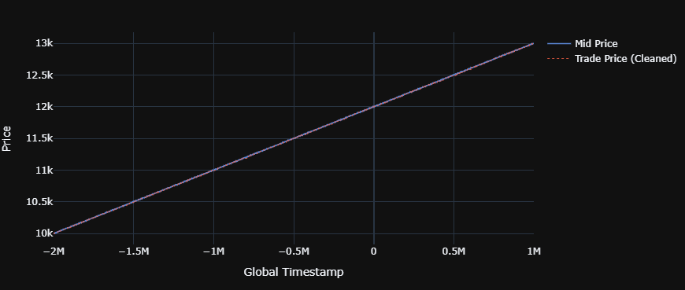
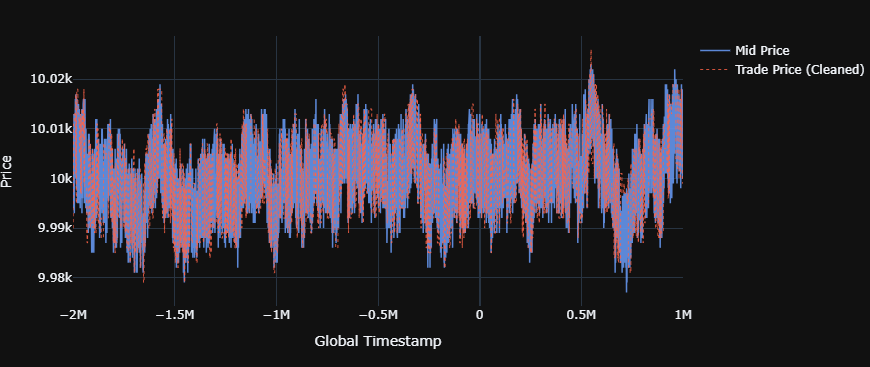

# Round 1: Alpha Generation & Market Making

> **Theme:** *"Limited Market Access"* — two delta-1 assets, pure market making
> **Assets:** INTARIAN_PEPPER_ROOT · ASH_COATED_OSMIUM

---

## Overview

Round 1 was the foundation round — no options, no exotic structures, just two assets and the question of how to make markets on them profitably. The core challenge was fair value estimation: without a reliable fair value anchor, any quoting strategy is just noise.

The two assets required fundamentally different approaches, and the failure on OSMIUM established an early lesson about the limits of static fair value assumptions.

---

## INTARIAN_PEPPER_ROOT — Trend-Following Market Making

### What the data showed

PEPPER exhibited a clear and persistent **linear price trend** across all three days of data. Unlike a mean-reverting asset, the mid-price was not oscillating around a stable level — it was drifting directionally at a roughly constant rate.

This made static fair value anchors (rolling mid, VWAP) structurally wrong for this asset. A quote centered on the current mid would be systematically stale the moment it was placed.

  <figure align="center">
    
    <figcaption><small><i>Figure 1: PEPPER Mid Price with Trade Price</i></small></figcaption>
  </figure>

### Fair value construction

Fair value was derived directly from the observed trend:

$$
FV_t = \alpha \cdot t + \beta
$$

where $\alpha$ is the estimated price slope (ticks per timestamp) and $\beta$ is the intercept, both estimated via linear regression on historical mid-price data.

At each timestamp, quotes were centered on $FV_t$ rather than the current mid. As time progressed and $FV_t$ drifted upward, the bid and ask shifted with it — keeping the market making position roughly delta-neutral relative to the true underlying drift.

### Why this worked

The key insight was recognizing that the spread cost on PEPPER was manageable, and that the trend was stable enough across days to use as a quoting anchor. By pricing off the trend rather than the instantaneous mid, the strategy avoided the adverse selection that would have come from quoting a stale level on a drifting asset.

---

## ASH_COATED_OSMIUM — Mean-Reversion Market Making

### What the data showed

OSMIUM displayed a very different character: prices oscillated around the **10,000 level** with no clear directional trend. The natural approach was mean-reversion market making — quote around a stable fair value, collect spread as prices revert.

  <figure align="center">
    
    <figcaption><small><i>Figure 2: OSMIUM Mid Price with Trade Price</i></small></figcaption>
  </figure>

### Fair value construction

Fair value was set using the instantaneous **mid-price** as the anchor, with quotes placed symmetrically around it.

### Where it broke down

In the out-of-sample period, OSMIUM's price drifted **downward** rather than reverting. The mid-price anchor, updated tick by tick, chased the declining price — resulting in a sequence of buys at levels that continued falling. The mean-reversion assumption held in-sample but failed when the regime shifted.

**What would have worked better:** A slower fair value anchor — **VWAP** or a **rolling mid over a longer lookback window** — would have been less reactive to short-term drift and more representative of the asset's true equilibrium. The instantaneous mid is the most noise-sensitive fair value estimate available; in a noisy, range-bound asset, it amplifies rather than dampens adverse selection.

---

## Toxic Flow Analysis & Spread Arbitrage Screening

### Order flow toxicity baseline

Beyond price visualization, trade data was used to test whether the market contained **informed order flow** — trades that systematically predict adverse price movement after execution.

The test: for each trade, measure the price distribution over the subsequent 1–15 ticks. If toxic flow is present, the price should move against the market maker consistently enough to erode spread income.

**Finding:** Under normal spread conditions, post-trade price tick distributions showed no consistent directional drift. The flow was not toxic in the conventional sense — trades were not reliably predicting near-term price moves. This confirmed that standard market making (quoting around fair value, collecting spread) was viable on both assets.

### The spread-break arbitrage — and why it was blocked

An edge case was identified: when the spread temporarily **collapsed or inverted** (bid ≥ ask), placing passive quotes on both sides simultaneously guaranteed a locked-in profit regardless of which side filled first. In a standard FIFO queue-based LOB, this opportunity disappears instantly as queue priority determines fill order. But this competition uses a **price-matching system with no queue** — meaning passive quotes at a given price are treated symmetrically, with no time priority.

In theory, this makes the spread-break window a **structural arbitrage**: quote both sides aggressively during the break, capture the cross.

**What happened in practice:** Trades placed specifically during these spread-break windows consistently showed adverse outcomes — the fills that occurred were systematically the unfavorable ones. The pattern was consistent enough to conclude that the competition had intentionally introduced **toxic counterparties** that selectively target quotes during spread anomalies, precisely to prevent this structural edge from being harvested.

This is a meaningful design observation: the absence of FIFO queue priority creates a potential absolute alpha source, so the organizers closed it through counterparty design rather than market structure. Recognizing *why* a seemingly riskless edge doesn't work in practice — and correctly attributing it to deliberate system design rather than faulty execution — is a more useful outcome than simply observing the loss.

---

## Key Takeaways

- **Fair value construction is asset-specific.** PEPPER required a dynamic, trend-adjusted anchor; OSMIUM required a stable, mean-reversion anchor. Applying the same quoting logic to both would have degraded performance on at least one of them. The first step in any market making problem is characterizing the price process, not parameterizing the quotes.
- **Mid-price is the noisiest fair value estimate.** For mean-reverting assets, instantaneous mid tracks short-term fluctuations too closely. VWAP or a longer-window rolling mid would have absorbed the OOS drift on OSMIUM without chasing it.
- **Regime shifts are the primary risk in mean-reversion strategies.** The OSMIUM strategy was correctly calibrated for the in-sample regime (range-bound). The OOS loss came from a regime change, not a flaw in the strategy logic itself. The lesson is not to abandon mean-reversion — it's to build in a regime detection layer that recognizes when the range-bound assumption is no longer valid.
- **Structural arbitrage in a no-queue system gets closed through counterparty design, not market structure.** The spread-break opportunity was real and theoretically riskless — the competition blocked it by introducing toxic counterparties that selectively fill against you during anomalous spread windows. When a seemingly riskless edge consistently loses money, the right question is not "what went wrong with my execution?" but "what is the system doing that I'm not modeling?" Answering that question correctly is more valuable than the P&L would have been.

---

*[Round 2: Market Access Bidding & Resource Allocation →](../round2/ROUND2_DESCRIPTION.md)*