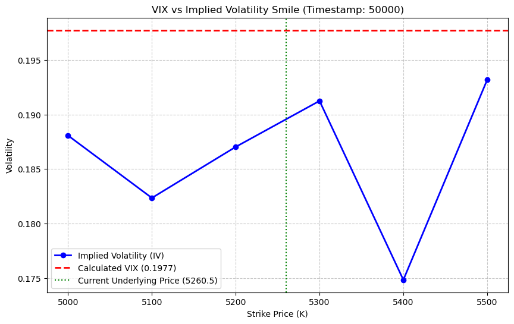

# Round 3: Options Volatility Modeling & Market Making

> **Assets:** HYDROGEL_PACK · VELVETFRUIT_EXTRACT (delta-1 underlying) · VELVETFRUIT_EXTRACT_VOUCHERs (calls, 10 strikes)  
> **Structure:** European-style calls, 7-day expiry. No early exercise. Positions liquidated at hidden fair value at round end.

## Overview

Round 3 introduced the first options layer. The key tension: theoretically sound frameworks repeatedly running into the hard wall of spread costs.

**Sections:**
1. Data loading & option type identification (call vs. put from price behavior)
2. Arbitrage screening — mid-price vs. intrinsic value
3. Black-Scholes IV extraction via bisection
4. IV surface visualization (cross-section & time series)
5. Orc-Wing model fitting for fair value

> **Key finding:** The IV surface showed persistent *upward slope as TTM decreased* — a volatility clustering signal that wasn't decoded until Round 4. Gamma scalping failed because realized moves were too small to generate gamma income against wide spread costs.


---
## Section 1: Data Loading & Asset Universe

Load price and trade CSVs for all three days. Identify the underlying (VELVETFRUIT_EXTRACT) and all option vouchers.  
Classify options by strike into Deep ITM / ATM / Deep OTM based on price behavior relative to the underlying.

| Strike range | Regime | Trading implication |
|---|---|---|
| 4,000–4,500 | Deep ITM | Delta ≈ 1; market make with passive quotes at mid ± 2 |
| ~5,200 | ATM | Highest edge; delta fluctuates most sharply |
| 6,000–6,500 | Deep OTM | Mid quoted at 0.5, trades at 0; functionally illiquid |


```python
import pandas as pd
import glob
import os
import re
import plotly.graph_objects as go

# 1. Data loading setup
price_files = sorted(glob.glob('prices_round_3_day_*.csv'))
trade_files = sorted(glob.glob('trades_round_3_day_*.csv'))

def extract_day(filename):
    match = re.search(r'day_(-?\d+)', filename)
    return int(match.group(1)) if match else 0

# Load price data
prices_list = []
for f in price_files:
    df = pd.read_csv(f, sep=';')
    prices_list.append(df)
prices = pd.concat(prices_list)
prices['global_timestamp'] = prices['day'] * 1000000 + prices['timestamp']

# Load trade data
trades_list = []
for f in trade_files:
    day = extract_day(f)
    df = pd.read_csv(f, sep=';')
    df['day'] = day
    trades_list.append(df)
trades = pd.concat(trades_list)
trades['global_timestamp'] = trades['day'] * 1000000 + trades['timestamp']

# ---------------------------------------------------------
# [Filter] Extract only assets containing 'VELVETFRUIT'
# ---------------------------------------------------------
# Case-insensitive check for 'VELVETFRUIT' in product name
target_assets = [a for a in prices['product'].unique() if 'VELV' in str(a).upper()]

if not target_assets:
    print("No asset found containing the keyword.")
else:
    print(f"Filtering complete. Targets: {target_assets}")

    for asset in target_assets:
        # Filter data for target asset
        asset_prices = prices[prices['product'] == asset][['global_timestamp', 'mid_price']].copy()
        asset_trades = trades[trades['symbol'] == asset][['global_timestamp', 'price']].copy()
        asset_trades.rename(columns={'price': 'trade_price'}, inplace=True)
        
        # Merge and clean data
        combined = pd.merge(asset_prices, asset_trades, on='global_timestamp', how='left')
        combined = combined.groupby('global_timestamp').last().reset_index()
        
        # Forward-fill interpolation
        combined['trade_price'] = combined['trade_price'].ffill()
        combined['mid_price'] = combined['mid_price'].ffill()
        
        # Visualization
        fig = go.Figure()

        fig.add_trace(go.Scatter(
            x=combined['global_timestamp'],
            y=combined['mid_price'],
            mode='lines',
            name='Mid Price',
            line=dict(color='rgba(100, 149, 237, 0.8)', width=1.5)
        ))
        """
        fig.add_trace(go.Scatter(
            x=combined['global_timestamp'],
            y=combined['trade_price'],
            mode='lines',
            name='Trade Price (Interpolated)',
            line=dict(color='rgba(255, 99, 71, 0.7)', width=1, dash='dot')
        ))
        """
        fig.update_layout(
            title=f'Volcanic Rock Analysis: {asset} (Mid vs Trade)',
            xaxis_title='Global Timestamp',
            yaxis_title='Price',
            template='plotly_dark',
            hovermode='x unified',
            legend=dict(yanchor="top", y=0.99, xanchor="left", x=0.01)
        )

        fig.show()


```

    c:\Users\dhko23\AppData\Local\anaconda3\Lib\site-packages\pandas\core\arrays\masked.py:61: UserWarning: Pandas requires version '1.3.6' or newer of 'bottleneck' (version '1.3.5' currently installed).
      from pandas.core import (
    

    Filtering complete. Targets: ['VELVETFRUIT_EXTRACT']
    


```python
import pandas as pd
import glob
import os
import re
import plotly.graph_objects as go

# 1. Data loading setup
price_files = sorted(glob.glob('prices_round_3_day_*.csv'))
trade_files = sorted(glob.glob('trades_round_3_day_*.csv'))

def extract_day(filename):
    match = re.search(r'day_(-?\d+)', filename)
    return int(match.group(1)) if match else 0

# Load price data
prices_list = []
for f in price_files:
    df = pd.read_csv(f, sep=';')
    prices_list.append(df)
prices = pd.concat(prices_list)
prices['global_timestamp'] = prices['day'] * 1000000 + prices['timestamp']

# Load trade data
trades_list = []
for f in trade_files:
    day = extract_day(f)
    df = pd.read_csv(f, sep=';')
    df['day'] = day
    trades_list.append(df)
trades = pd.concat(trades_list)
trades['global_timestamp'] = trades['day'] * 1000000 + trades['timestamp']

# ---------------------------------------------------------
# [Filter] Extract only assets containing 'VELVETFRUIT'
# ---------------------------------------------------------
# Case-insensitive check for 'VELVETFRUIT' in product name
target_assets = [a for a in prices['product'].unique() if 'VEV' in str(a).upper()]

if not target_assets:
    print("No asset found containing the keyword.")
else:
    print(f"Filtering complete. Targets: {target_assets}")

    for asset in target_assets:
        # Filter data for target asset
        asset_prices = prices[prices['product'] == asset][['global_timestamp', 'mid_price']].copy()
        asset_trades = trades[trades['symbol'] == asset][['global_timestamp', 'price']].copy()
        asset_trades.rename(columns={'price': 'trade_price'}, inplace=True)
        
        # Merge and clean data
        combined = pd.merge(asset_prices, asset_trades, on='global_timestamp', how='left')
        combined = combined.groupby('global_timestamp').last().reset_index()
        
        # Forward-fill interpolation
        combined['trade_price'] = combined['trade_price'].ffill()
        combined['mid_price'] = combined['mid_price'].ffill()
        
        # Visualization
        fig = go.Figure()

        fig.add_trace(go.Scatter(
            x=combined['global_timestamp'],
            y=combined['mid_price'],
            mode='lines',
            name='Mid Price',
            line=dict(color='rgba(100, 149, 237, 0.8)', width=1.5)
        ))
        """
        fig.add_trace(go.Scatter(
            x=combined['global_timestamp'],
            y=combined['trade_price'],
            mode='lines',
            name='Trade Price (Interpolated)',
            line=dict(color='rgba(255, 99, 71, 0.7)', width=1, dash='dot')
        ))
        """
        fig.update_layout(
            title=f'Volcanic Rock Analysis: {asset} (Mid vs Trade)',
            xaxis_title='Global Timestamp',
            yaxis_title='Price',
            template='plotly_dark',
            hovermode='x unified',
            legend=dict(yanchor="top", y=0.99, xanchor="left", x=0.01)
        )

        fig.show()

target_option_asset = [item for item in target_assets if item!= 'VELVETFRUIT_EXTRACT']

filtered_option_prices = prices[prices['product'].isin(target_option_asset)]
filtered_option_trades = trades[trades['symbol'].isin(target_option_asset)]
filtered_prices = prices[prices['product'] == 'VELVETFRUIT_EXTRACT']
filtered_trades = trades[trades['symbol'] == 'VELVETFRUIT_EXTRACT']   

```

    Filtering complete. Targets: ['VEV_5400', 'VEV_6500', 'VEV_5500', 'VEV_5200', 'VEV_5300', 'VEV_4500', 'VEV_5000', 'VEV_4000', 'VEV_5100', 'VEV_6000']
    


> **What we're establishing:** Before any model is applied, the asset universe needs to be mapped. HYDROGEL_PACK and VELVETFRUIT_EXTRACT are delta-1 products — linear exposure to the underlying. The 10 VOUCHERs are options. No call/put label was provided, so option type was inferred empirically from price behavior relative to the underlying.
>
> **Finding:** Price behavior confirmed these are **call options**. The universe splits into three regimes — Deep ITM (price ≈ intrinsic value, delta ≈ 1, no edge), ATM (highest delta sensitivity, ~50 time value remaining, primary trading target), Deep OTM (effectively illiquid, trades at 0).
>
> **Why this matters for everything downstream:** ATM is the only segment with meaningful spread income potential. Deep ITM is market-making territory only if arbitrage exists. Deep OTM is not worth modeling.

---
## Section 2: Arbitrage Screening

Test whether any option trades below intrinsic value (call price < max(0, S−K)).  
Any breach is a riskless arbitrage — buy the option, exercise immediately.

> **Result:** No persistent violations found. Calendar arbitrage (convexity check) also clean.  
> **Spread cost wall:** Mid-price signals showed 5–10 ticks of edge. Actual spreads exceeded 30 ticks → any taker strategy loses 20–25 per entry net.  
> **Implication:** Any profitable strategy must be a *maker*, not a taker.


```python
target_option_asset = [item for item in target_assets if item!= 'VELVETFRUIT_EXTRACT']

filtered_option_prices = prices[prices['product'].isin(target_option_asset)]
filtered_option_trades = trades[trades['symbol'].isin(target_option_asset)]
filtered_prices = prices[prices['product'] == 'VELVETFRUIT_EXTRACT']
filtered_trades = trades[trades['symbol'] == 'VELVETFRUIT_EXTRACT']   

```

> **What we found:** No persistent intrinsic value violations — calendar arbitrage was also clean (convexity held throughout). The market was structurally fair at the mid-price level.
>
> **The spread cost wall:** Mid-price signals showed 5–10 ticks of edge. Actual spreads exceeded 30 ticks. Taking liquidity → realized loss of 20–25 per entry. This single finding eliminated every taker-side strategy and forced the approach toward passive quoting.
>
> **Implication for strategy:** Deep ITM options (strikes 4000/4500) → market making with passive quotes at mid ± 2 ticks. Fair value as anchor makes this viable. Everything else requires a signal strong enough to survive 30+ tick spreads — a much higher bar.

---
## Section 3: Black-Scholes IV Extraction

Extract implied volatility via bisection on the BSM call pricing formula:

$$
C(S, t) = S_t N(d_1) - K e^{-r(T-t)} N(d_2)
$$

Risk-free rate r = 0 (negligible carry at near-zero TTM). IV is used as a signal benchmark, not a pricing engine.


```python
import numpy as np
from scipy.stats import norm
from scipy.optimize import brentq

# Black-Scholes call/put price function
def bs_price(S, K, T, r, sigma, option_type='call'):
    if T <= 0: return max(0, S - K) if option_type == 'call' else max(0, K - S)
    d1 = (np.log(S / K) + (r + 0.5 * sigma ** 2) * T) / (sigma * np.sqrt(T))
    d2 = d1 - sigma * np.sqrt(T)
    if option_type == 'call':
        return S * norm.cdf(d1) - K * np.exp(-r * T) * norm.cdf(d2)
    else:
        return K * np.exp(-r * T) * norm.cdf(norm.cdf(-d2)) - S * norm.cdf(-d1)

# Implied volatility inversion function
def calculate_iv(market_price, S, K, T, r, option_type):
    if market_price <= 0 or T <= 0: return np.nan
    try:
        # Bisect over [0.001%, 500%] for implied vol
        return brentq(lambda x: bs_price(S, K, T, r, x, option_type) - market_price, 1e-6, 5.0)
    except:
        return np.nan
```


```python
import numpy as np
from scipy.stats import norm
from scipy.optimize import brentq

# Black-Scholes call/put price function
def bs_price(S, K, T, r, sigma, option_type='call'):
    if T <= 0: return max(0, S - K) if option_type == 'call' else max(0, K - S)
    d1 = (np.log(S / K) + (r + 0.5 * sigma ** 2) * T) / (sigma * np.sqrt(T))
    d2 = d1 - sigma * np.sqrt(T)
    if option_type == 'call':
        return S * norm.cdf(d1) - K * np.exp(-r * T) * norm.cdf(d2)
    else:
        return K * np.exp(-r * T) * norm.cdf(norm.cdf(-d2)) - S * norm.cdf(-d1)

# Implied volatility inversion function
def calculate_iv(market_price, S, K, T, r, option_type):
    if market_price <= 0 or T <= 0: return np.nan
    try:
        # Bisect over [0.001%, 500%] for implied vol
        return brentq(lambda x: bs_price(S, K, T, r, x, option_type) - market_price, 1e-6, 5.0)
    except:
        return np.nan
    
# 1. Clean underlying asset (EXTRACT) data
underlying_prices = prices[prices['product'] == 'VELVETFRUIT_EXTRACT'][['global_timestamp', 'mid_price']].copy()
underlying_prices.rename(columns={'mid_price': 'S'}, inplace=True)

# 2. Process option data
# Extract strike from option symbol (e.g. VELVETFRUIT_C_10500 → 10500)
# Adjust regex to match actual symbol format.
def parse_strike(symbol):
    nums = re.findall(r'\d+', symbol)
    return int(nums[-1]) if nums else 10000

# Classify option type (call/put)
def parse_type(symbol):
    return 'call' if 'C' in symbol.upper() else 'put'

# Set constants (verify against competition guide)
R = 0.0  # Risk-free rate
T = 250 / 365 # Example: TTM (recommend computing relative to round end timestamp)

option_iv_data = []

for asset in target_option_asset:
    K = parse_strike(asset)
    o_type = parse_type(asset)
    
    # Merge option prices with underlying prices
    opt_df = prices[prices['product'] == asset][['global_timestamp', 'mid_price']].copy()
    merged = pd.merge(opt_df, underlying_prices, on='global_timestamp', how='inner')
    
    # Compute implied volatility
    merged['iv'] = merged.apply(
        lambda row: calculate_iv(row['mid_price'], row['S'], K, T, R, o_type), axis=1
    )
    merged['product'] = asset
    option_iv_data.append(merged)

iv_df = pd.concat(option_iv_data)
fig = go.Figure()

for asset in target_option_asset:
    asset_data = iv_df[iv_df['product'] == asset].sort_values('global_timestamp')
    
    fig.add_trace(go.Scatter(
        x=asset_data['global_timestamp'],
        y=asset_data['iv'],
        mode='lines',
        name=f'{asset} IV',
        line=dict(width=1.2),
        hovertemplate='%{fullData.name}<br>TS: %{x}<br>IV: %{y:.2%}'
    ))

fig.update_layout(
    title='Implied Volatility Dynamics by Strike (Round 3)',
    xaxis_title='Global Timestamp',
    yaxis_title='Implied Volatility',
    template='plotly_dark',
    hovermode='x unified',
    yaxis=dict(tickformat='.1%')
)

fig.show()

```

> **Method:** Bisection on BSM call formula with r = 0. Risk-free rate set to zero because (a) annualized TTM is near zero so carry effects are negligible, and (b) IV is used as a signal benchmark, not a pricing engine. Exact r doesn't matter for relative comparisons.
>
> **What we're building toward:** IV per strike per timestamp. The cross-sectional shape (smile vs. skew vs. clustering) and the time-series behavior (term structure) will determine whether a parametric model like Orc-Wing can generate reliable Z-scores for trading.

---
## Section 4: IV Surface — Cross-Section & Time Series

Plot IV across all strikes (cross-section) and over time (time series per strike).

**Cross-section finding:** IV shows *clustering* rather than the expected smile/skew structure.  
**Time-series finding:** Most strikes exhibit a persistent *upward trend in IV as TTM decreases*.

This was the key unresolved question from Round 3 — decoded in Round 4 as a volatility clustering signature via log-moneyness.


```python
import pandas as pd
import numpy as np
import re
import plotly.graph_objects as go
from plotly.subplots import make_subplots

# Underlying asset data (VELVETFRUIT_EXTRACT)
underlying_df = filtered_prices[['global_timestamp', 'mid_price']].copy()
underlying_df.rename(columns={'mid_price': 'S'}, inplace=True)

n_assets = len(target_option_asset)
# Create subplots
fig = make_subplots(
    rows=n_assets, cols=1, 
    subplot_titles=[f"{asset} (Intrinsic - Price)" for asset in target_option_asset],
    vertical_spacing=0.02
)

for i, asset in enumerate(target_option_asset):
    # 1. Extract strike and option type
    K = int(re.findall(r'\d+', asset)[-1])
    
    
    # 2. Join option prices with underlying prices
    opt_df = prices[prices['product'] == asset][['global_timestamp', 'mid_price']].copy()
    merged = pd.merge(opt_df, underlying_df, on='global_timestamp', how='inner')
    
    # 3. Compute intrinsic value
    
    merged['intrinsic'] = (merged['S'] - K).clip(lower=0)
   
    # 4. Compute arbitrage gap: (intrinsic value − market price)
    # Positive gap = market price below intrinsic value → arbitrage opportunity
    merged['gap'] = merged['intrinsic'] - merged['mid_price']
    
    # 5. Add to subplots
    fig.add_trace(go.Scatter(
        x=merged['global_timestamp'], 
        y=merged['gap'],
        mode='lines',
        name=f'{asset} Gap',
        line=dict(width=1.5, color='orange' if is_call else 'cyan'),
        fill='tozeroy' # Fill from zero for easy visual inspection
    ), row=i+1, col=1)
    
    # Show zero reference line
    fig.add_shape(
        type="line", line=dict(color="white", width=1, dash="dash"),
        x0=merged['global_timestamp'].min(), x1=merged['global_timestamp'].max(),
        y0=0, y1=0, row=i+1, col=1
    )

fig.update_layout(
    title_text="Gap Analysis: Intrinsic Value - Market Price",
    template='plotly_dark',
    height=250 * n_assets,
    showlegend=False,
    hovermode='x unified'
)

fig.show()
```


> **Cross-section finding:** IV shows **clustering** rather than the expected smile or skew. Most strikes carry similar IV levels at any given point in time — the dispersion across strikes is low. This explains why gamma scalping failed (covered in Section 3b): if IV is clustered, realized moves relative to strike are small, and gamma income can't clear spread costs.
>
> **Time-series finding:** Most strikes show a **persistent upward trend in IV as TTM decreases**. This was the key unresolved question in Round 3 — the signal was visible but the mechanism wasn't decoded until Round 4.
>
> *(Round 4 answer: as TTM → 0, the denominator σ√(T−t) shrinks. For IV to rise, the market is keeping log(S/K) — log-moneyness — roughly constant. This is volatility clustering: realized moves clustering around the strike rather than diffusing away from it.)*

---
## Section 3b: Gamma Scalping Attempt

Delta-hedge an ATM option (long option, short Δ units of underlying). Rebalance as delta shifts — selling into rallies, buying into dips. Accumulated rebalancing P&L ≈ gamma.

**Condition for profitability:** Gamma income > theta decay + transaction costs.

**Why it failed:** Theta was structurally near zero (single expiry chain). But rebalancing required crossing wide spreads on the underlying. The realized volatility of the underlying relative to strike spacing was insufficient to generate gamma income that exceeded spread drag.


```python
import pandas as pd
import numpy as np
import matplotlib.pyplot as plt
import math

# --- 1. Black-Scholes logic (same as main.py) ---
def norm_cdf(x):
    return 0.5 * (1.0 + math.erf(x / math.sqrt(2)))

def call_price(S, K, T, v):
    if T <= 0 or v <= 0:
        return max(0.0, S - K)
    d1 = (math.log(S/K) + 0.5*v*v*T) / (v * math.sqrt(T))
    d2 = d1 - v * math.sqrt(T)
    return S * norm_cdf(d1) - K * norm_cdf(d2)

def iv(price, S, K, T):
    intrinsic = max(0.0, S-K)
    if price <= intrinsic:
        return 0.16
    low = 1e-6
    high = 3.0
    for _ in range(25):
        mid = 0.5*(low+high)
        val = call_price(S, K, T, mid)
        if val > price:
            high = mid
        else:
            low = mid
    return 0.5*(low+high)

# --- 2. Load data and filter to a specific timestamp ---
# (load day_2 or any desired day)
df = pd.read_csv('prices_round_3_day_2.csv', sep=';')

target_timestamp = 50000  # Specify the timestamp to analyze
df_ts = df[df['timestamp'] == target_timestamp]

# Extract underlying price S
S_row = df_ts[df_ts['product'] == 'VELVETFRUIT_EXTRACT']
if S_row.empty:
    raise ValueError("No VELVETFRUIT_EXTRACT data at this timestamp.")
S = S_row['mid_price'].values[0]

# --- 3. Parse option mid_price per strike ---
strikes = [4000, 4500, 5000, 5100, 5200, 5300, 5400, 5500, 6000, 6500]
prices = {}
for K in strikes:
    sym = f'VEV_{K}'
    opt_row = df_ts[df_ts['product'] == sym]
    if not opt_row.empty:
        prices[K] = opt_row['mid_price'].values[0]

# --- 4. Compute TTM (following main.py tick logic) ---
# (Using 10,000 ticks per day convention)
elapsed_days = (target_timestamp / 100) / 10000  
remaining_days = max(0.0001, 7 - elapsed_days)
T = remaining_days / 252

# --- 5. Compute model-free VIX ---
var_sum = 0.0
for i, K in enumerate(strikes):
    if i == 0:
        dK = strikes[1] - strikes[0]
    elif i == len(strikes) - 1:
        dK = strikes[-1] - strikes[-2]
    else:
        dK = (strikes[i+1] - strikes[i-1]) / 2.0
        
    if K not in prices: 
        continue
    
    time_val = prices[K] - max(0.0, S - K)
    if time_val > 0:
        var_sum += time_val / (K * K) * dK

vix_vol = math.sqrt((2.0 / T) * var_sum)

# --- 6. Compute implied volatility (moneyness-filtered options only) ---
ivs = []
valid_strikes = []

for K in strikes:
    if K in prices:
        # Same moneyness filter as main.py
        k = math.log(K / S)
        if abs(k) < 0.1:  
            implied_vol = iv(prices[K], S, K, T)
            ivs.append(implied_vol)
            valid_strikes.append(K)

# --- 7. Finding Visualization ---
plt.figure(figsize=(10, 6))

# Plot IV curve (check for smile/smirk structure)
plt.plot(valid_strikes, ivs, marker='o', linestyle='-', color='b', linewidth=2, label='Implied Volatility (IV)')

# Plot model-free VIX line
plt.axhline(y=vix_vol, color='r', linestyle='--', linewidth=2, label=f'Calculated VIX ({vix_vol:.4f})')

# Mark current underlying price
plt.axvline(x=S, color='g', linestyle=':', label=f'Current Underlying Price ({S:.1f})')

plt.title(f'VIX vs Implied Volatility Smile (Timestamp: {target_timestamp})')
plt.xlabel('Strike Price (K)')
plt.ylabel('Volatility')
plt.legend()
plt.grid(True, linestyle='--', alpha=0.7)

plt.show()

```


    

    


> **Why gamma scalping was the natural next attempt:** ATM options have the highest gamma, and delta-hedging + rebalancing mechanically captures the gap between the option price curve and its delta tangent. If theta is near zero (as it appeared), the strategy should theoretically generate net gamma income.
>
> **Why it failed:** Rebalancing required crossing the spread on the underlying. The gamma realized per rebalancing cycle was insufficient to absorb those transaction costs. Confirmed by the IV clustering finding — low cross-sectional IV dispersion meant underlying moves relative to strike were small, making gamma income structurally inadequate against spread drag.
>
> **The honest summary:** Gamma scalping was the right idea for the wrong market. It requires sufficient realized vol relative to spread costs. This market didn't have it.


```python
import pandas as pd
import numpy as np
import math

def norm_cdf(x): return 0.5 * (1.0 + math.erf(x / math.sqrt(2)))

def call_price(S, K, T, v):
    if T <= 0 or v <= 0: return max(0.0, S - K)
    d1 = (math.log(S/K) + 0.5*v*v*T) / (v * math.sqrt(T))
    d2 = d1 - v * math.sqrt(T)
    return S * norm_cdf(d1) - K * norm_cdf(d2)

def iv(price, S, K, T):
    intrinsic = max(0.0, S-K)
    if price <= intrinsic: return 0.16
    low, high = 1e-6, 3.0
    for _ in range(25):
        mid = 0.5*(low+high)
        val = call_price(S, K, T, mid)
        if val > price: high = mid
        else: low = mid
    return 0.5*(low+high)

# Load data
df = pd.read_csv('prices_round_3_day_2.csv', sep=';')
strikes = [4000, 4500, 5000, 5100, 5200, 5300, 5400, 5500, 6000, 6500]

vix_list = []
iv_lists = {K: [] for K in strikes}

# Sample every 100 timestamps for speed; compute average
timestamps = df['timestamp'].unique()[::100]

for ts in timestamps:
    df_ts = df[df['timestamp'] == ts]
    S_row = df_ts[df_ts['product'] == 'VELVETFRUIT_EXTRACT']
    if S_row.empty: continue
    S = S_row['mid_price'].values[0]
    
    prices = {}
    for K in strikes:
        opt_row = df_ts[df_ts['product'] == f'VEV_{K}']
        if not opt_row.empty:
            prices[K] = opt_row['mid_price'].values[0]
            
    elapsed_days = (ts / 100) / 10000
    remaining_days = max(0.0001, 7 - elapsed_days)
    T = remaining_days / 252
    
    var_sum = 0.0
    for i, K in enumerate(strikes):
        if i == 0: dK = strikes[1] - strikes[0]
        elif i == len(strikes) - 1: dK = strikes[-1] - strikes[-2]
        else: dK = (strikes[i+1] - strikes[i-1]) / 2.0
        
        if K not in prices: continue
        time_val = prices[K] - max(0.0, S - K)
        if time_val > 0:
            var_sum += time_val / (K * K) * dK
            
    vix_vol = math.sqrt((2.0 / T) * var_sum)
    vix_list.append(vix_vol)
    
    for K in strikes:
        if K in prices:
            k = math.log(K / S)
            if abs(k) < 0.1:  # Moneyness filter
                implied_vol = iv(prices[K], S, K, T)
                iv_lists[K].append(implied_vol)

# Finding Print output
print(f'VIX Average (overall mean): {sum(vix_list)/len(vix_list):.5f}\n')
print('IV Averages by Strike:')
for K in strikes:
    if len(iv_lists[K]) > 0:
        avg_iv = sum(iv_lists[K])/len(iv_lists[K])
        print(f' - Strike {K}: {avg_iv:.5f}')

```

    VIX Average (전체 평균): 0.19748
    
    IV Averages by Strike:
     - Strike 5000: 0.18573
     - Strike 5100: 0.18064
     - Strike 5200: 0.18552
     - Strike 5300: 0.18908
     - Strike 5400: 0.17589
     - Strike 5500: 0.19242
    

---
*Cells below: IV time series computation and Orc-Wing fitting.*

> **Transition note:** Sections 1–3b established what doesn't work (arbitrage taking, gamma scalping) and why (spread costs, IV clustering). The remaining cells ask a different question: can we fit a parametric model to the IV surface and use deviations from that model as trading signals?
>
> This is the Orc-Wing approach — if the model describes the surface well, Z-scores per option become entry/exit signals. If it doesn't describe the surface well, the Z-scores are noise.


```python
import pandas as pd
import numpy as np
import matplotlib.pyplot as plt
import scipy.stats as si
import os

# 1. Load data (prices_round_3_day_0 ~ 2)
days = [0, 1, 2]
dfs = []
for day in days:
    file_path = f'prices_round_3_day_{day}.csv'
    if os.path.exists(file_path):
        df = pd.read_csv(file_path, sep=';')
        dfs.append(df)

if len(dfs) > 0:
    df_all = pd.concat(dfs, ignore_index=True)
else:
    raise FileNotFoundError("No price CSV files found.")

# Extract underlying asset (VELVETFRUIT_EXTRACT)
underlying_df = df_all[df_all['product'] == 'VELVETFRUIT_EXTRACT'][['day', 'timestamp', 'mid_price']].copy()
underlying_df.rename(columns={'mid_price': 'S'}, inplace=True)

# Extract option series (VEV_*)
options_df = df_all[df_all['product'].str.startswith('VEV_')].copy()

# Parse strike from product name
options_df['strike'] = options_df['product'].str.replace('VEV_', '').astype(float)

# Merge underlying and option data
merged_df = pd.merge(options_df, underlying_df, on=['day', 'timestamp'], how='left')

# 2. Compute TTM (Time To Maturity)
# Reference: 7 days to expiry at global timestamp 0 (day 0, ts 0).
# One day = timestamps 0–999,900 (10,000 data points)
# timestamp / 1,000,000 = fraction of one day elapsed
merged_df['TTM_days'] = 7 - merged_df['day'] - (merged_df['timestamp'] / 1000000)

# Annualize (assuming 252 trading days; change to 365 if needed)
DAYS_IN_YEAR = 252.0 
merged_df['T'] = merged_df['TTM_days'] / DAYS_IN_YEAR

# Assume risk-free rate = 0
r = 0.0

# 3. Vectorized IV computation via bisection method
def bs_call(S, K, T, r, sigma):
    d1 = (np.log(S / K) + (r + 0.5 * sigma ** 2) * T) / (sigma * np.sqrt(T))
    d2 = d1 - sigma * np.sqrt(T)
    call = (S * si.norm.cdf(d1, 0.0, 1.0) - K * np.exp(-r * T) * si.norm.cdf(d2, 0.0, 1.0))
    return call

def implied_volatility_bisection(S, K, T, r, C, tol=1e-5, max_iter=100):
    low = np.zeros_like(S) + 1e-5
    high = np.zeros_like(S) + 5.0 # Max vol 500%
    
    valid = (T > 0) & (S > 0) & (K > 0) & (C > 0)
    iv = np.full_like(S, np.nan)
    
    for i in range(max_iter):
        mid = (low + high) / 2.0
        
        C_mid = np.zeros_like(S)
        C_mid[valid] = bs_call(S[valid], K[valid], T[valid], r, mid[valid])
        
        diff = C_mid - C
        
        high = np.where(diff > 0, mid, high)
        low = np.where(diff <= 0, mid, low)
        
        if np.max(np.abs(high[valid] - low[valid])) < tol:
            break
            
    iv[valid] = (low[valid] + high[valid]) / 2.0
    return iv

print("Calculating Implied Volatility for 30,000+ data points per option...")
merged_df['IV'] = implied_volatility_bisection(
    merged_df['S'].values, 
    merged_df['strike'].values, 
    merged_df['T'].values, 
    r, 
    merged_df['mid_price'].values
)

# X-axis: log-moneyness = ln(S/K) 
merged_df['log_moneyness'] = np.log(merged_df['S'] / merged_df['strike'])

plot_df = merged_df.dropna(subset=['IV', 'log_moneyness'])

# 4. Visualization (Scatter plot)
print("Plotting Implied Volatility...")
plt.figure(figsize=(14, 8))
strikes = sorted(plot_df['strike'].unique())
colors = plt.cm.viridis(np.linspace(0, 1, len(strikes)))

for strike, color in zip(strikes, colors):
    subset = plot_df[plot_df['strike'] == strike]
    plt.scatter(subset['log_moneyness'], subset['IV'], 
                label=f'Strike {int(strike)}', 
                color=color, alpha=0.3, s=2)

plt.xlabel('Log Moneyness (ln(S/K))', fontsize=12)
plt.ylabel('Implied Volatility (Annualized)', fontsize=12)
plt.title('Implied Volatility vs Log Moneyness (Bisection Method)', fontsize=14)
plt.legend(bbox_to_anchor=(1.05, 1), loc='upper left', title="Options")
plt.grid(True, linestyle='--', alpha=0.7)
plt.tight_layout()
plt.show()

```


```python
# 5. IV time series per strike (subplots, excluding 6000/6500)
import math

print("Plotting IV over Time with Subplots (excluding 6000 and 6500)...")

# Build global_timestamp for x-axis
if 'global_timestamp' not in plot_df.columns:
    plot_df_time = plot_df.copy()
    plot_df_time['global_timestamp'] = plot_df_time['day'] * 1000000 + plot_df_time['timestamp']
else:
    plot_df_time = plot_df

strikes = sorted(plot_df_time['strike'].unique())
# Exclude strikes 6000 and 6500
strikes = [s for s in strikes if s not in [6000.0, 6500.0]]
num_strikes = len(strikes)

# Compute subplot grid (3 columns)
cols = 3
rows = math.ceil(num_strikes / cols)

# sharex=False: show x-ticks per subplot; sharey=False: independent y-scales (large IV variance)
fig, axes = plt.subplots(rows, cols, figsize=(18, 4 * rows))
axes = axes.flatten()

colors = plt.cm.viridis(np.linspace(0, 1, num_strikes))
day_ticks = [0, 1000000, 2000000, 3000000]
day_labels = ['Day 0', 'Day 1', 'Day 2', 'Day 3']

for idx, (strike, color) in enumerate(zip(strikes, colors)):
    ax = axes[idx]
    subset = plot_df_time[plot_df_time['strike'] == strike].sort_values('global_timestamp')
    
    ax.plot(subset['global_timestamp'], subset['IV'], 
             color=color, alpha=0.8, linewidth=1)
             
    ax.set_title(f'Strike {int(strike)}', fontsize=13, fontweight='bold')
    ax.set_xticks(day_ticks)
    ax.set_xticklabels(day_labels)
    ax.grid(True, linestyle='--', alpha=0.7)
    
    # Independent Y-scale per subplot makes relative deviations easier to see
    ax.set_ylabel('Implied Volatility')

# Hide unused subplot panels
for idx in range(num_strikes, len(axes)):
    fig.delaxes(axes[idx])

plt.tight_layout()
plt.show()

```


## Section 5: Orc-Wing Model Fitting

Fit ma parametric IV surface model to generate Z-scores per option:

$$
\sigma(x) = \sigma_{ref} \cdot \left[1 + SSR\left(\frac{V_c(1-\rho)f_c(x) + V_p(1+\rho)f_p(x)}{2}\right)\right]
$$

Parameters: σ_ref (ATM vol), SSR (skew slope), V_c/V_p (wing weights), ρ (asymmetry).

**Result: overfit.** Performance improved on specific options and specific days in a pattern that was data-specific, not structural. The Orc-Wing curve was not describing the market's actual IV dynamics — it was fitting noise.


```python
# 6. Orc-Wing Model Fitting (improved visualization: parameter labels, outlier removal, per-option coloring)
from scipy.optimize import curve_fit
import warnings

print("Fitting Orc Wing Model with improved visualization...")

# 1) Filter target strikes
excluded_strikes = [4000.0, 4500.0, 6000.0, 6500.0]
fit_df = plot_df[~plot_df['strike'].isin(excluded_strikes)].copy()
fit_df = fit_df.dropna(subset=['log_moneyness', 'IV'])

# Remove outliers
# Exclude bisection results that hit bounds (1e-5 or 5.0) — these distort the plot scale
valid_mask = (fit_df['IV'] > 1e-4) & (fit_df['IV'] < 4.9)
fit_df = fit_df[valid_mask]

x_raw = fit_df['log_moneyness'].values
y_raw = fit_df['IV'].values

# Compute mean IV per strike for visualization
mean_data = fit_df.groupby('strike')[['log_moneyness', 'IV']].mean().reset_index()
mean_data = mean_data.sort_values('log_moneyness')

# 2) Define Orc-Wing model function
def orc_wing_model(x, vc, sc, pc, cc, dc, uc):
    x = np.atleast_1d(x)
    vol = np.zeros_like(x, dtype=float)
    for i in range(len(x)):
        val = x[i]
        if val >= 0:
            if val <= uc:
                vol[i] = vc + sc * val + (cc / 2.0) * (val**2)
            else:
                val_uc = vc + sc * uc + (cc / 2.0) * (uc**2)
                slope_uc = sc + cc * uc
                vol[i] = val_uc + slope_uc * (val - uc)
        else:
            if val >= dc:
                vol[i] = vc + sc * val + (pc / 2.0) * (val**2)
            else:
                val_dc = vc + sc * dc + (pc / 2.0) * (dc**2)
                slope_dc = sc + pc * dc
                vol[i] = val_dc + slope_dc * (val - dc)
    return vol

# 3) Set parameter initial values and bounds
p0 = [np.mean(y_raw), 0.0, 1.0, 1.0, -0.05, 0.05]
bounds = (
    [0.0, -np.inf, 0.0, 0.0, -1.0, 1e-4],
    [np.inf, np.inf, np.inf, np.inf, -1e-4, 1.0]
)

try:
    with warnings.catch_warnings():
        warnings.simplefilter("ignore")
        popt, pcov = curve_fit(orc_wing_model, x_raw, y_raw, p0=p0, bounds=bounds)
    
    vc_opt, sc_opt, pc_opt, cc_opt, dc_opt, uc_opt = popt

    # 4) Visualization
    plt.figure(figsize=(14, 8))
    
    # Scatter plot with distinct color per strike
    strikes = sorted(fit_df['strike'].unique())
    colors = plt.cm.viridis(np.linspace(0, 1, len(strikes)))
    
    for strike, color in zip(strikes, colors):
        subset = fit_df[fit_df['strike'] == strike]
        plt.scatter(subset['log_moneyness'], subset['IV'], 
                    color=color, alpha=0.1, s=2, 
                    label=f'Strike {int(strike)} Raw')
        
    # Add mean IV markers
    plt.scatter(mean_data['log_moneyness'], mean_data['IV'], 
                color='red', s=80, zorder=5, edgecolors='black', label='Mean IV')
    
    # Fitting Curve
    x_min, x_max = min(x_raw) - 0.02, max(x_raw) + 0.02
    x_fit = np.linspace(x_min, x_max, 500)
    y_fit = orc_wing_model(x_fit, *popt)
    
    plt.plot(x_fit, y_fit, color='blue', linewidth=3, zorder=4, label='Orc Wing Fit')
    
    # Cutoff reference point
    if dc_opt > x_min:
        plt.axvline(dc_opt, color='green', linestyle='--', alpha=0.7)
    if uc_opt < x_max:
        plt.axvline(uc_opt, color='orange', linestyle='--', alpha=0.7)

    # Add parameter annotation box
    param_text = (
        "$\mathbf{Orc\ Wing\ Parameters}$" + "\n"
        f"VC (Center Vol) : {vc_opt:.4f}\n"
        f"SC (Slope)        : {sc_opt:.4f}\n"
        f"PC (Put Curv)  : {pc_opt:.4f}\n"
        f"CC (Call Curv)  : {cc_opt:.4f}\n"
        f"DC (Down Cut) : {dc_opt:.4f}\n"
        f"UC (Up Cut)     : {uc_opt:.4f}"
    )
    plt.gca().text(0.02, 0.96, param_text, transform=plt.gca().transAxes, 
                   fontsize=12, verticalalignment='top', 
                   bbox=dict(boxstyle='round,pad=0.5', facecolor='white', alpha=0.9, edgecolor='gray'),
                   zorder=10)

    # Dynamic Y-axis range (prevent outlier distortion)
    y_lower = np.percentile(y_raw, 0.1)
    y_upper = np.percentile(y_raw, 99.9)
    y_range = y_upper - y_lower
    plt.ylim(max(0, y_lower - y_range*0.2), y_upper + y_range*0.2)

    plt.title('Implied Volatility Smile: Orc Wing Model Fit', fontsize=16, fontweight='bold')
    plt.xlabel('Log Moneyness (ln(S/K))', fontsize=12)
    plt.ylabel('Implied Volatility (Annualized)', fontsize=12)
    
    # Consolidate legend and restore opacity
    leg = plt.legend(loc='upper right', bbox_to_anchor=(1.15, 1))
    for handle in leg.legend_handles:
        if hasattr(handle, 'set_alpha'):
            handle.set_alpha(1.0)
            
    plt.grid(True, linestyle='--', alpha=0.5)
    plt.tight_layout()
    plt.show()

except Exception as e:
    print(f"Fitting failed: {e}")

```

> **What the fitting showed:** Performance improved on specific options and specific days — but the pattern was data-specific, not structural. Cherry-picking those options was tempting but confirmed as overfitting. The Orc-Wing curve was not describing the market's actual IV dynamics.
>
> **Why:** Orc-Wing is a powerful model applied to a market with too few strikes and too much IV clustering. The parametric surface it fits is richer than the actual data generating process. More parameters than signal.
>
> **What would have worked (found in Round 4):** Instead of fitting a parametric model to the surface, rank log-moneyness across strikes and trade mean-reversion. The signal was always there — it required the right analytical frame.
