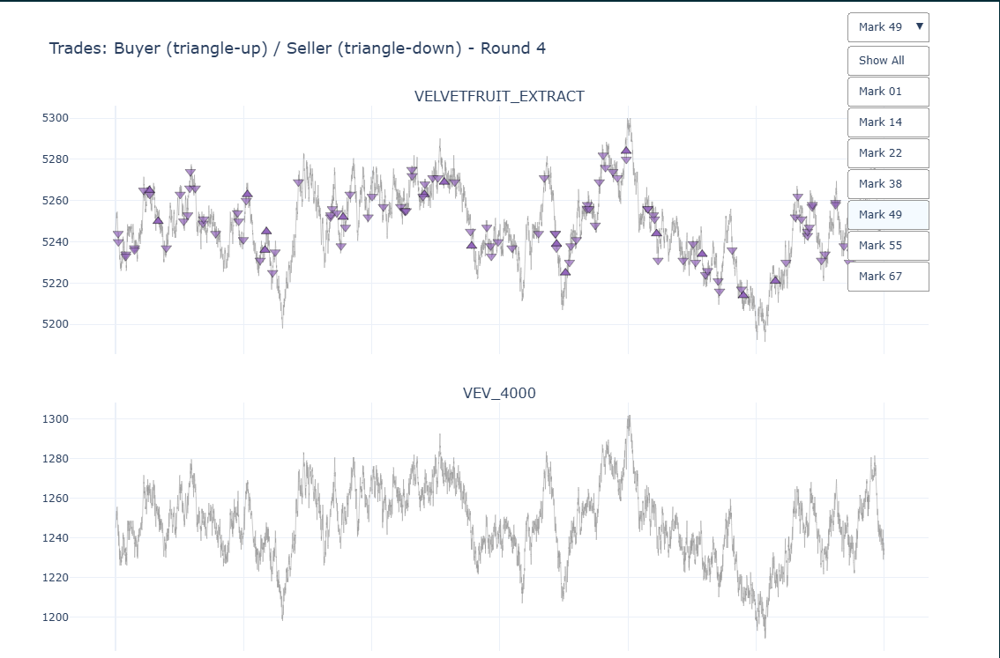
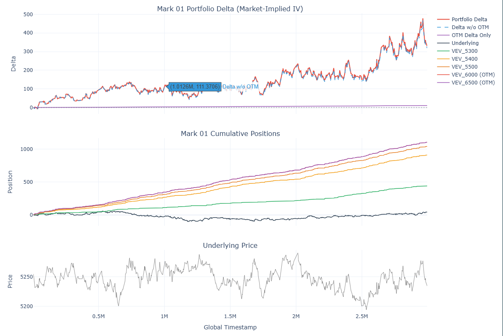
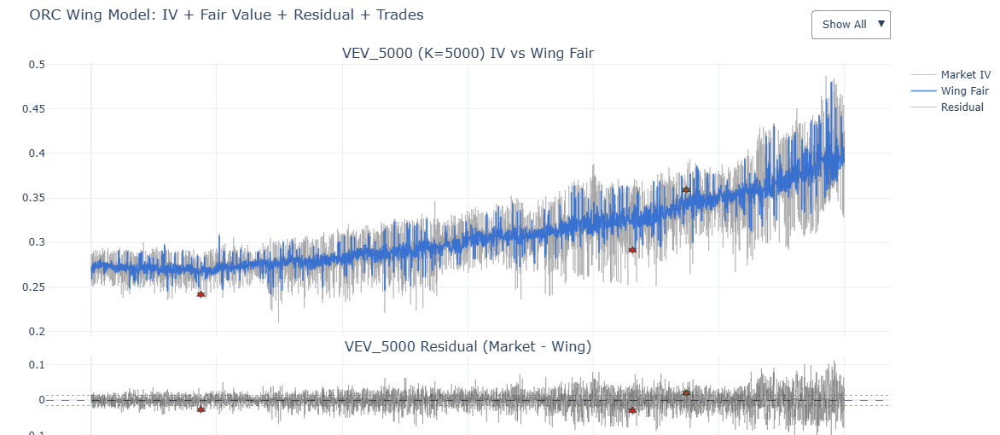
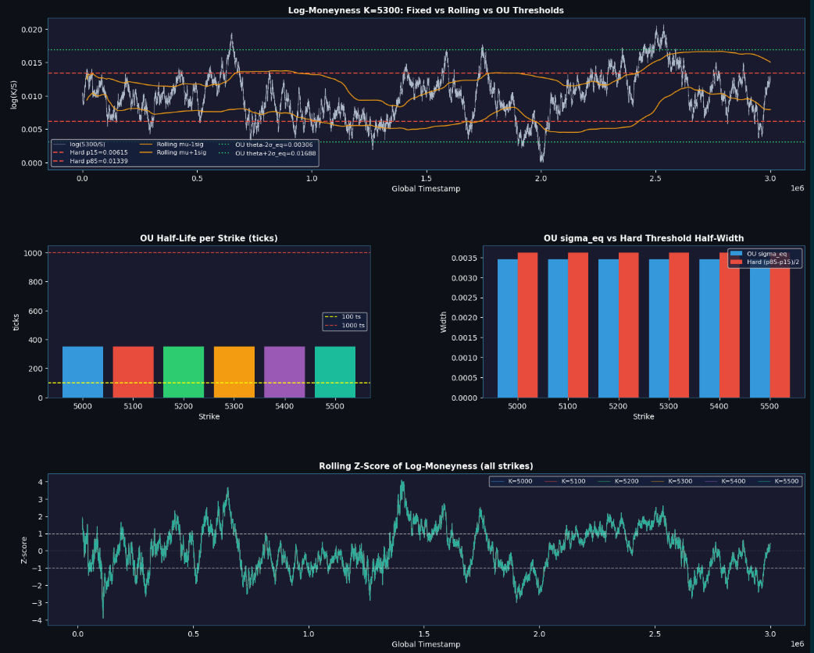

# Round 4: Market Microstructure, Volatility Clustering & Exotic Options

> **Theme:** *"Hello, I'm Mark"* (Algorithmic) · *"Vanilla Just Isn't Exotic Enough"* (Manual)

> **Assets:** Same tradable universe as Round 3 + trader IDs now disclosed (Algorithmic) · AETHER_CRYSTAL + vanilla & exotic options (Manual)

---

## Overview

Round 4 split into two distinct challenges. The algorithmic side introduced trader identity — each market participant now had a disclosed ID, enabling order flow analysis and microstructure decomposition. The manual side introduced exotic derivatives, requiring portfolio optimization under severe simulation constraints.

The algorithmic round also delivered the structural insight that Round 3 had missed: the mechanism behind IV term structure and clustering, decoded through log-moneyness. That single realization drove a ~60% improvement in options P&L.

---

## Part 1: Algorithmic Trading — Order Flow & Microstructure Analysis

### Trader Taxonomy

With trader IDs exposed, the first step was mapping each participant's behavioral signature:

| Mark | Role | Behavior |
|------|------|----------|
| **Mark 01** | OTM collector | Always buys options; accumulates near-zero OTM vouchers as lottery tickets; takes Mark 22's offers |
| **Mark 14** | Market maker + option buyer | Primary counterparty to Mark 38; captures spread on HG/VEV_4000; buys ATM options from Mark 22 |
| **Mark 22** | Option writer / market maker | Sells options to Mark 01 and 14; sells underlying to Mark 49/55/67; subject to adverse selection on underlying |
| **Mark 38** | Spread payer | Trades exclusively with Mark 14; consistently crosses the spread in the unfavorable direction |
| **Mark 49** | Short-term momentum seller | Underlying only; net short; price tends to rise after his sells |
| **Mark 67** | Underlying accumulator | Market-takes only; price tends to rise immediately after buys |

**Key structural observation:** No confirmed informed traders (bots with a true information edge taking directional positions). Marks 49 and 67 create price impact, but post-trade drift is noisy and mean-reversion is absent — closer to random walk than exploitable momentum.

### Pattern Recognition & Price Impact Testing

Trades were visualized per Mark using Plotly, overlaid on the underlying price series.

  <figure align="center">
    
    <figcaption><small><i>Figure 1: Plotly Visualization of Disclosed Trader Order Flow. Trades by Mark 67 (Aggregator) and Mark 49 (Momentum Seller) are overlaid on the underlying price series to detect price impact signals.</i></small></figcaption>
  </figure>

**Mark 49 case study:**
Post-sell price impact was statistically significant. However:
- Buy sample (n=17) was too small relative to sell sample (n=105) — mean/median divergence unreliable
- Price drift post-trade showed no mean-reverting behavior; movement was effectively random
- Spread costs exceeded the price impact signal margin

Mark 22's underlying trades were similarly analyzed — post-trade price movement was indistinguishable from noise.

**Conclusion on price impact:** Marks 49 and 67 move prices, but not in a way that generates edge after accounting for spread costs. The drift is neither large enough nor persistent enough to trade against.

### Delta-Hedging & Arbitrage Screening

Two hypotheses were tested systematically:

**Is any Mark delta-hedging?**
Excluding deep OTM (where delta is near zero), delta exposure across Marks showed a persistent upward bias with no rebalancing. No bot was operating delta-neutral. This ruled out the possibility of reverse-engineering a delta-hedger's rebalancing trades.

**Is any Mark running a vol-arb strategy?**
Tested whether any Mark's trade timing correlated with deviations from the fitted Wing model surface. No such pattern was found across any trader ID. No arbitrageur present in the market.

<table align="center" border="0" cellpadding="0" cellspacing="0">
  <tr>
    <td>
      <figure align="center">
        
        <figcaption><small><i>Figure 2: Aggregate Trader Delta Exposure. The persistent upward bias without rebalancing confirms no market participant was running a delta-neutral framework.</i></small></figcaption>
      </figure>
    </td>
    <td>
      <figure align="center">
        
        <figcaption><small><i>Figure 3: Arbitrage Screening via Wing Model. Trade timing across all Marks showed zero correlation with fitted IV surface deviations, ruling out cross-sectional volatility arbitrageurs.</i></small></figcaption>
      </figure>
    </td>
  </tr>
</table>

### Mark Analysis — Honest Assessment

Translating trader behavioral patterns into actionable alpha had clear limits. Most patterns were either already priced into Round 3 strategy, or masked by smarter participants. The more significant risk encountered was **confirmation bias**: when analyzing individual trader intent, it becomes easy to construct narratives that fit the data rather than test falsifiable hypotheses.

> *The market doesn't announce its trading signals.*

---

### Option Trading Signal: Decoding the IV Term Structure

Round 3 left two unresolved questions:
1. Why was IV clustering rather than forming a smile?
2. Why was IV upward-sloping as TTM decreased?

Both resolve from the same mechanism.

**The BSM framework under r = 0:**

$$
C_{BS}(S_t, t) = S_t N(d_1) - K e^{-r(T-t)} N(d_2)
$$

With $r = 0$, the only driver of option price dynamics is volatility. $N(d_2)$ represents the probability of finishing ITM at expiry; $N(d_1)$ captures the premium for the magnitude of that payoff.

Examine $d_2$ as TTM compresses:

$$
d_2 = \frac{\ln(S/K) - \frac{1}{2}\sigma^2(T-t)}{\sigma\sqrt{T-t}}
$$

As $T - t \to 0$, the denominator $\sigma\sqrt{T-t}$ shrinks. For IV to rise as TTM falls, the market is implicitly asserting:

> *"As expiry approaches, volatility increases to keep the underlying anchored near the strike."*

In other words, $\ln(S/K)$ — log-moneyness — is being held roughly constant. This is the signature of **volatility clustering**: realized moves are clustering around the strike rather than diffusing away from it. The smile collapses into a cluster because the cross-sectional dispersion of log-moneyness is low.

**Trading signal construction:**
Log-moneyness ranks were computed across strikes. Deviations beyond the 20th/80th percentile thresholds triggered mean-reversion trades.

**Result: ~60% improvement in options-side P&L.**

### OU Process Validation

The 20/80 percentile threshold was intuition-based. To validate it rigorously, log-moneyness was modeled as an Ornstein-Uhlenbeck process:

$$
dX_t = \kappa(\theta - X_t)\,dt + \sigma\,dW_t
$$

Parameters $\kappa$, $\theta$, $\sigma$ were estimated via OLS. The equilibrium standard deviation $\sigma_{eq} = \sigma / \sqrt{2\kappa}$ provided a theory-derived threshold.

  <figure align="center">
    
    <figcaption><small><i>Figure 4: Ornstein-Uhlenbeck Process Validation. Confirms visual and statistical mean reversion of log-moneyness, though the theoretical equilibrium band proved too conservative for live execution relative to empirical percentiles.</i></small></figcaption>
  </figure>

**Findings:**
- Mean reversion confirmed visually and statistically across all strikes
- AIC test: OU model dominates random walk at every strike ($\Delta$AIC $\approx$ 25)
- $\kappa = 0.002$, half-life $\approx$ 352 timestamps — reversion is slow
- **In backtesting, data-driven percentile thresholds (p15/p85) outperformed the OU-derived threshold**

The OU equilibrium range was too wide relative to actual market deviation patterns — the model correctly identified the mean-reverting structure, but overestimated the reversion band. Theoretical rigor and live performance can diverge even when the underlying model is correct.

**Structural limitation:** $\ln(K/S)$ is a constant shift of the same time series across strikes. Signals are fully synchronized across the strike universe — no cross-strike diversification exists by construction.

---

## Part 2: Manual Trading — Exotic Options Portfolio Optimization

### Instrument Universe

**Vanilla options:** Puts and calls across multiple strikes (put-heavy); 2-week and 3-week expiries. 2-week currently ATM only.

**Exotic options (3 types):**
- **Chooser's Option:** At 1 week remaining, holder selects call or put
- **Binary Put:** Pays fixed rebate if underlying finishes below strike; zero otherwise
- **Knock-Out Put:** Standard put that voids if the underlying hits the KO barrier from above

### Strategy Framework

The core position: **sell the Chooser's Option** (richest premium in the universe) and hedge with a combination of the remaining instruments to minimize downside path probability.

A perfect hedge — buying a matched put and call at the same strike — was available but unprofitable: hedge cost exceeded the Chooser's premium. The problem reduced to finding portfolio weights that minimized tail exposure without surrendering the collected premium.

**Key constraint:** Final P&L is marked against the average of 100 Monte Carlo simulation paths. Optimizing against a large simulation (100k+ paths) is therefore meaningless — the evaluation function itself has high variance at 100 paths. The optimization had to match the evaluation structure.

### Optimization Methodology

**Simulation setup:**
- 100 sample paths per evaluation (matching competition evaluation structure)
- Antithetic variates applied for variance reduction *(In retrospect: marginal benefit limited — antithetic variates are a fair-value estimation tool, not a portfolio optimization tool)*
- Each 100-path P&L treated as one sample; distribution built from 200,000 repetitions

**Risk metric:** CVaR at 5% tail — capturing expected loss in worst outcomes rather than optimizing mean P&L alone. Given the volatile underlying (GBM vol = 250%), tail risk was the primary concern.

**Search algorithm:**
- Grid search in increments of 5 units (sub-unit precision not warranted given evaluation noise)
- Coordinate descent with **Simulated Annealing** to escape local minima — probabilistically accepting worse solutions during search to avoid premature convergence

**Chooser's Option exercise logic:**
Rather than the naive rule (exercise whichever option is currently ITM), a residual-value simulation was used at the 1-week decision point — analogous to American option early exercise modeling. Path distributions from that point forward were simulated to determine which exercise choice maximized expected value.

### Results

*[Validation: 100-sim game, 10,000 iterations]*

| Metric | Value |
|--------|-------|
| Mean P&L | 81,209 |
| CVaR 5% | −95,974 |
| Worst 1% | −115,728 |
| Best Case | 431,048 |
| P(profit > 0) | 82.0% |

**Post-mortem note:** The CVaR-based objective penalized full Chooser's Option exposure, resulting in a partial position. In hindsight, the correct call was likely to take the full 50-contract position and capture the entire premium — the CVaR constraint was too conservative given the 82% win rate and the payout structure. Risk metric selection shaped the outcome as much as the strategy itself did.

---

## Key Takeaways

- **Trader ID analysis is useful for falsification, not signal generation.** Mapping behavioral archetypes efficiently rules out hypotheses — no informed traders, no delta-hedgers, no vol arb. But ruling things out is not the same as finding edge. Confirmation bias is the primary risk when reasoning about intent.
- **Structural signals live in the math, not the data.** The IV term structure told a coherent story once BSM dynamics under r=0 were examined carefully. The signal was present in Round 3 — it required the right analytical frame to become legible.
- **OU processes can validate structure without improving thresholds.** Log-moneyness mean reversion was real and statistically robust ($\Delta$AIC $\approx$ 25). But the equilibrium band the model estimated was too wide for live trading. A correct model and a useful model are not always the same thing.
- **Optimization objectives shape outcomes as much as strategies do.** CVaR minimization and mean P&L maximization produce different optimal portfolios. Choosing the right risk metric for the specific evaluation structure is part of the strategy design, not an afterthought.

---

*[← Round 3: Options Volatility Modeling & Market Making](../round3/ROUND3_DESCRIPTION.md)*
*[Round 5: Pairs Trading Post-Mortem & Overfitting Analysis →](../round5/ROUND5_DESCRIPTION.md)*