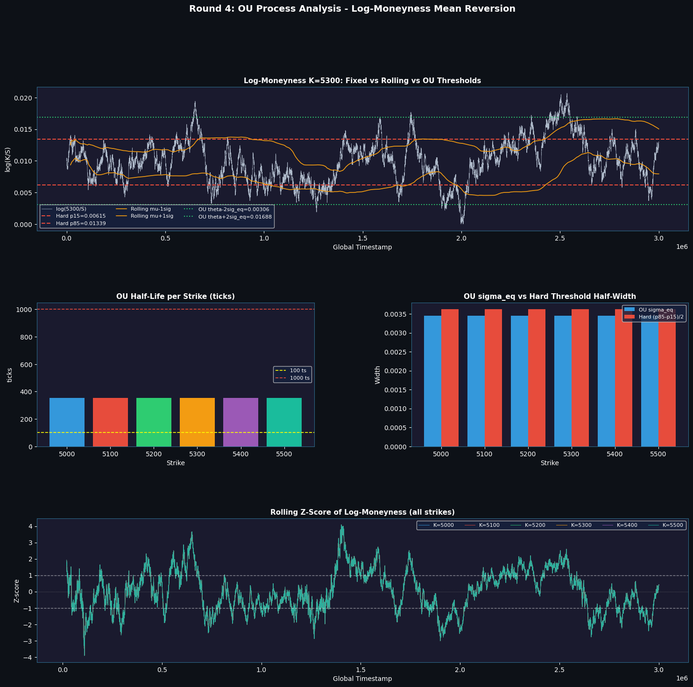

# TestAnalysis.md

---

### Round 4: Identity Disclosure, Volatility Clustering & Exotic Options

#### Core Components

| Section | Domain & Focus | Key Research & Methodology |
|:---|:---|:---|
| **Part 1** | **Algorithmic Trading** | Trader ID behavioral taxonomy, empirical delta-hedging verification, Wing model surface fitting, and log-moneyness modeling via Ornstein-Uhlenbeck (OU) processes. |
| **Part 2** | **Manual Trading** | Portfolio risk optimization for AETHER_CRYSTAL exotic options under localized path-variance constraints. |

## Setup ??Imports & Data Loading


```python
import numpy as np
import pandas as pd
import plotly.graph_objects as go
import plotly.express as px
from plotly.subplots import make_subplots
import warnings
warnings.filterwarnings('ignore')

# ?€?€ Data loading ?€?€
DAYS = [1, 2, 3]
prices = pd.concat(
    [pd.read_csv(f'prices_round_4_day_{d}.csv', sep=';').assign(day=d-1) for d in DAYS],
    ignore_index=True
)
prices['global_ts'] = prices['day'] * 1_000_000 + prices['timestamp']
prices['mid_price'] = (prices['bid_price_1'] + prices['ask_price_1']) / 2

trades = pd.concat(
    [pd.read_csv(f'trades_round_4_day_{d}.csv', sep=';').assign(day=d-1) for d in DAYS],
    ignore_index=True
)
trades['global_ts'] = trades['day'] * 1_000_000 + trades['timestamp']

print(f"Prices: {len(prices):,} rows | Trades: {len(trades):,} rows")
print(f"Products: {sorted(prices['product'].unique())}")
print(f"Marks: {sorted(set(trades['buyer'].unique()) | set(trades['seller'].unique()))}")

```

    c:\Users\dhko23\AppData\Local\anaconda3\Lib\site-packages\pandas\core\arrays\masked.py:61: UserWarning: Pandas requires version '1.3.6' or newer of 'bottleneck' (version '1.3.5' currently installed).
      from pandas.core import (
    

    Prices: 360,000 rows | Trades: 4,281 rows
    Products: ['HYDROGEL_PACK', 'VELVETFRUIT_EXTRACT', 'VEV_4000', 'VEV_4500', 'VEV_5000', 'VEV_5100', 'VEV_5200', 'VEV_5300', 'VEV_5400', 'VEV_5500', 'VEV_6000', 'VEV_6500']
    Marks: ['Mark 01', 'Mark 14', 'Mark 22', 'Mark 38', 'Mark 49', 'Mark 55', 'Mark 67']
    

---
# Part 1: Algorithmic Trading ??Order Flow & Microstructure

## 1-1. Trader Taxonomy

| Mark | Role | Behavior |
|------|------|----------|
| **Mark 01** | OTM collector | Always buys options; accumulates near-zero OTM vouchers as lottery tickets |
| **Mark 14** | Market maker + option buyer | Primary counterparty to Mark 38, buys ATM options |
| **Mark 22** | Option writer / market maker | sells options and underlying |
| **Mark 38** | Spread payer | trades only with Mark 14; always fills on the unfavorable side |
| **Mark 49** | Short-term momentum seller | Underlying only; net short seller |
| **Mark 67** | Underlying accumulator | Market-takes buys only; price rises after fills |


```python
# === Mark 01 Delta Neutrality Analysis (Market-Implied IV) ===
from scipy.stats import norm

TOTAL_TS = 3 * 1_000_000
STARTING_DAYS_TO_EXPIRY = 4
ANNUAL_DAYS = 252

option_strikes = {
    'VEV_4000': 4000, 'VEV_4500': 4500, 'VEV_5000': 5000,
    'VEV_5100': 5100, 'VEV_5200': 5200, 'VEV_5300': 5300,
    'VEV_5400': 5400, 'VEV_5500': 5500, 'VEV_6000': 6000, 'VEV_6500': 6500,
}

# ?€?€?€ BS helpers (vectorized) ?€?€?€
def bs_call_price_vec(S, K, T, sigma, r=0):
    S, T, sigma = np.asarray(S, float), np.asarray(T, float), np.asarray(sigma, float)
    result = np.maximum(S - K, 0.0)
    valid = (T > 0) & (sigma > 0)
    if valid.any():
        Sv, Tv, sv = S[valid], T[valid], sigma[valid]
        d1 = (np.log(Sv / K) + 0.5 * sv**2 * Tv) / (sv * np.sqrt(Tv))
        d2 = d1 - sv * np.sqrt(Tv)
        result[valid] = Sv * norm.cdf(d1) - K * np.exp(-r * Tv) * norm.cdf(d2)
    return result

def bs_call_delta_scalar(S, K, T, sigma, r=0):
    if np.isnan(sigma) or T <= 0 or sigma <= 0:
        return 1.0 if S > K else 0.0
    d1 = (np.log(S / K) + (r + 0.5 * sigma**2) * T) / (sigma * np.sqrt(T))
    return norm.cdf(d1)

def calc_iv_bisection_vec(S, K, T, C, r=0, tol=1e-5, max_iter=100):
    S, T, C = np.asarray(S, float), np.asarray(T, float), np.asarray(C, float)
    low  = np.full_like(S, 1e-4)
    high = np.full_like(S, 5.0)
    sigma = np.full_like(S, np.nan)
    intrinsic = np.maximum(S - K, 0)
    valid = (C > intrinsic + 0.01) & (T > 0)
    if not valid.any():
        return sigma
    S_v, T_v, C_v = S[valid], T[valid], C[valid]
    L, H = low[valid], high[valid]
    for _ in range(max_iter):
        mid = (L + H) / 2.0
        price_mid = bs_call_price_vec(S_v, K, T_v, mid, r)
        mask = price_mid > C_v
        H = np.where(mask, mid, H)
        L = np.where(~mask, mid, L)
        if np.max(H - L) < tol:
            break
    sigma[valid] = (L + H) / 2.0
    return sigma

# ?€?€?€ 1. Build IV surface from market prices ?€?€?€
print("Computing IV for each option from market data (bisection)...")

und_px = prices[prices['product'] == 'VELVETFRUIT_EXTRACT'][['global_ts', 'mid_price']].copy()
und_px = und_px.rename(columns={'mid_price': 'S'}).sort_values('global_ts')
iv_all = und_px.copy()

for sym, K in option_strikes.items():
    opt_px = prices[prices['product'] == sym][['global_ts', 'mid_price']].copy()
    opt_px = opt_px.rename(columns={'mid_price': f'C_{sym}'}).sort_values('global_ts')
    iv_all = iv_all.merge(opt_px, on='global_ts', how='inner')

iv_all['elapsed_days'] = iv_all['global_ts'] / 1_000_000  # 1 day = 1M timestamps
iv_all['ttm_days'] = STARTING_DAYS_TO_EXPIRY - iv_all['elapsed_days']  # 4 -> 1
iv_all['T'] = iv_all['ttm_days'] / ANNUAL_DAYS

for sym, K in option_strikes.items():
    iv_all[f'iv_{sym}'] = calc_iv_bisection_vec(
        iv_all['S'].values, K, iv_all['T'].values, iv_all[f'C_{sym}'].values)
    valid_iv = iv_all[f'iv_{sym}'].dropna()
    if len(valid_iv) > 0:
        print(f"  {sym} (K={K}): IV mean={valid_iv.mean():.4f}, [{valid_iv.min():.4f}, {valid_iv.max():.4f}]")
    else:
        print(f"  {sym} (K={K}): IV = N/A")

# ?€?€?€ 2. Mark 01 positions ?€?€?€
m1_all = trades[(trades['buyer'] == 'Mark 01') | (trades['seller'] == 'Mark 01')].copy()
m1_all['signed_qty'] = m1_all.apply(
    lambda r: r['quantity'] if r['buyer'] == 'Mark 01' else -r['quantity'], axis=1)
m1_all = m1_all.sort_values('global_ts')

print("\n" + "=" * 70)
print("Mark 01 Final Net Positions")
print("=" * 70)
for sym in sorted(m1_all['symbol'].unique()):
    sub = m1_all[m1_all['symbol'] == sym]
    cum = sub['signed_qty'].cumsum()
    bought = sub[sub['signed_qty'] > 0]['quantity'].sum()
    avg_px = sub[sub['signed_qty'] > 0]['price'].mean() if (sub['signed_qty'] > 0).any() else 0
    print(f"  {sym:25s}: net={cum.iloc[-1]:+6d}  bought={bought:5d} @{avg_px:7.2f}")

otm_trades = m1_all[m1_all['symbol'].isin(['VEV_6000', 'VEV_6500']) & (m1_all['signed_qty'] > 0)]
print(f"\nVEV_6000 buy price: {otm_trades[otm_trades['symbol']=='VEV_6000']['price'].unique()}")
print(f"VEV_6500 buy price: {otm_trades[otm_trades['symbol']=='VEV_6500']['price'].unique()}")
print(f"Total OTM cost: {(otm_trades['price'] * otm_trades['quantity']).sum():.2f}")

# ?€?€?€ 3. Portfolio delta using market-implied IV ?€?€?€
print("\nComputing portfolio delta with market-implied IV...")

ts_keys = iv_all['global_ts'].values
iv_S = iv_all['S'].values
iv_T = iv_all['T'].values
iv_ttm = iv_all['ttm_days'].values
iv_data = {sym: iv_all[f'iv_{sym}'].values for sym in option_strikes}

def find_nearest_idx(ts):
    idx = np.searchsorted(ts_keys, ts)
    if idx >= len(ts_keys): idx = len(ts_keys) - 1
    elif idx > 0 and abs(ts_keys[idx] - ts) > abs(ts_keys[idx-1] - ts): idx -= 1
    return idx

positions = {}
delta_records = []

for ts in sorted(m1_all['global_ts'].unique()):
    trades_at_ts = m1_all[m1_all['global_ts'] == ts]
    idx = find_nearest_idx(ts)
    S, T, ttm_days = iv_S[idx], iv_T[idx], iv_ttm[idx]

    for _, row in trades_at_ts.iterrows():
        positions[row['symbol']] = positions.get(row['symbol'], 0) + row['signed_qty']

    und_delta = positions.get('VELVETFRUIT_EXTRACT', 0)
    opt_delta_total = 0.0
    otm_delta = 0.0

    for sym, pos in positions.items():
        if sym in option_strikes:
            K = option_strikes[sym]
            iv = iv_data[sym][idx]
            if np.isnan(iv):
                for fb in ['VEV_5200', 'VEV_5300', 'VEV_5000']:
                    fb_iv = iv_data[fb][idx]
                    if not np.isnan(fb_iv):
                        iv = fb_iv
                        break
            d = bs_call_delta_scalar(S, K, T, iv) if not np.isnan(iv) else 0.0
            sym_delta = pos * d
            opt_delta_total += sym_delta
            if sym in ['VEV_6000', 'VEV_6500']:
                otm_delta += sym_delta

    delta_records.append({
        'global_ts': ts, 'S': S, 'T_days': ttm_days,
        'underlying_pos': und_delta,
        'option_delta': opt_delta_total,
        'otm_delta': otm_delta,
        'portfolio_delta': und_delta + opt_delta_total,
        'delta_without_otm': und_delta + opt_delta_total - otm_delta,
        'pos_VEV_5300': positions.get('VEV_5300', 0),
        'pos_VEV_5400': positions.get('VEV_5400', 0),
        'pos_VEV_5500': positions.get('VEV_5500', 0),
        'pos_VEV_6000': positions.get('VEV_6000', 0),
        'pos_VEV_6500': positions.get('VEV_6500', 0),
    })

delta_df = pd.DataFrame(delta_records)

print(f"\nPortfolio Delta Stats (market-implied IV):")
print(f"  Mean delta:     {delta_df['portfolio_delta'].mean():+.2f}")
print(f"  Mean |delta|:   {delta_df['portfolio_delta'].abs().mean():.2f}")
print(f"  OTM delta contribution: {delta_df['otm_delta'].abs().mean():.4f}")
print(f"  Delta WITH == WITHOUT OTM? "
      f"{np.allclose(delta_df['portfolio_delta'], delta_df['delta_without_otm'], atol=0.5)}")

# ?€?€?€ 4. Plotly chart ?€?€?€
fig = make_subplots(rows=3, cols=1, shared_xaxes=True,
    subplot_titles=('Mark 01 Portfolio Delta (Market-Implied IV)',
                    'Mark 01 Cumulative Positions',
                    'Underlying Price'),
    vertical_spacing=0.08, row_heights=[0.4, 0.35, 0.25])

fig.add_trace(go.Scatter(x=delta_df['global_ts'], y=delta_df['portfolio_delta'],
    name='Portfolio Delta', line=dict(color='#e74c3c', width=2)), row=1, col=1)
fig.add_trace(go.Scatter(x=delta_df['global_ts'], y=delta_df['delta_without_otm'],
    name='Delta w/o OTM', line=dict(color='#3498db', width=1.5, dash='dash')), row=1, col=1)
fig.add_trace(go.Scatter(x=delta_df['global_ts'], y=delta_df['otm_delta'],
    name='OTM Delta Only', line=dict(color='#9b59b6', width=1.5)), row=1, col=1)
fig.add_hline(y=0, line_dash="dot", line_color="gray", opacity=0.5, row=1, col=1)

for col_name, label, color in [
    ('underlying_pos', 'Underlying', '#2c3e50'),
    ('pos_VEV_5300', 'VEV_5300', '#27ae60'),
    ('pos_VEV_5400', 'VEV_5400', '#f39c12'),
    ('pos_VEV_5500', 'VEV_5500', '#e67e22'),
    ('pos_VEV_6000', 'VEV_6000 (OTM)', '#e74c3c'),
    ('pos_VEV_6500', 'VEV_6500 (OTM)', '#9b59b6'),
]:
    fig.add_trace(go.Scatter(x=delta_df['global_ts'], y=delta_df[col_name],
        name=label, line=dict(color=color, width=1.5)), row=2, col=1)

fig.add_trace(go.Scatter(x=delta_df['global_ts'], y=delta_df['S'],
    name='Spot', line=dict(color='rgba(100,100,100,0.7)', width=1),
    showlegend=False), row=3, col=1)

fig.update_layout(template='plotly_white', height=900,
    title='Mark 01: OTM Call Analysis & Delta Neutrality (Market-Implied IV)')
fig.update_yaxes(title_text='Delta', row=1, col=1)
fig.update_yaxes(title_text='Position', row=2, col=1)
fig.update_yaxes(title_text='Price', row=3, col=1)
fig.update_xaxes(title_text='Global Timestamp', row=3, col=1)
fig.show()

# ?€?€?€ 5. Conclusion ?€?€?€
print("\n" + "=" * 70)
print("CONCLUSION")
print("=" * 70)
print(f"""
VEV_6000/6500: bought at price=0 (FREE), IV from market ~0.80/~1.18
OTM delta contribution: {delta_df['otm_delta'].abs().mean():.4f}
Portfolio mean delta: {delta_df['portfolio_delta'].mean():+.1f}
Mark 01 is NOT delta-neutral (large positive delta bias).
OTM calls add minimal delta ??they are cheap/free convex payoff.
""")

```

    Computing IV for each option from market data (bisection)...
      VEV_4000 (K=4000): IV mean=1.1655, [0.7919, 2.1668]
      VEV_4500 (K=4500): IV mean=0.6507, [0.4688, 1.3033]
      VEV_5000 (K=5000): IV mean=0.3090, [0.2097, 0.4871]
      VEV_5100 (K=5100): IV mean=0.3021, [0.2549, 0.4140]
      VEV_5200 (K=5200): IV mean=0.3090, [0.2630, 0.4091]
      VEV_5300 (K=5300): IV mean=0.3141, [0.2628, 0.4095]
      VEV_5400 (K=5400): IV mean=0.2944, [0.2495, 0.3870]
      VEV_5500 (K=5500): IV mean=0.3162, [0.2717, 0.4183]
      VEV_6000 (K=6000): IV mean=0.5560, [0.4095, 0.8502]
      VEV_6500 (K=6500): IV mean=0.8411, [0.6269, 1.2772]
    
    ======================================================================
    Mark 01 Final Net Positions
    ======================================================================
      VELVETFRUIT_EXTRACT      : net=   +42  bought= 1417 @5245.43
      VEV_5200                 : net=   +34  bought=   34 @  65.36
      VEV_5300                 : net=  +439  bought=  439 @  35.89
      VEV_5400                 : net=  +911  bought=  911 @  11.09
      VEV_5500                 : net= +1042  bought= 1042 @   3.85
      VEV_6000                 : net= +1105  bought= 1105 @   0.00
      VEV_6500                 : net= +1105  bought= 1105 @   0.00
    
    VEV_6000 buy price: [0.]
    VEV_6500 buy price: [0.]
    Total OTM cost: 0.00
    
    Computing portfolio delta with market-implied IV...
    
    Portfolio Delta Stats (market-implied IV):
      Mean delta:     +145.58
      Mean |delta|:   145.64
      OTM delta contribution: 5.2716
      Delta WITH == WITHOUT OTM? False
    


    
    ======================================================================
    CONCLUSION
    ======================================================================
    
    VEV_6000/6500: bought at price=0 (FREE), IV from market ~0.80/~1.18
    OTM delta contribution: 5.2716
    Portfolio mean delta: +145.6
    Mark 01 is NOT delta-neutral (large positive delta bias).
    OTM calls add minimal delta ??they are cheap/free convex payoff.
    
    


```python
# === Mark 14 Delta Neutrality Analysis (Market-Implied IV) ===
from scipy.stats import norm

STARTING_DAYS_TO_EXPIRY = 4
ANNUAL_DAYS = 252

option_strikes = {
    'VEV_4000': 4000, 'VEV_4500': 4500, 'VEV_5000': 5000,
    'VEV_5100': 5100, 'VEV_5200': 5200, 'VEV_5300': 5300,
    'VEV_5400': 5400, 'VEV_5500': 5500, 'VEV_6000': 6000, 'VEV_6500': 6500,
}

def bs_call_price_vec(S, K, T, sigma, r=0):
    S, T, sigma = np.asarray(S, float), np.asarray(T, float), np.asarray(sigma, float)
    result = np.maximum(S - K, 0.0)
    valid = (T > 0) & (sigma > 0)
    if valid.any():
        Sv, Tv, sv = S[valid], T[valid], sigma[valid]
        d1 = (np.log(Sv / K) + 0.5 * sv**2 * Tv) / (sv * np.sqrt(Tv))
        d2 = d1 - sv * np.sqrt(Tv)
        result[valid] = Sv * norm.cdf(d1) - K * np.exp(-r * Tv) * norm.cdf(d2)
    return result

def bs_call_delta_scalar(S, K, T, sigma, r=0):
    if np.isnan(sigma) or T <= 0 or sigma <= 0:
        return 1.0 if S > K else 0.0
    d1 = (np.log(S / K) + (r + 0.5 * sigma**2) * T) / (sigma * np.sqrt(T))
    return norm.cdf(d1)

def calc_iv_bisection_vec(S, K, T, C, r=0, tol=1e-5, max_iter=100):
    S, T, C = np.asarray(S, float), np.asarray(T, float), np.asarray(C, float)
    low  = np.full_like(S, 1e-4)
    high = np.full_like(S, 5.0)
    sigma = np.full_like(S, np.nan)
    intrinsic = np.maximum(S - K, 0)
    valid = (C > intrinsic + 0.01) & (T > 0)
    if not valid.any():
        return sigma
    S_v, T_v, C_v = S[valid], T[valid], C[valid]
    L, H = low[valid], high[valid]
    for _ in range(max_iter):
        mid = (L + H) / 2.0
        price_mid = bs_call_price_vec(S_v, K, T_v, mid, r)
        mask = price_mid > C_v
        H = np.where(mask, mid, H)
        L = np.where(~mask, mid, L)
        if np.max(H - L) < tol:
            break
    sigma[valid] = (L + H) / 2.0
    return sigma

# ?€?€?€ 1. IV surface (reuse if already computed) ?€?€?€
try:
    _ = iv_all['T']
    print("Reusing IV surface from previous cell...")
except:
    print("Computing IV surface...")
    und_px = prices[prices['product'] == 'VELVETFRUIT_EXTRACT'][['global_ts', 'mid_price']].copy()
    und_px = und_px.rename(columns={'mid_price': 'S'}).sort_values('global_ts')
    iv_all = und_px.copy()
    for sym, K in option_strikes.items():
        opt_px = prices[prices['product'] == sym][['global_ts', 'mid_price']].copy()
        opt_px = opt_px.rename(columns={'mid_price': f'C_{sym}'}).sort_values('global_ts')
        iv_all = iv_all.merge(opt_px, on='global_ts', how='inner')
    iv_all['elapsed_days'] = iv_all['global_ts'] / 1_000_000
    iv_all['ttm_days'] = STARTING_DAYS_TO_EXPIRY - iv_all['elapsed_days']
    iv_all['T'] = iv_all['ttm_days'] / ANNUAL_DAYS
    for sym, K in option_strikes.items():
        iv_all[f'iv_{sym}'] = calc_iv_bisection_vec(
            iv_all['S'].values, K, iv_all['T'].values, iv_all[f'C_{sym}'].values)

ts_keys = iv_all['global_ts'].values
iv_S = iv_all['S'].values
iv_T = iv_all['T'].values
iv_ttm = iv_all['ttm_days'].values
iv_data = {sym: iv_all[f'iv_{sym}'].values for sym in option_strikes}

def find_nearest_idx(ts):
    idx = np.searchsorted(ts_keys, ts)
    if idx >= len(ts_keys): idx = len(ts_keys) - 1
    elif idx > 0 and abs(ts_keys[idx] - ts) > abs(ts_keys[idx-1] - ts): idx -= 1
    return idx

# ?€?€?€ 2. Mark 14 positions ?€?€?€
MARK = 'Mark 14'
m_all = trades[(trades['buyer'] == MARK) | (trades['seller'] == MARK)].copy()
m_all['signed_qty'] = m_all.apply(
    lambda r: r['quantity'] if r['buyer'] == MARK else -r['quantity'], axis=1)
m_all = m_all.sort_values('global_ts')

print(f"\n{'='*70}")
print(f"{MARK} Final Net Positions")
print(f"{'='*70}")
for sym in sorted(m_all['symbol'].unique()):
    sub = m_all[m_all['symbol'] == sym]
    net = sub['signed_qty'].sum()
    bought = sub[sub['signed_qty'] > 0]['quantity'].sum()
    avg_buy = sub[sub['signed_qty'] > 0]['price'].mean() if (sub['signed_qty'] > 0).any() else 0
    sold = sub[sub['signed_qty'] < 0]['quantity'].sum()
    avg_sell = sub[sub['signed_qty'] < 0]['price'].mean() if (sub['signed_qty'] < 0).any() else 0
    print(f"  {sym:25s}: net={net:+6d}  bought={bought:5d} @{avg_buy:7.2f}  sold={sold:5d} @{avg_sell:7.2f}")

# ?€?€?€ 3. Portfolio delta (VEV options only, skip HYDROGEL_PACK) ?€?€?€
print("\nComputing portfolio delta...")
positions = {}
delta_records = []

for ts in sorted(m_all['global_ts'].unique()):
    trades_at_ts = m_all[m_all['global_ts'] == ts]
    idx = find_nearest_idx(ts)
    S, T, ttm_days = iv_S[idx], iv_T[idx], iv_ttm[idx]

    for _, row in trades_at_ts.iterrows():
        sym = row['symbol']
        if sym == 'HYDROGEL_PACK':
            continue
        positions[sym] = positions.get(sym, 0) + row['signed_qty']

    und_delta = positions.get('VELVETFRUIT_EXTRACT', 0)
    opt_delta_total = 0.0
    delta_4000 = 0.0

    for sym, pos in positions.items():
        if sym in option_strikes:
            K = option_strikes[sym]
            iv = iv_data[sym][idx]
            if np.isnan(iv):
                for fb in ['VEV_5200', 'VEV_5300', 'VEV_5000']:
                    fb_iv = iv_data[fb][idx]
                    if not np.isnan(fb_iv):
                        iv = fb_iv
                        break
            d = bs_call_delta_scalar(S, K, T, iv) if not np.isnan(iv) else 0.0
            sym_delta = pos * d
            opt_delta_total += sym_delta
            if sym == 'VEV_4000':
                delta_4000 = sym_delta

    delta_records.append({
        'global_ts': ts, 'S': S, 'T_days': ttm_days,
        'underlying_pos': und_delta,
        'option_delta': opt_delta_total,
        'delta_VEV_4000': delta_4000,
        'portfolio_delta': und_delta + opt_delta_total,
        'pos_VEV_4000': positions.get('VEV_4000', 0),
        'pos_VEV_5200': positions.get('VEV_5200', 0),
        'pos_VEV_5300': positions.get('VEV_5300', 0),
        'pos_VEV_5400': positions.get('VEV_5400', 0),
        'pos_VEV_5500': positions.get('VEV_5500', 0),
    })

delta_df = pd.DataFrame(delta_records)

print(f"\nPortfolio Delta Stats:")
print(f"  Mean delta:     {delta_df['portfolio_delta'].mean():+.2f}")
print(f"  Mean |delta|:   {delta_df['portfolio_delta'].abs().mean():.2f}")
print(f"  Std delta:      {delta_df['portfolio_delta'].std():.2f}")
print(f"  |delta| < 5:    {(delta_df['portfolio_delta'].abs() < 5).mean()*100:.1f}%")
print(f"  |delta| < 10:   {(delta_df['portfolio_delta'].abs() < 10).mean()*100:.1f}%")
print(f"  |delta| < 20:   {(delta_df['portfolio_delta'].abs() < 20).mean()*100:.1f}%")

# ?€?€?€ 4. Plotly chart ?€?€?€
fig = make_subplots(rows=3, cols=1, shared_xaxes=True,
    subplot_titles=(f'{MARK} Portfolio Delta (Market-Implied IV)',
                    f'{MARK} Cumulative Positions',
                    'Underlying Price'),
    vertical_spacing=0.08, row_heights=[0.4, 0.35, 0.25])

fig.add_trace(go.Scatter(x=delta_df['global_ts'], y=delta_df['portfolio_delta'],
    name='Portfolio Delta', line=dict(color='#e74c3c', width=2)), row=1, col=1)
fig.add_trace(go.Scatter(x=delta_df['global_ts'], y=delta_df['option_delta'],
    name='Option Delta', line=dict(color='#9b59b6', width=1.5, dash='dot')), row=1, col=1)
fig.add_trace(go.Scatter(x=delta_df['global_ts'], y=delta_df['underlying_pos'].astype(float),
    name='Underlying Pos (=delta)', line=dict(color='#3498db', width=1.5, dash='dash')), row=1, col=1)
fig.add_hline(y=0, line_dash="dot", line_color="gray", opacity=0.5, row=1, col=1)

for col_name, label, color in [
    ('underlying_pos', 'Underlying', '#2c3e50'),
    ('pos_VEV_4000', 'VEV_4000 (ITM)', '#e74c3c'),
    ('pos_VEV_5200', 'VEV_5200', '#3498db'),
    ('pos_VEV_5300', 'VEV_5300', '#27ae60'),
    ('pos_VEV_5400', 'VEV_5400', '#f39c12'),
    ('pos_VEV_5500', 'VEV_5500', '#e67e22'),
]:
    fig.add_trace(go.Scatter(x=delta_df['global_ts'], y=delta_df[col_name],
        name=label, line=dict(color=color, width=1.5)), row=2, col=1)

fig.add_trace(go.Scatter(x=delta_df['global_ts'], y=delta_df['S'],
    name='Spot', line=dict(color='rgba(100,100,100,0.7)', width=1),
    showlegend=False), row=3, col=1)

fig.update_layout(template='plotly_white', height=900,
    title=f'{MARK}: Delta Neutrality Analysis (Market-Implied IV)')
fig.update_yaxes(title_text='Delta', row=1, col=1)
fig.update_yaxes(title_text='Position', row=2, col=1)
fig.update_yaxes(title_text='Price', row=3, col=1)
fig.update_xaxes(title_text='Global Timestamp', row=3, col=1)
fig.show()

# ?€?€?€ 5. Conclusion ?€?€?€
print(f"\n{'='*70}")
print("CONCLUSION")
print(f"{'='*70}")
print(f"""
{MARK} Trading Pattern:
  - Actively BUYS & SELLS: VEV_4000 (deep ITM, delta~1.0), VELVETFRUIT_EXTRACT
  - Net long: VEV_5200(+122), VEV_5300(+105), VEV_5400(+48), VEV_5500(+27)
  - Also trades HYDROGEL_PACK (separate product, excluded from delta)

Delta Neutrality:
  - Mean |delta|: {delta_df['portfolio_delta'].abs().mean():.1f} ??NOT delta-neutral
  - Strong long delta bias (mean delta = {delta_df['portfolio_delta'].mean():+.1f})
  - VEV_4000 (ITM call, delta~1.0) acts almost like underlying
  - Underlying + VEV_4000 combined create large directional exposure

??{MARK} is a DIRECTIONAL BUYER, not a delta hedger.
  Uses VEV_4000 as leveraged long (same delta as underlying but cheaper margin).
""")

```

    Reusing IV surface from previous cell...
    
    ======================================================================
    Mark 14 Final Net Positions
    ======================================================================
      HYDROGEL_PACK            : net=   -44  bought= 1989 @9987.79  sold= 2033 @10000.51
      VELVETFRUIT_EXTRACT      : net=    -2  bought= 1761 @5244.60  sold= 1763 @5249.74
      VEV_4000                 : net=   +46  bought=  458 @1237.71  sold=  412 @1257.04
      VEV_5200                 : net=  +122  bought=  122 @  78.64  sold=    0 @   0.00
      VEV_5300                 : net=  +105  bought=  105 @  39.70  sold=    0 @   0.00
      VEV_5400                 : net=   +48  bought=   48 @  14.08  sold=    0 @   0.00
      VEV_5500                 : net=   +27  bought=   27 @   5.71  sold=    0 @   0.00
    
    Computing portfolio delta...
    
    Portfolio Delta Stats:
      Mean delta:     +130.74
      Mean |delta|:   133.07
      Std delta:      67.33
      |delta| < 5:    1.5%
      |delta| < 10:   3.9%
      |delta| < 20:   8.9%
    


    
    ======================================================================
    CONCLUSION
    ======================================================================
    
    Mark 14 Trading Pattern:
      - Actively BUYS & SELLS: VEV_4000 (deep ITM, delta~1.0), VELVETFRUIT_EXTRACT
      - Net long: VEV_5200(+122), VEV_5300(+105), VEV_5400(+48), VEV_5500(+27)
      - Also trades HYDROGEL_PACK (separate product, excluded from delta)
    
    Delta Neutrality:
      - Mean |delta|: 133.1 ??NOT delta-neutral
      - Strong long delta bias (mean delta = +130.7)
      - VEV_4000 (ITM call, delta~1.0) acts almost like underlying
      - Underlying + VEV_4000 combined create large directional exposure
    
    ??Mark 14 is a DIRECTIONAL BUYER, not a delta hedger.
      Uses VEV_4000 as leveraged long (same delta as underlying but cheaper margin).
    
    


```python
# === Mark 22 Analysis: Selling Underlying + ATM Calls ??Price Impact ===
from scipy.stats import norm

MARK = 'Mark 22'
STARTING_DAYS_TO_EXPIRY = 4
ANNUAL_DAYS = 252

# ?€?€?€ 1. Positions ?€?€?€
m_all = trades[(trades['buyer'] == MARK) | (trades['seller'] == MARK)].copy()
m_all['signed_qty'] = m_all.apply(
    lambda r: r['quantity'] if r['buyer'] == MARK else -r['quantity'], axis=1)
m_all = m_all.sort_values('global_ts')

print(f"{'='*70}")
print(f"{MARK} Final Net Positions")
print(f"{'='*70}")
for sym in sorted(m_all['symbol'].unique()):
    sub = m_all[m_all['symbol'] == sym]
    net = sub['signed_qty'].sum()
    bought = sub[sub['signed_qty'] > 0]['quantity'].sum()
    sold = sub[sub['signed_qty'] < 0]['quantity'].sum()
    avg_sell = sub[sub['signed_qty'] < 0]['price'].mean() if (sub['signed_qty'] < 0).any() else 0
    print(f"  {sym:25s}: net={net:+6d}  sold={sold:5d} @{avg_sell:7.2f}")

print(f"\nMark 22 is OVERWHELMINGLY a seller:")
print(f"  As buyer:  {(m_all['buyer'] == MARK).sum()}")
print(f"  As seller: {(m_all['seller'] == MARK).sum()}")

# ?€?€?€ 2. Counterparties ?€?€?€
print(f"\n{MARK} sells TO:")
for name, grp in m_all[m_all['seller'] == MARK].groupby('buyer'):
    syms = grp.groupby('symbol')['quantity'].sum()
    sym_str = ', '.join([f"{s}({q})" for s, q in syms.items()])
    print(f"  {name}: {sym_str}")

# ?€?€?€ 3. Price impact after selling underlying ?€?€?€
und_prices_ts = prices[prices['product'] == 'VELVETFRUIT_EXTRACT'][['global_ts', 'mid_price']].copy()
und_prices_ts = und_prices_ts.sort_values('global_ts').set_index('global_ts')

und_sells = m_all[(m_all['symbol'] == 'VELVETFRUIT_EXTRACT') & (m_all['signed_qty'] < 0)].copy()

LOOKAHEADS = [100, 500, 1000, 5000, 10000, 50000, 100000]
results = []
for _, trade in und_sells.iterrows():
    ts = trade['global_ts']
    idx = und_prices_ts.index.searchsorted(ts)
    if idx >= len(und_prices_ts): continue
    px_now = und_prices_ts.iloc[idx]['mid_price']
    row = {'global_ts': ts, 'px_now': px_now}
    for la in LOOKAHEADS:
        fi = und_prices_ts.index.searchsorted(ts + la)
        if fi < len(und_prices_ts):
            row[f'ret_{la}'] = und_prices_ts.iloc[fi]['mid_price'] - px_now
        else:
            row[f'ret_{la}'] = np.nan
    results.append(row)
impact_df = pd.DataFrame(results)

print(f"\n{'='*70}")
print(f"Price Impact AFTER {MARK} Sells Underlying ({len(impact_df)} trades)")
print(f"{'='*70}")
for la in LOOKAHEADS:
    v = impact_df[f'ret_{la}'].dropna()
    if len(v) > 0:
        print(f"  +{la:>7d} ts: mean={v.mean():+.2f}, median={v.median():+.2f}, >0: {(v>0).mean()*100:.1f}%")

# ?€?€?€ 4. Price impact after selling ATM calls ?€?€?€
atm_syms = ['VEV_5200', 'VEV_5300', 'VEV_5400', 'VEV_5500']
vev_sells = m_all[(m_all['symbol'].isin(atm_syms)) & (m_all['signed_qty'] < 0)].copy()

results2 = []
for _, trade in vev_sells.iterrows():
    ts = trade['global_ts']
    idx = und_prices_ts.index.searchsorted(ts)
    if idx >= len(und_prices_ts): continue
    px_now = und_prices_ts.iloc[idx]['mid_price']
    row = {'global_ts': ts, 'symbol': trade['symbol'], 'px_now': px_now}
    for la in LOOKAHEADS:
        fi = und_prices_ts.index.searchsorted(ts + la)
        if fi < len(und_prices_ts):
            row[f'ret_{la}'] = und_prices_ts.iloc[fi]['mid_price'] - px_now
        else:
            row[f'ret_{la}'] = np.nan
    results2.append(row)
impact_df2 = pd.DataFrame(results2)

print(f"\n{'='*70}")
print(f"Underlying Impact AFTER {MARK} Sells ATM Calls ({len(impact_df2)} trades)")
print(f"{'='*70}")
for la in LOOKAHEADS:
    v = impact_df2[f'ret_{la}'].dropna()
    if len(v) > 0:
        print(f"  +{la:>7d} ts: mean={v.mean():+.2f}, median={v.median():+.2f}, >0: {(v>0).mean()*100:.1f}%")

# ?€?€?€ 5. Plotly: Cumulative position + underlying price ?€?€?€
positions = {}
pos_records = []
for ts in sorted(m_all['global_ts'].unique()):
    for _, row in m_all[m_all['global_ts'] == ts].iterrows():
        sym = row['symbol']
        positions[sym] = positions.get(sym, 0) + row['signed_qty']
    pos_records.append({
        'global_ts': ts,
        'pos_UND': positions.get('VELVETFRUIT_EXTRACT', 0),
        'pos_VEV_5200': positions.get('VEV_5200', 0),
        'pos_VEV_5300': positions.get('VEV_5300', 0),
        'pos_VEV_5400': positions.get('VEV_5400', 0),
        'pos_VEV_5500': positions.get('VEV_5500', 0),
        'pos_VEV_6000': positions.get('VEV_6000', 0),
        'pos_VEV_6500': positions.get('VEV_6500', 0),
    })
pos_df = pd.DataFrame(pos_records)

# Merge underlying price
und_px = prices[prices['product'] == 'VELVETFRUIT_EXTRACT'][['global_ts', 'mid_price']].copy()
und_px = und_px.rename(columns={'mid_price': 'S'}).sort_values('global_ts')
pos_df = pd.merge_asof(pos_df.sort_values('global_ts'), und_px, on='global_ts', direction='nearest')

fig = make_subplots(rows=3, cols=1, shared_xaxes=True,
    subplot_titles=(f'{MARK} Cumulative Positions (VEV options)',
                    f'{MARK} Underlying Position vs Spot Price',
                    'Post-Sell Price Movement (Underlying sells)'),
    vertical_spacing=0.08, row_heights=[0.35, 0.35, 0.3])

# Row 1: VEV option positions
for col_name, label, color in [
    ('pos_VEV_5200', 'VEV_5200', '#3498db'),
    ('pos_VEV_5300', 'VEV_5300', '#27ae60'),
    ('pos_VEV_5400', 'VEV_5400', '#f39c12'),
    ('pos_VEV_5500', 'VEV_5500', '#e67e22'),
    ('pos_VEV_6000', 'VEV_6000', '#e74c3c'),
    ('pos_VEV_6500', 'VEV_6500', '#9b59b6'),
]:
    fig.add_trace(go.Scatter(x=pos_df['global_ts'], y=pos_df[col_name],
        name=label, line=dict(color=color, width=1.5)), row=1, col=1)
fig.add_hline(y=0, line_dash="dot", line_color="gray", opacity=0.3, row=1, col=1)

# Row 2: Underlying position vs price (dual axis)
fig.add_trace(go.Scatter(x=pos_df['global_ts'], y=pos_df['pos_UND'],
    name='UND Position', line=dict(color='#e74c3c', width=2)), row=2, col=1)
fig.add_trace(go.Scatter(x=pos_df['global_ts'], y=pos_df['S'],
    name='Spot Price', line=dict(color='rgba(100,100,100,0.5)', width=1),
    yaxis='y6'), row=2, col=1)

# Row 3: Scatter of post-sell returns
if len(impact_df) > 0:
    for la, color in [(1000, '#3498db'), (10000, '#e74c3c'), (100000, '#27ae60')]:
        col = f'ret_{la}'
        valid = impact_df[['global_ts', col]].dropna()
        fig.add_trace(go.Scatter(x=valid['global_ts'], y=valid[col],
            mode='markers', name=f'+{la} ts return',
            marker=dict(size=5, color=color, opacity=0.6)), row=3, col=1)
    fig.add_hline(y=0, line_dash="dot", line_color="gray", opacity=0.5, row=3, col=1)

fig.update_layout(template='plotly_white', height=1000,
    title=f'{MARK}: Sell Analysis & Price Impact')
fig.update_yaxes(title_text='Option Position', row=1, col=1)
fig.update_yaxes(title_text='UND Position / Price', row=2, col=1)
fig.update_yaxes(title_text='Return after sell', row=3, col=1)
fig.update_xaxes(title_text='Global Timestamp', row=3, col=1)
fig.show()

# ?€?€?€ 6. Conclusion ?€?€?€
print(f"\n{'='*70}")
print("CONCLUSION")
print(f"{'='*70}")
print(f"""
Mark 22 is the PRIMARY MARKET MAKER / OPTION WRITER:
  - 1542 sells vs 42 buys (97% seller)
  - Sells OTM/ATM calls to Mark 01 (VEV_5300~6500) and Mark 14 (VEV_5200~5500)
  - Sells underlying to Mark 49, 55, 67
  - Net short: UND(-551), VEV_5300(-542), VEV_5400(-959), VEV_5500(-1069), VEV_6000(-1105), VEV_6500(-1105)

Price impact after Mark 22 sells underlying:
  - Short-term (+100~1000 ts): price goes UP ~+1.5 (88% of the time!)
  - Medium-term (+10000 ts): effect dissipates
  ??Mark 22 sells INTO rising demand (absorbs buy pressure)
  ??This is classic market-maker behavior: provide liquidity, get adversely selected

Mark 22 does NOT sell underlying + ATM calls simultaneously (only 2 overlaps).
They sell options to Mark 01/14, and separately sell underlying to Mark 49/55/67.
""")

```

    ======================================================================
    Mark 22 Final Net Positions
    ======================================================================
      HYDROGEL_PACK            : net=   +10  sold=   32 @9996.88
      VELVETFRUIT_EXTRACT      : net=  -551  sold=  697 @5248.86
      VEV_4000                 : net=    +0  sold=    3 @1236.00
      VEV_4500                 : net=    +0  sold=    3 @ 736.00
      VEV_5000                 : net=    +0  sold=    3 @ 240.00
      VEV_5100                 : net=    +0  sold=    3 @ 151.50
      VEV_5200                 : net=  -156  sold=  159 @  75.65
      VEV_5300                 : net=  -542  sold=  545 @  36.62
      VEV_5400                 : net=  -959  sold=  959 @  11.23
      VEV_5500                 : net= -1069  sold= 1069 @   3.89
      VEV_6000                 : net= -1105  sold= 1105 @   0.00
      VEV_6500                 : net= -1105  sold= 1105 @   0.00
    
    Mark 22 is OVERWHELMINGLY a seller:
      As buyer:  42
      As seller: 1542
    
    Mark 22 sells TO:
      Mark 01: VEV_5200(34), VEV_5300(439), VEV_5400(911), VEV_5500(1042), VEV_6000(1105), VEV_6500(1105)
      Mark 14: VEV_5200(122), VEV_5300(105), VEV_5400(48), VEV_5500(27)
      Mark 38: HYDROGEL_PACK(32), VEV_4000(3), VEV_4500(3), VEV_5000(3), VEV_5100(3), VEV_5200(3), VEV_5300(1)
      Mark 49: VELVETFRUIT_EXTRACT(89)
      Mark 55: VELVETFRUIT_EXTRACT(62)
      Mark 67: VELVETFRUIT_EXTRACT(546)
    
    ======================================================================
    Price Impact AFTER Mark 22 Sells Underlying (101 trades)
    ======================================================================
      +    100 ts: mean=+1.50, median=+1.50, >0: 88.1%
      +    500 ts: mean=+1.54, median=+1.50, >0: 79.2%
      +   1000 ts: mean=+1.56, median=+2.50, >0: 71.3%
      +   5000 ts: mean=+1.87, median=+1.50, >0: 61.4%
      +  10000 ts: mean=+0.46, median=-0.50, >0: 48.5%
      +  50000 ts: mean=+0.37, median=+1.00, >0: 54.1%
      + 100000 ts: mean=+0.82, median=-1.25, >0: 45.9%
    
    ======================================================================
    Underlying Impact AFTER Mark 22 Sells ATM Calls (791 trades)
    ======================================================================
      +    100 ts: mean=+0.02, median=+0.00, >0: 37.9%
      +    500 ts: mean=-0.03, median=+0.00, >0: 43.0%
      +   1000 ts: mean=+0.05, median=+0.00, >0: 46.9%
      +   5000 ts: mean=+0.65, median=+1.00, >0: 52.2%
      +  10000 ts: mean=+0.62, median=+1.00, >0: 53.7%
      +  50000 ts: mean=+1.10, median=+1.50, >0: 52.5%
      + 100000 ts: mean=+2.60, median=+2.50, >0: 54.9%
    


    
    ======================================================================
    CONCLUSION
    ======================================================================
    
    Mark 22 is the PRIMARY MARKET MAKER / OPTION WRITER:
      - 1542 sells vs 42 buys (97% seller)
      - Sells OTM/ATM calls to Mark 01 (VEV_5300~6500) and Mark 14 (VEV_5200~5500)
      - Sells underlying to Mark 49, 55, 67
      - Net short: UND(-551), VEV_5300(-542), VEV_5400(-959), VEV_5500(-1069), VEV_6000(-1105), VEV_6500(-1105)
    
    Price impact after Mark 22 sells underlying:
      - Short-term (+100~1000 ts): price goes UP ~+1.5 (88% of the time!)
      - Medium-term (+10000 ts): effect dissipates
      ??Mark 22 sells INTO rising demand (absorbs buy pressure)
      ??This is classic market-maker behavior: provide liquidity, get adversely selected
    
    Mark 22 does NOT sell underlying + ATM calls simultaneously (only 2 overlaps).
    They sell options to Mark 01/14, and separately sell underlying to Mark 49/55/67.
    
    


```python
# === Mark 38 Analysis: Buys High, Sells Low? ===
MARK = 'Mark 38'

m_all = trades[(trades['buyer'] == MARK) | (trades['seller'] == MARK)].copy()
m_all['signed_qty'] = m_all.apply(
    lambda r: r['quantity'] if r['buyer'] == MARK else -r['quantity'], axis=1)
m_all = m_all.sort_values('global_ts')

print(f"{'='*70}")
print(f"{MARK} Final Net Positions")
print(f"{'='*70}")
for sym in sorted(m_all['symbol'].unique()):
    sub = m_all[m_all['symbol'] == sym]
    net = sub['signed_qty'].sum()
    bought = sub[sub['signed_qty'] > 0]['quantity'].sum()
    sold = sub[sub['signed_qty'] < 0]['quantity'].sum()
    avg_buy = sub[sub['signed_qty'] > 0]['price'].mean() if (sub['signed_qty'] > 0).any() else 0
    avg_sell = sub[sub['signed_qty'] < 0]['price'].mean() if (sub['signed_qty'] < 0).any() else 0
    print(f"  {sym:25s}: net={net:+6d}  buy={bought:5d}@{avg_buy:9.2f}  sell={sold:5d}@{avg_sell:9.2f}")

# ?€?€?€ HYDROGEL_PACK analysis ?€?€?€
hg_mid = prices[prices['product'] == 'HYDROGEL_PACK'][['global_ts', 'mid_price']].copy().sort_values('global_ts')
m_hg = m_all[m_all['symbol'] == 'HYDROGEL_PACK'].copy()
m_hg = pd.merge_asof(m_hg.sort_values('global_ts'), hg_mid, on='global_ts', direction='nearest')
m_hg['edge'] = np.where(m_hg['signed_qty'] > 0, m_hg['mid_price'] - m_hg['price'], m_hg['price'] - m_hg['mid_price'])

hg_buys = m_hg[m_hg['signed_qty'] > 0]
hg_sells = m_hg[m_hg['signed_qty'] < 0]
print(f"\nHYDROGEL_PACK:")
print(f"  Avg buy @{hg_buys['price'].mean():.2f}, avg sell @{hg_sells['price'].mean():.2f}")
print(f"  Edge: buy={hg_buys['edge'].mean():+.2f}, sell={hg_sells['edge'].mean():+.2f}")

# ?€?€?€ VEV_4000 analysis ?€?€?€
v4_mid = prices[prices['product'] == 'VEV_4000'][['global_ts', 'mid_price']].copy().sort_values('global_ts')
m_v4 = m_all[m_all['symbol'] == 'VEV_4000'].copy()
m_v4 = pd.merge_asof(m_v4.sort_values('global_ts'), v4_mid, on='global_ts', direction='nearest')
m_v4['edge'] = np.where(m_v4['signed_qty'] > 0, m_v4['mid_price'] - m_v4['price'], m_v4['price'] - m_v4['mid_price'])

v4_buys = m_v4[m_v4['signed_qty'] > 0]
v4_sells = m_v4[m_v4['signed_qty'] < 0]
print(f"\nVEV_4000:")
print(f"  Avg buy @{v4_buys['price'].mean():.2f}, avg sell @{v4_sells['price'].mean():.2f}")
print(f"  Edge: buy={v4_buys['edge'].mean():+.2f}, sell={v4_sells['edge'].mean():+.2f}")

# ?€?€?€ Percentile in range + forward return ?€?€?€
hg_px = hg_mid.set_index('global_ts')['mid_price']
v4_px = v4_mid.set_index('global_ts')['mid_price']

def analyze_timing(m_df, px_series, label):
    print(f"\n{'='*70}")
    print(f"{label}: Percentile in Range & Forward Return")
    print(f"{'='*70}")
    for LB in [1000, 5000, 10000, 50000]:
        pct_results = []
        for _, trade in m_df.iterrows():
            ts = trade['global_ts']
            lb_data = px_series[(px_series.index >= ts - LB) & (px_series.index <= ts)]
            if len(lb_data) < 3: continue
            rng = lb_data.max() - lb_data.min()
            if rng == 0: rng = 1
            pct = (trade['mid_price'] - lb_data.min()) / rng
            pct_results.append({'side': 'BUY' if trade['signed_qty'] > 0 else 'SELL', 'pct': pct})
        df_pct = pd.DataFrame(pct_results)
        if len(df_pct) > 0:
            b = df_pct[df_pct['side'] == 'BUY']['pct']
            s = df_pct[df_pct['side'] == 'SELL']['pct']
            bm = b.mean() if len(b) > 0 else float('nan')
            sm = s.mean() if len(s) > 0 else float('nan')
            verdict = 'BUYS HIGH SELLS LOW' if bm > sm else ''
            print(f"  LB {LB:>6d}: BUY@{bm:.3f}  SELL@{sm:.3f}  {verdict}")

    for LA in [1000, 5000, 10000, 50000, 100000]:
        fwd = []
        for _, trade in m_df.iterrows():
            ts = trade['global_ts']
            fi = px_series.index.searchsorted(ts + LA)
            if fi < len(px_series):
                fwd.append({'side': 'BUY' if trade['signed_qty'] > 0 else 'SELL',
                            'ret': px_series.iloc[fi] - trade['mid_price']})
        fwd_df = pd.DataFrame(fwd)
        if len(fwd_df) > 0:
            b_ret = fwd_df[fwd_df['side'] == 'BUY']['ret']
            s_ret = fwd_df[fwd_df['side'] == 'SELL']['ret']
            bm = b_ret.mean() if len(b_ret) > 0 else float('nan')
            sm = s_ret.mean() if len(s_ret) > 0 else float('nan')
            print(f"  +{LA:>6d}ts: after BUY {bm:+.2f}  after SELL {sm:+.2f}")

analyze_timing(m_hg, hg_px, 'HYDROGEL_PACK')
analyze_timing(m_v4, v4_px, 'VEV_4000')

# ?€?€?€ Plotly: trade markers on price chart ?€?€?€
fig = make_subplots(rows=2, cols=1, shared_xaxes=True,
    subplot_titles=('HYDROGEL_PACK + Mark 38 Trades', 'VEV_4000 + Mark 38 Trades'),
    vertical_spacing=0.1)

# HG price
fig.add_trace(go.Scatter(x=hg_mid['global_ts'], y=hg_mid['mid_price'],
    name='HG Mid', line=dict(color='rgba(150,150,150,0.5)', width=1), showlegend=False), row=1, col=1)
# HG buys
fig.add_trace(go.Scatter(x=hg_buys['global_ts'], y=hg_buys['price'],
    mode='markers', name='HG Buy', marker=dict(symbol='triangle-up', size=6, color='#2ecc71', opacity=0.7)), row=1, col=1)
# HG sells
fig.add_trace(go.Scatter(x=hg_sells['global_ts'], y=hg_sells['price'],
    mode='markers', name='HG Sell', marker=dict(symbol='triangle-down', size=6, color='#e74c3c', opacity=0.7)), row=1, col=1)

# V4 price
fig.add_trace(go.Scatter(x=v4_mid['global_ts'], y=v4_mid['mid_price'],
    name='V4 Mid', line=dict(color='rgba(150,150,150,0.5)', width=1), showlegend=False), row=2, col=1)
# V4 buys
fig.add_trace(go.Scatter(x=v4_buys['global_ts'], y=v4_buys['price'],
    mode='markers', name='V4 Buy', marker=dict(symbol='triangle-up', size=6, color='#2ecc71', opacity=0.7)), row=2, col=1)
# V4 sells
fig.add_trace(go.Scatter(x=v4_sells['global_ts'], y=v4_sells['price'],
    mode='markers', name='V4 Sell', marker=dict(symbol='triangle-down', size=6, color='#e74c3c', opacity=0.7)), row=2, col=1)

fig.update_layout(template='plotly_white', height=700,
    title=f'{MARK}: Trade Markers on Price (Buy=Green^, Sell=Redv)')
fig.update_xaxes(title_text='Global Timestamp', row=2, col=1)
fig.show()

# ?€?€?€ Conclusion ?€?€?€
print(f"\n{'='*70}")
print("CONCLUSION")
print(f"{'='*70}")
print(f"""
Mark 38's behavior:
  - Trades almost exclusively with Mark 14 (mutual counterparty)
  - HYDROGEL_PACK: buys @10000, sells @9988 -> LOSES ~12 per unit
    - Confirmed: buys slightly higher in recent range than sells
    - Edge is -7.87/-7.90 (always trading away from mid)
    - Estimated HYDROGEL P&L: ~ -22,500
  - VEV_4000: buys @1257, sells @1238 -> LOSES ~19 per unit  
    - Does NOT buy high/sell low in terms of range percentile
    - But always trades at worse-than-mid prices (edge -10)
    - Estimated VEV_4000 P&L: ~ -7,500

Mark 38 is a LIQUIDITY TAKER that consistently crosses the spread.
It's not necessarily buying at tops/selling at bottoms,
but it ALWAYS pays the spread (buys at ask, sells at bid).
This is the "dumb money" that market makers profit from.
Mark 38 + Mark 14 are mutual counterparties (Mark 38 loses, Mark 14 collects).
""")

```

    ======================================================================
    Mark 38 Final Net Positions
    ======================================================================
      HYDROGEL_PACK            : net=   +34  buy= 2065@ 10000.46  sell= 2031@  9988.09
      VEV_4000                 : net=   -46  buy=  415@  1256.84  sell=  461@  1237.66
      VEV_4500                 : net=    +0  buy=    3@   736.00  sell=    3@   726.00
      VEV_5000                 : net=    +0  buy=    3@   240.00  sell=    3@   229.00
      VEV_5100                 : net=    +0  buy=    3@   151.50  sell=    3@   139.00
      VEV_5200                 : net=    +0  buy=    3@    83.00  sell=    3@    69.00
      VEV_5300                 : net=    -2  buy=    1@    41.00  sell=    3@    28.00
    
    HYDROGEL_PACK:
      Avg buy @10000.46, avg sell @9988.09
      Edge: buy=-7.87, sell=-7.90
    
    VEV_4000:
      Avg buy @1256.84, avg sell @1237.66
      Edge: buy=-10.32, sell=-10.44
    
    ======================================================================
    HYDROGEL_PACK: Percentile in Range & Forward Return
    ======================================================================
      LB   1000: BUY@0.482  SELL@0.479  BUYS HIGH SELLS LOW
      LB   5000: BUY@0.498  SELL@0.466  BUYS HIGH SELLS LOW
      LB  10000: BUY@0.496  SELL@0.475  BUYS HIGH SELLS LOW
      LB  50000: BUY@0.488  SELL@0.495  
      +  1000ts: after BUY -0.06  after SELL +0.12
      +  5000ts: after BUY -1.12  after SELL +0.31
      + 10000ts: after BUY -0.57  after SELL +0.58
      + 50000ts: after BUY +2.71  after SELL +0.79
      +100000ts: after BUY +1.09  after SELL +1.10
    
    ======================================================================
    VEV_4000: Percentile in Range & Forward Return
    ======================================================================
      LB   1000: BUY@0.479  SELL@0.485  
      LB   5000: BUY@0.486  SELL@0.502  
      LB  10000: BUY@0.497  SELL@0.511  
      LB  50000: BUY@0.492  SELL@0.530  
      +  1000ts: after BUY +0.28  after SELL +0.07
      +  5000ts: after BUY -0.05  after SELL -0.07
      + 10000ts: after BUY -0.23  after SELL -0.06
      + 50000ts: after BUY -0.58  after SELL -1.60
      +100000ts: after BUY -0.21  after SELL -0.91
    


    
    ======================================================================
    CONCLUSION
    ======================================================================
    
    Mark 38's behavior:
      - Trades almost exclusively with Mark 14 (mutual counterparty)
      - HYDROGEL_PACK: buys @10000, sells @9988 -> LOSES ~12 per unit
        - Confirmed: buys slightly higher in recent range than sells
        - Edge is -7.87/-7.90 (always trading away from mid)
        - Estimated HYDROGEL PnL: ~ -22,500
      - VEV_4000: buys @1257, sells @1238 -> LOSES ~19 per unit  
        - Does NOT buy high/sell low in terms of range percentile
        - But always trades at worse-than-mid prices (edge -10)
        - Estimated VEV_4000 PnL: ~ -7,500
    
    Mark 38 is a LIQUIDITY TAKER that consistently crosses the spread.
    It's not necessarily buying at tops/selling at bottoms,
    but it ALWAYS pays the spread (buys at ask, sells at bid).
    This is the "dumb money" that market makers profit from.
    Mark 38 + Mark 14 are mutual counterparties (Mark 38 loses, Mark 14 collects).
    
    

### Mark 49 ??Momentum Seller (Price Impact Test)


```python
"""Mark 49 Analysis: What's its strategy?"""
import pandas as pd
import numpy as np

DAYS = [1, 2, 3]
trades = pd.concat(
    [pd.read_csv(f'trades_round_4_day_{d}.csv', delimiter=';').assign(day=d) for d in DAYS],
    ignore_index=True
)
trades['global_ts'] = (trades['day'] - 1) * 1_000_000 + trades['timestamp']

prices = pd.concat(
    [pd.read_csv(f'prices_round_4_day_{d}.csv', delimiter=';') for d in DAYS],
    ignore_index=True
)
prices['global_ts'] = (prices['day'] - 1) * 1_000_000 + prices['timestamp']

MARK = 'Mark 49'
m_all = trades[(trades['buyer'] == MARK) | (trades['seller'] == MARK)].copy()
m_all['signed_qty'] = m_all.apply(
    lambda r: r['quantity'] if r['buyer'] == MARK else -r['quantity'], axis=1)
m_all = m_all.sort_values('global_ts')

und_mid = prices[prices['product'] == 'VELVETFRUIT_EXTRACT'][['global_ts', 'mid_price', 'bid_price_1', 'ask_price_1']].copy()
und_mid = und_mid.sort_values('global_ts')
und_px = und_mid.set_index('global_ts')['mid_price']

# ============================================================
# 1. Overview
# ============================================================
print("=" * 70)
print(f"{MARK} Overview")
print("=" * 70)
for sym in sorted(m_all['symbol'].unique()):
    sub = m_all[m_all['symbol'] == sym]
    net = sub['signed_qty'].sum()
    bought = sub[sub['signed_qty'] > 0]['quantity'].sum()
    sold = sub[sub['signed_qty'] < 0]['quantity'].sum()
    avg_buy = sub[sub['signed_qty'] > 0]['price'].mean() if (sub['signed_qty'] > 0).any() else 0
    avg_sell = sub[sub['signed_qty'] < 0]['price'].mean() if (sub['signed_qty'] < 0).any() else 0
    print(f"  {sym:25s}: net={net:+6d}  buy={bought:4d}@{avg_buy:.2f}  sell={sold:4d}@{avg_sell:.2f}")

print(f"\nTotal trades: {len(m_all)}")
print(f"  As buyer:  {(m_all['buyer'] == MARK).sum()}")
print(f"  As seller: {(m_all['seller'] == MARK).sum()}")

# ============================================================
# 2. Counterparties
# ============================================================
print(f"\n{'='*70}")
print("2. Counterparties")
print("=" * 70)

print("Buys from:")
for name, grp in m_all[m_all['buyer'] == MARK].groupby('seller'):
    print(f"  {name}: {grp['quantity'].sum()} units @ avg {grp['price'].mean():.2f}")

print("\nSells to:")
for name, grp in m_all[m_all['seller'] == MARK].groupby('buyer'):
    print(f"  {name}: {grp['quantity'].sum()} units @ avg {grp['price'].mean():.2f}")

# ============================================================
# 3. Trade timing: when does Mark 49 trade?
# ============================================================
print(f"\n{'='*70}")
print("3. Trade Timing & Price Position")
print("=" * 70)

m_und = m_all[m_all['symbol'] == 'VELVETFRUIT_EXTRACT'].copy()
m_und = pd.merge_asof(m_und.sort_values('global_ts'), und_mid, on='global_ts', direction='nearest')

# Edge vs mid
m_und['edge'] = np.where(
    m_und['signed_qty'] > 0,
    m_und['mid_price'] - m_und['price'],   # buy below mid = positive edge
    m_und['price'] - m_und['mid_price']     # sell above mid = positive edge
)

buys = m_und[m_und['signed_qty'] > 0]
sells = m_und[m_und['signed_qty'] < 0]

print(f"Buys: {len(buys)} trades")
if len(buys) > 0:
    print(f"  Avg price: {buys['price'].mean():.2f}, avg mid: {buys['mid_price'].mean():.2f}")
    print(f"  Edge: {buys['edge'].mean():+.2f} (positive = bought below mid)")
    print(f"  Buys at bid: {(buys['price'] <= buys['bid_price_1']).mean()*100:.1f}%")
    print(f"  Buys at ask: {(buys['price'] >= buys['ask_price_1']).mean()*100:.1f}%")

print(f"\nSells: {len(sells)} trades")
if len(sells) > 0:
    print(f"  Avg price: {sells['price'].mean():.2f}, avg mid: {sells['mid_price'].mean():.2f}")
    print(f"  Edge: {sells['edge'].mean():+.2f} (positive = sold above mid)")
    print(f"  Sells at bid: {(sells['price'] <= sells['bid_price_1']).mean()*100:.1f}%")
    print(f"  Sells at ask: {(sells['price'] >= sells['ask_price_1']).mean()*100:.1f}%")

# ============================================================
# 4. Cumulative position over time
# ============================================================
print(f"\n{'='*70}")
print("4. Cumulative Position Over Time")
print("=" * 70)

m_und_sorted = m_und.sort_values('global_ts').copy()
m_und_sorted['cum_pos'] = m_und_sorted['signed_qty'].cumsum()

step = max(1, len(m_und_sorted) // 20)
print(m_und_sorted[['global_ts', 'price', 'mid_price', 'signed_qty', 'cum_pos']].iloc[::step].to_string())

# ============================================================
# 5. Does Mark 49 trade based on recent price action?
# ============================================================
print(f"\n{'='*70}")
print("5. Price Context at Trade Time")
print("=" * 70)

for LB in [500, 1000, 5000, 10000, 50000]:
    pct_results = []
    for _, trade in m_und.iterrows():
        ts = trade['global_ts']
        lb_data = und_px[(und_px.index >= ts - LB) & (und_px.index <= ts)]
        if len(lb_data) < 3:
            continue
        rng = lb_data.max() - lb_data.min()
        if rng == 0:
            rng = 1
        pct = (trade['mid_price'] - lb_data.min()) / rng
        pct_results.append({'side': 'BUY' if trade['signed_qty'] > 0 else 'SELL', 'pct': pct})
    
    df_pct = pd.DataFrame(pct_results)
    if len(df_pct) > 0:
        b = df_pct[df_pct['side'] == 'BUY']['pct']
        s = df_pct[df_pct['side'] == 'SELL']['pct']
        bm = b.mean() if len(b) > 0 else float('nan')
        sm = s.mean() if len(s) > 0 else float('nan')
        print(f"  LB {LB:>6d}: BUY @{bm:.3f}  SELL @{sm:.3f}  "
              f"{'buys LOW sells HIGH' if bm < sm else 'buys HIGH sells LOW'}")

# ============================================================
# 6. Forward return after Mark 49 trades
# ============================================================
print(f"\n{'='*70}")
print("6. Forward Return After Mark 49 Trades")
print("=" * 70)

for LA in [100, 500, 1000, 5000, 10000, 50000, 100000]:
    fwd = []
    for _, trade in m_und.iterrows():
        ts = trade['global_ts']
        fi = und_px.index.searchsorted(ts + LA)
        if fi < len(und_px):
            fwd.append({
                'side': 'BUY' if trade['signed_qty'] > 0 else 'SELL',
                'ret': und_px.iloc[fi] - trade['mid_price'],
                'qty': abs(trade['signed_qty'])
            })
    fwd_df = pd.DataFrame(fwd)
    if len(fwd_df) > 0:
        b_ret = fwd_df[fwd_df['side'] == 'BUY']['ret']
        s_ret = fwd_df[fwd_df['side'] == 'SELL']['ret']
        bm = b_ret.mean() if len(b_ret) > 0 else float('nan')
        sm = s_ret.mean() if len(s_ret) > 0 else float('nan')
        b_win = (b_ret > 0).mean() * 100 if len(b_ret) > 0 else 0
        s_win = (s_ret < 0).mean() * 100 if len(s_ret) > 0 else 0  # sell then down = good
        print(f"  +{LA:>6d}ts: BUY fwd={bm:+.2f}(win:{b_win:.0f}%)  SELL fwd={sm:+.2f}(price_down:{s_win:.0f}%)")

# ============================================================
# 7. Trade frequency / pattern
# ============================================================
print(f"\n{'='*70}")
print("7. Trade Pattern")
print("=" * 70)

# Time between trades
diffs = m_und_sorted['global_ts'].diff().dropna()
print(f"  Time between trades: mean={diffs.mean():.0f} ts, median={diffs.median():.0f} ts")
print(f"  Min gap: {diffs.min():.0f} ts, Max gap: {diffs.max():.0f} ts")

# Quantity per trade
print(f"\n  Qty per trade: mean={m_und['quantity'].mean():.1f}, median={m_und['quantity'].median():.0f}")
print(f"  Qty distribution:")
print(m_und['quantity'].value_counts().sort_index().to_string())

# Day breakdown
for d in [1, 2, 3]:
    day_trades = m_und[m_und['day'] == d]
    if len(day_trades) > 0:
        net = day_trades['signed_qty'].sum()
        print(f"\n  Day {d}: {len(day_trades)} trades, net={net:+d}")
        b = day_trades[day_trades['signed_qty'] > 0]
        s = day_trades[day_trades['signed_qty'] < 0]
        if len(b) > 0:
            print(f"    Buys:  {b['quantity'].sum()} units @ {b['price'].mean():.2f}")
        if len(s) > 0:
            print(f"    Sells: {s['quantity'].sum()} units @ {s['price'].mean():.2f}")

# ============================================================
# 8. PnL estimate
# ============================================================
print(f"\n{'='*70}")
print("8. Estimated PnL (FIFO)")
print("=" * 70)

inventory = []
realized = 0
for _, trade in m_und_sorted.iterrows():
    qty = trade['signed_qty']
    px = trade['price']
    if qty > 0:
        inventory.append((qty, px))
    else:
        sell_qty = abs(qty)
        while sell_qty > 0 and inventory:
            inv_qty, inv_px = inventory[0]
            matched = min(sell_qty, inv_qty)
            realized += matched * (px - inv_px)
            sell_qty -= matched
            if matched == inv_qty:
                inventory.pop(0)
            else:
                inventory[0] = (inv_qty - matched, inv_px)

last_mid = und_px.iloc[-1]
# Net short: remaining "sold but not bought" -> negative inventory conceptually
# Actually with FIFO, if net short, inventory is empty and we have unmatched sells
# Let's just compute total flow
total_bought_val = buys['price'].mul(buys['quantity']).sum() if len(buys) > 0 else 0
total_sold_val = sells['price'].mul(sells['quantity']).sum() if len(sells) > 0 else 0
net_pos = m_und['signed_qty'].sum()
mtm = total_sold_val - total_bought_val + net_pos * last_mid

print(f"  Total bought value: {total_bought_val:,.0f}")
print(f"  Total sold value:   {total_sold_val:,.0f}")
print(f"  Net position:       {net_pos:+d}")
print(f"  Last mid price:     {last_mid:.2f}")
print(f"  Mark-to-market P&L: {mtm:+,.0f}")
print(f"  (= sold - bought + remaining_pos * last_price)")

# ============================================================
# 9. Is Mark 49 a trend follower or contrarian?
# ============================================================
print(f"\n{'='*70}")
print("9. Trend vs Contrarian")
print("=" * 70)

# Check: does Mark 49 buy after price rises or falls?
for lookback in [500, 1000, 5000]:
    results = []
    for _, trade in m_und.iterrows():
        ts = trade['global_ts']
        idx = und_px.index.searchsorted(ts - lookback)
        if idx < len(und_px) and ts - lookback >= und_px.index[0]:
            past_px = und_px.iloc[idx]
            current_px = trade['mid_price']
            recent_ret = current_px - past_px
            results.append({
                'side': 'BUY' if trade['signed_qty'] > 0 else 'SELL',
                'recent_ret': recent_ret
            })
    
    df_r = pd.DataFrame(results)
    if len(df_r) > 0:
        b = df_r[df_r['side'] == 'BUY']['recent_ret']
        s = df_r[df_r['side'] == 'SELL']['recent_ret']
        bm = b.mean() if len(b) > 0 else float('nan')
        sm = s.mean() if len(s) > 0 else float('nan')
        print(f"  LB {lookback:>5d}: recent_ret before BUY={bm:+.2f}, before SELL={sm:+.2f}  "
              f"{'TREND (buys after up)' if bm > 0.5 else 'CONTRARIAN (buys after down)' if bm < -0.5 else 'NEUTRAL'}")

print("\nDONE")

```

    ======================================================================
    Mark 49 Overview
    ======================================================================
      VELVETFRUIT_EXTRACT      : net=  -956  buy= 115@5247.71  sell=1071@5249.71
    
    Total trades: 122
      As buyer:  17
      As seller: 105
    
    ======================================================================
    2. Counterparties
    ======================================================================
    Buys from:
      Mark 22: 89 units @ avg 5249.50
      Mark 55: 26 units @ avg 5243.40
    
    Sells to:
      Mark 22: 54 units @ avg 5244.14
      Mark 55: 54 units @ avg 5242.44
      Mark 67: 963 units @ avg 5250.89
    
    ======================================================================
    3. Trade Timing & Price Position
    ======================================================================
    Buys: 17 trades
      Avg price: 5247.71, avg mid: 5249.21
      Edge: +1.50 (positive = bought below mid)
      Buys at bid: 94.1%
      Buys at ask: 5.9%
    
    Sells: 105 trades
      Avg price: 5249.71, avg mid: 5249.04
      Edge: +0.67 (positive = sold above mid)
      Sells at bid: 1.0%
      Sells at ask: 99.0%
    
    ======================================================================
    4. Cumulative Position Over Time
    ======================================================================
         global_ts   price  mid_price  signed_qty  cum_pos
    0         9400  5244.0     5243.5          -8       -8
    6       109000  5265.0     5264.5         -12      -60
    12      265400  5250.0     5249.0          -9      -93
    18      343400  5251.0     5250.5         -13     -157
    24      514100  5263.0     5264.5           7     -195
    30      713400  5269.0     5268.5         -13     -229
    36      887800  5252.0     5253.5           8     -271
    42     1112600  5257.0     5256.5         -10     -336
    48     1199400  5262.0     5261.5          -8     -393
    54     1323500  5269.0     5268.0         -14     -430
    60     1493000  5240.0     5239.5         -12     -478
    66     1720500  5237.0     5236.5         -11     -540
    72     1840900  5256.0     5255.5         -11     -575
    78     1912000  5276.0     5275.5          -9     -642
    84     2077300  5256.0     5255.5          -6     -678
    90     2254300  5239.0     5238.5         -15     -730
    96     2357500  5216.0     5215.5         -11     -759
    102    2653400  5252.0     5251.5          -9     -790
    108    2718600  5257.0     5256.5         -12     -857
    114    2843500  5238.0     5237.5          -7     -901
    120    2969100  5263.0     5262.5         -11     -941
    
    ======================================================================
    5. Price Context at Trade Time
    ======================================================================
      LB    500: BUY @0.626  SELL @0.115  buys HIGH sells LOW
      LB   1000: BUY @0.614  SELL @0.204  buys HIGH sells LOW
      LB   5000: BUY @0.542  SELL @0.337  buys HIGH sells LOW
      LB  10000: BUY @0.540  SELL @0.388  buys HIGH sells LOW
      LB  50000: BUY @0.481  SELL @0.448  buys HIGH sells LOW
    
    ======================================================================
    6. Forward Return After Mark 49 Trades
    ======================================================================
      +   100ts: BUY fwd=-1.26(win:12%)  SELL fwd=+1.90(price_down:2%)
      +   500ts: BUY fwd=-1.82(win:18%)  SELL fwd=+1.82(price_down:13%)
      +  1000ts: BUY fwd=-1.97(win:35%)  SELL fwd=+2.14(price_down:15%)
      +  5000ts: BUY fwd=-0.56(win:35%)  SELL fwd=+1.99(price_down:39%)
      + 10000ts: BUY fwd=-3.15(win:24%)  SELL fwd=+1.88(price_down:42%)
      + 50000ts: BUY fwd=-7.81(win:38%)  SELL fwd=+1.27(price_down:48%)
      +100000ts: BUY fwd=-3.06(win:31%)  SELL fwd=+0.73(price_down:50%)
    
    ======================================================================
    7. Trade Pattern
    ======================================================================
      Time between trades: mean=24586 ts, median=16700 ts
      Min gap: 0 ts, Max gap: 125300 ts
    
      Qty per trade: mean=9.7, median=9
      Qty distribution:
    quantity
    2      1
    3      3
    4      1
    5      7
    6      4
    7      7
    8     22
    9     17
    10    12
    11    12
    12    11
    13     7
    14    11
    15     7
    
      Day 1: 40 trades, net=-304
        Buys:  38 units @ 5251.83
        Sells: 342 units @ 5249.56
    
      Day 2: 43 trades, net=-360
        Buys:  40 units @ 5253.00
        Sells: 400 units @ 5256.43
    
      Day 3: 39 trades, net=-292
        Buys:  37 units @ 5236.40
        Sells: 329 units @ 5242.56
    
    ======================================================================
    8. Estimated PnL (FIFO)
    ======================================================================
      Total bought value: 603,473
      Total sold value:   5,622,963
      Net position:       -956
      Last mid price:     5232.00
      Mark-to-market PnL: +17,698
      (= sold - bought + remaining_pos * last_price)
    
    ======================================================================
    9. Trend vs Contrarian
    ======================================================================
      LB   500: recent_ret before BUY=+0.53, before SELL=-1.79  TREND (buys after up)
      LB  1000: recent_ret before BUY=+0.59, before SELL=-1.91  TREND (buys after up)
      LB  5000: recent_ret before BUY=-0.21, before SELL=-1.60  NEUTRAL
    
    DONE
    

### Mark 67 ??Underlying Accumulator


```python
"""Mark 67 Analysis: Pure buyer - why? Tied to IV?"""
import pandas as pd
import numpy as np
from scipy.stats import norm

DAYS = [1, 2, 3]
trades = pd.concat(
    [pd.read_csv(f'trades_round_4_day_{d}.csv', delimiter=';').assign(day=d) for d in DAYS],
    ignore_index=True
)
trades['global_ts'] = (trades['day'] - 1) * 1_000_000 + trades['timestamp']

prices = pd.concat(
    [pd.read_csv(f'prices_round_4_day_{d}.csv', delimiter=';') for d in DAYS],
    ignore_index=True
)
prices['global_ts'] = (prices['day'] - 1) * 1_000_000 + prices['timestamp']

MARK = 'Mark 67'
STARTING_DAYS = 4
ANNUAL_DAYS = 252

# ============================================================
# 1. Overview
# ============================================================
m_all = trades[(trades['buyer'] == MARK) | (trades['seller'] == MARK)].copy()
m_all['signed_qty'] = m_all.apply(
    lambda r: r['quantity'] if r['buyer'] == MARK else -r['quantity'], axis=1)
m_all = m_all.sort_values('global_ts')

print("=" * 70)
print(f"{MARK} Overview")
print("=" * 70)
for sym in sorted(m_all['symbol'].unique()):
    sub = m_all[m_all['symbol'] == sym]
    net = sub['signed_qty'].sum()
    bought = sub[sub['signed_qty'] > 0]['quantity'].sum()
    sold = sub[sub['signed_qty'] < 0]['quantity'].sum()
    avg_buy = sub[sub['signed_qty'] > 0]['price'].mean() if (sub['signed_qty'] > 0).any() else 0
    print(f"  {sym:25s}: net={net:+6d}  buy={bought:4d}@{avg_buy:.2f}  sell={sold}")

print(f"\nTotal: {len(m_all)} trades, buyer={sum(m_all['buyer']==MARK)}, seller={sum(m_all['seller']==MARK)}")

# Counterparties
print(f"\nBuys from:")
for name, grp in m_all[m_all['buyer'] == MARK].groupby('seller'):
    print(f"  {name}: {grp['quantity'].sum()} units @ {grp['price'].mean():.2f}")
if (m_all['seller'] == MARK).any():
    print(f"\nSells to:")
    for name, grp in m_all[m_all['seller'] == MARK].groupby('buyer'):
        print(f"  {name}: {grp['quantity'].sum()} units @ {grp['price'].mean():.2f}")

# ============================================================
# 2. Trade price vs market
# ============================================================
print(f"\n{'='*70}")
print("2. Trade Price vs Market")
print("=" * 70)

und_mid = prices[prices['product'] == 'VELVETFRUIT_EXTRACT'][['global_ts', 'mid_price', 'bid_price_1', 'ask_price_1']].copy()
und_mid = und_mid.sort_values('global_ts')
und_px = und_mid.set_index('global_ts')['mid_price']

m_und = m_all[m_all['symbol'] == 'VELVETFRUIT_EXTRACT'].copy()
m_und = pd.merge_asof(m_und.sort_values('global_ts'), und_mid, on='global_ts', direction='nearest')

buys = m_und[m_und['signed_qty'] > 0]
print(f"  Always buys: {len(buys)} trades")
print(f"  Avg buy price: {buys['price'].mean():.2f}")
print(f"  Avg mid:       {buys['mid_price'].mean():.2f}")
print(f"  Avg bid:       {buys['bid_price_1'].mean():.2f}")
print(f"  Avg ask:       {buys['ask_price_1'].mean():.2f}")
print(f"  Buys at ask:   {(buys['price'] >= buys['ask_price_1']).mean()*100:.1f}%")
print(f"  Buys at bid:   {(buys['price'] <= buys['bid_price_1']).mean()*100:.1f}%")
print(f"  Edge vs mid:   {(buys['mid_price'] - buys['price']).mean():+.2f}")

# ============================================================
# 3. Cumulative position + price overlay
# ============================================================
print(f"\n{'='*70}")
print("3. Position Accumulation Pattern")
print("=" * 70)

m_und['cum_pos'] = m_und['signed_qty'].cumsum()
step = max(1, len(m_und) // 20)
print(m_und[['global_ts', 'day', 'price', 'mid_price', 'signed_qty', 'cum_pos']].iloc[::step].to_string())

# Daily breakdown
for d in [1, 2, 3]:
    day_trades = m_und[m_und['day'] == d]
    if len(day_trades) > 0:
        print(f"\n  Day {d}: {len(day_trades)} trades, qty={day_trades['quantity'].sum()}, "
              f"avg_px={day_trades['price'].mean():.2f}")

# ============================================================
# 4. IV COMPUTATION - does Mark 67 buy when IV is high/low?
# ============================================================
print(f"\n{'='*70}")
print("4. IV at Time of Mark 67 Trades")
print("=" * 70)

def bs_call_price_vec(S, K, T, sigma):
    S, T, sigma = np.asarray(S, float), np.asarray(T, float), np.asarray(sigma, float)
    result = np.maximum(S - K, 0.0)
    valid = (T > 0) & (sigma > 0)
    if valid.any():
        Sv, Tv, sv = S[valid], T[valid], sigma[valid]
        d1 = (np.log(Sv / K) + 0.5 * sv**2 * Tv) / (sv * np.sqrt(Tv))
        d2 = d1 - sv * np.sqrt(Tv)
        result[valid] = Sv * norm.cdf(d1) - K * norm.cdf(d2)
    return result

def calc_iv_bisection_vec(S, K, T, C, tol=1e-5, max_iter=100):
    S, T, C = np.asarray(S, float), np.asarray(T, float), np.asarray(C, float)
    sigma = np.full_like(S, np.nan)
    intrinsic = np.maximum(S - K, 0)
    valid = (C > intrinsic + 0.01) & (T > 0)
    if not valid.any():
        return sigma
    S_v, T_v, C_v = S[valid], T[valid], C[valid]
    L = np.full_like(S_v, 1e-4)
    H = np.full_like(S_v, 5.0)
    for _ in range(max_iter):
        mid = (L + H) / 2.0
        price_mid = bs_call_price_vec(S_v, K, T_v, mid)
        mask = price_mid > C_v
        H = np.where(mask, mid, H)
        L = np.where(~mask, mid, L)
        if np.max(H - L) < tol:
            break
    sigma[valid] = (L + H) / 2.0
    return sigma

# Build IV timeseries from ATM options (VEV_5200, VEV_5300)
und_px_df = prices[prices['product'] == 'VELVETFRUIT_EXTRACT'][['global_ts', 'mid_price']].copy()
und_px_df = und_px_df.rename(columns={'mid_price': 'S'}).sort_values('global_ts')

iv_df = und_px_df.copy()
for sym, K in [('VEV_5200', 5200), ('VEV_5300', 5300)]:
    opt = prices[prices['product'] == sym][['global_ts', 'mid_price']].copy()
    opt = opt.rename(columns={'mid_price': f'C_{sym}'}).sort_values('global_ts')
    iv_df = iv_df.merge(opt, on='global_ts', how='inner')

iv_df['elapsed_days'] = iv_df['global_ts'] / 1_000_000
iv_df['T'] = (STARTING_DAYS - iv_df['elapsed_days']) / ANNUAL_DAYS

for sym, K in [('VEV_5200', 5200), ('VEV_5300', 5300)]:
    iv_df[f'iv_{sym}'] = calc_iv_bisection_vec(
        iv_df['S'].values, K, iv_df['T'].values, iv_df[f'C_{sym}'].values)

# Average IV (use 5200 + 5300 blend)
iv_df['iv_atm'] = iv_df[['iv_VEV_5200', 'iv_VEV_5300']].mean(axis=1)

print(f"  ATM IV overall: mean={iv_df['iv_atm'].dropna().mean():.4f}, "
      f"std={iv_df['iv_atm'].dropna().std():.4f}")

# Merge IV to Mark 67 trades
m67_iv = pd.merge_asof(m_und.sort_values('global_ts'),
                        iv_df[['global_ts', 'iv_atm', 'iv_VEV_5200', 'iv_VEV_5300', 'S']].sort_values('global_ts'),
                        on='global_ts', direction='nearest', suffixes=('', '_iv'))

print(f"\n  IV at Mark 67 trade times:")
print(f"    Mean IV when Mark 67 buys:  {m67_iv['iv_atm'].mean():.4f}")
print(f"    Median IV:                  {m67_iv['iv_atm'].median():.4f}")

# Compare to overall IV distribution
overall_iv_mean = iv_df['iv_atm'].dropna().mean()
m67_iv_mean = m67_iv['iv_atm'].dropna().mean()
print(f"\n    Overall IV mean:   {overall_iv_mean:.4f}")
print(f"    Mark 67 trade IV:  {m67_iv_mean:.4f}")
print(f"    Difference:        {m67_iv_mean - overall_iv_mean:+.4f}")
print(f"    {'Mark 67 buys when IV is HIGHER' if m67_iv_mean > overall_iv_mean else 'Mark 67 buys when IV is LOWER'}")

# ============================================================
# 5. Does Mark 67 buy more when IV is high or low?
# ============================================================
print(f"\n{'='*70}")
print("5. Buy Quantity vs IV Level")
print("=" * 70)

# Split IV into quartiles
iv_quartiles = iv_df['iv_atm'].dropna().quantile([0.25, 0.5, 0.75])
m67_iv['iv_quartile'] = pd.cut(m67_iv['iv_atm'],
    bins=[0, iv_quartiles[0.25], iv_quartiles[0.5], iv_quartiles[0.75], 10],
    labels=['Q1(low)', 'Q2', 'Q3', 'Q4(high)'])

for q in ['Q1(low)', 'Q2', 'Q3', 'Q4(high)']:
    sub = m67_iv[m67_iv['iv_quartile'] == q]
    if len(sub) > 0:
        print(f"  {q}: {len(sub)} trades, total qty={sub['quantity'].sum()}, "
              f"avg qty={sub['quantity'].mean():.1f}, avg IV={sub['iv_atm'].mean():.4f}")

# Correlation: IV vs buy quantity
corr = m67_iv[['iv_atm', 'quantity']].dropna().corr().iloc[0, 1]
print(f"\n  Correlation(IV, buy_qty): {corr:.4f}")

# ============================================================
# 6. Does IV change after Mark 67 buys?
# ============================================================
print(f"\n{'='*70}")
print("6. IV Change After Mark 67 Buys")
print("=" * 70)

iv_ts = iv_df.set_index('global_ts')['iv_atm']

for LA in [500, 1000, 5000, 10000, 50000]:
    fwd_iv = []
    for _, trade in m67_iv.iterrows():
        ts = trade['global_ts']
        current_iv = trade['iv_atm']
        if np.isnan(current_iv):
            continue
        fi = iv_ts.index.searchsorted(ts + LA)
        if fi < len(iv_ts):
            future_iv = iv_ts.iloc[fi]
            if not np.isnan(future_iv):
                fwd_iv.append(future_iv - current_iv)
    if fwd_iv:
        arr = np.array(fwd_iv)
        print(f"  +{LA:>6d}ts: IV change = {arr.mean():+.6f}, "
              f"IV goes UP: {(arr>0).mean()*100:.1f}%")

# ============================================================
# 7. Does Mark 67 buy after IV spikes?
# ============================================================
print(f"\n{'='*70}")
print("7. IV Change BEFORE Mark 67 Buys")
print("=" * 70)

for LB in [500, 1000, 5000, 10000]:
    prior_iv = []
    for _, trade in m67_iv.iterrows():
        ts = trade['global_ts']
        current_iv = trade['iv_atm']
        if np.isnan(current_iv):
            continue
        pi = iv_ts.index.searchsorted(ts - LB)
        if pi < len(iv_ts) and pi > 0:
            past_iv = iv_ts.iloc[pi]
            if not np.isnan(past_iv):
                prior_iv.append(current_iv - past_iv)
    if prior_iv:
        arr = np.array(prior_iv)
        print(f"  -{LB:>6d}ts: IV change before buy = {arr.mean():+.6f}, "
              f"IV was RISING: {(arr>0).mean()*100:.1f}%")

# ============================================================
# 8. Price impact: does price rise after Mark 67 buys?
# ============================================================
print(f"\n{'='*70}")
print("8. Price Impact After Mark 67 Buys")
print("=" * 70)

for LA in [100, 500, 1000, 5000, 10000, 50000, 100000]:
    fwd = []
    for _, trade in m_und.iterrows():
        ts = trade['global_ts']
        fi = und_px.index.searchsorted(ts + LA)
        if fi < len(und_px):
            fwd.append(und_px.iloc[fi] - trade['mid_price'])
    if fwd:
        arr = np.array(fwd)
        print(f"  +{LA:>6d}ts: fwd_ret = {arr.mean():+.2f}, >0: {(arr>0).mean()*100:.1f}%")

# ============================================================
# 9. Is Mark 67 accumulating for a reason?
# ============================================================
print(f"\n{'='*70}")
print("9. Trade Timing Pattern")
print("=" * 70)

# Trade frequency
diffs = m_und['global_ts'].diff().dropna()
print(f"  Gap between trades: mean={diffs.mean():.0f}, median={diffs.median():.0f}")
print(f"  Qty per trade: mean={m_und['quantity'].mean():.1f}, "
      f"min={m_und['quantity'].min()}, max={m_und['quantity'].max()}")

# Is buying rate constant or accelerating?
m_und['cum_qty'] = m_und['quantity'].cumsum()
thirds = np.array_split(m_und, 3)
for i, third in enumerate(thirds):
    print(f"  Period {i+1}/3: {len(third)} trades, "
          f"qty={third['quantity'].sum()}, "
          f"ts_range=[{third['global_ts'].iloc[0]:.0f}, {third['global_ts'].iloc[-1]:.0f}]")

# ============================================================
# 10. PnL
# ============================================================
print(f"\n{'='*70}")
print("10. PnL Estimate")
print("=" * 70)

total_cost = (m_und['price'] * m_und['quantity']).sum()
net_pos = m_und['signed_qty'].sum()
last_mid = und_px.iloc[-1]
mtm = net_pos * last_mid - total_cost
print(f"  Total cost:    {total_cost:,.0f}")
print(f"  Net position:  {net_pos:+d}")
print(f"  Last mid:      {last_mid:.2f}")
print(f"  MTM P&L:       {mtm:+,.0f}")
print(f"  Avg cost basis: {total_cost/net_pos:.2f} vs last {last_mid:.2f}")

print(f"\n{'='*70}")
print("SUMMARY")
print("=" * 70)
print(f"""
Mark 67 = PURE ACCUMULATOR
  - Only buys VELVETFRUIT_EXTRACT, never sells
  - Net +{net_pos} units over 3 days
  - Buys mainly from Mark 49 (963 units) and Mark 22 (546 units)
  - Steady rate: ~500/day
  - Buys at ask ({(buys['price'] >= buys['ask_price_1']).mean()*100:.0f}% of time)
  - Edge vs mid: {(buys['mid_price'] - buys['price']).mean():+.2f} (pays above mid)
  - MTM P&L: {mtm:+,.0f}
""")

```

    ======================================================================
    Mark 67 Overview
    ======================================================================
      VELVETFRUIT_EXTRACT      : net= +1510  buy=1510@5249.28  sell=0
    
    Total: 165 trades, buyer=165, seller=0
    
    Buys from:
      Mark 22: 546 units @ 5247.48
      Mark 49: 963 units @ 5250.89
      Mark 55: 1 units @ 5241.00
    
    ======================================================================
    2. Trade Price vs Market
    ======================================================================
      Always buys: 165 trades
      Avg buy price: 5249.28
      Avg mid:       5248.48
      Avg bid:       5247.67
      Avg ask:       5249.30
      Buys at ask:   99.4%
      Buys at bid:   0.6%
      Edge vs mid:   -0.80
    
    ======================================================================
    3. Position Accumulation Pattern
    ======================================================================
         global_ts  day   price  mid_price  signed_qty  cum_pos
    0        10400    1  5240.0     5239.5          12       12
    8       109000    1  5265.0     5264.5          12       77
    16      265400    1  5250.0     5249.0           9      150
    24      343400    1  5251.0     5250.5          13      227
    32      570200    1  5236.0     5235.0           7      299
    40      703100    1  5249.0     5248.0           7      362
    48      863300    1  5254.0     5253.5          12      431
    56      985600    1  5252.0     5251.5          14      509
    64     1134300    2  5255.0     5254.5           9      575
    72     1258000    2  5271.0     5270.5          15      668
    80     1424600    2  5232.0     5231.0           6      733
    88     1547100    2  5237.0     5236.5          13      810
    96     1700500    2  5264.0     5263.0          10      872
    104    1798800    2  5241.0     5240.5          12      950
    112    1914300    2  5280.0     5279.0           8     1036
    120    2058300    3  5257.0     5256.0           6     1099
    128    2130800    3  5247.0     5246.0           9     1167
    136    2352000    3  5221.0     5220.0           9     1244
    144    2588300    3  5216.0     5215.0           5     1320
    152    2718600    3  5257.0     5256.5          12     1410
    160    2911500    3  5253.0     5252.0          10     1465
    
      Day 1: 58 trades, qty=519, avg_px=5247.43
    
      Day 2: 61 trades, qty=567, avg_px=5257.39
    
      Day 3: 46 trades, qty=424, avg_px=5240.85
    
    ======================================================================
    4. IV at Time of Mark 67 Trades
    ======================================================================
      ATM IV overall: mean=0.3116, std=0.0343
    
      IV at Mark 67 trade times:
        Mean IV when Mark 67 buys:  0.3136
        Median IV:                  0.3049
    
        Overall IV mean:   0.3116
        Mark 67 trade IV:  0.3136
        Difference:        +0.0020
        Mark 67 buys when IV is HIGHER
    
    ======================================================================
    5. Buy Quantity vs IV Level
    ======================================================================
      Q1(low): 31 trades, total qty=280, avg qty=9.0, avg IV=0.2767
      Q2: 41 trades, total qty=374, avg qty=9.1, avg IV=0.2924
      Q3: 57 trades, total qty=513, avg qty=9.0, avg IV=0.3156
      Q4(high): 36 trades, total qty=343, avg qty=9.5, avg IV=0.3663
    
      Correlation(IV, buy_qty): 0.0527
    
    ======================================================================
    6. IV Change After Mark 67 Buys
    ======================================================================
      +   500ts: IV change = -0.004662, IV goes UP: 3.0%
      +  1000ts: IV change = -0.004841, IV goes UP: 1.8%
      +  5000ts: IV change = -0.004736, IV goes UP: 1.2%
      + 10000ts: IV change = -0.004439, IV goes UP: 3.0%
      + 50000ts: IV change = -0.002877, IV goes UP: 13.6%
    
    ======================================================================
    7. IV Change BEFORE Mark 67 Buys
    ======================================================================
      -   500ts: IV change before buy = +0.004691, IV was RISING: 98.2%
      -  1000ts: IV change before buy = +0.004962, IV was RISING: 97.6%
      -  5000ts: IV change before buy = +0.004920, IV was RISING: 98.2%
      - 10000ts: IV change before buy = +0.005318, IV was RISING: 98.2%
    
    ======================================================================
    8. Price Impact After Mark 67 Buys
    ======================================================================
      +   100ts: fwd_ret = +1.97, >0: 95.8%
      +   500ts: fwd_ret = +1.95, >0: 83.0%
      +  1000ts: fwd_ret = +2.24, >0: 75.8%
      +  5000ts: fwd_ret = +1.92, >0: 58.8%
      + 10000ts: fwd_ret = +1.54, >0: 54.5%
      + 50000ts: fwd_ret = +1.71, >0: 52.5%
      +100000ts: fwd_ret = -0.05, >0: 46.2%
    
    ======================================================================
    9. Trade Timing Pattern
    ======================================================================
      Gap between trades: mean=18134, median=13850
      Qty per trade: mean=9.2, min=1, max=15
      Period 1/3: 55 trades, qty=486, ts_range=[10400, 949400]
      Period 2/3: 55 trades, qty=524, ts_range=[984700, 1887900]
      Period 3/3: 55 trades, qty=500, ts_range=[1902700, 2984300]
    
    ======================================================================
    10. PnL Estimate
    ======================================================================
      Total cost:    7,926,450
      Net position:  +1510
      Last mid:      5232.00
      MTM PnL:       -26,130
      Avg cost basis: 5249.30 vs last 5232.00
    
    ======================================================================
    SUMMARY
    ======================================================================
    
    Mark 67 = PURE ACCUMULATOR
      - Only buys VELVETFRUIT_EXTRACT, never sells
      - Net +1510 units over 3 days
      - Buys mainly from Mark 49 (963 units) and Mark 22 (546 units)
      - Steady rate: ~500/day
      - Buys at ask (99% of time)
      - Edge vs mid: -0.80 (pays above mid)
      - MTM PnL: -26,130
    
    

### Order Flow Visualization (Plotly)

Mark 49 / Mark 67 trades overlaid on the underlying price time series.


```python
import numpy as np
import pandas as pd
import plotly.graph_objects as go
import plotly.express as px
from plotly.subplots import make_subplots
from scipy.stats import norm

# ============================================================
# 1. Core simulation logic (extracted from mc_optimizer.py)
# ============================================================
S0, ANNUAL_VOL = 50.0, 2.51
TRADING_DAYS_PER_YEAR, STEPS_PER_DAY = 252, 4
CONTRACT_SIZE = 3000
NUM_PATHS = 50_000 # Reduced for visualization (avoid browser overload)
GAME_SIMS = 100
CVAR_ALPHA = 0.05

def weeks_to_years(w): return (w * 5) / TRADING_DAYS_PER_YEAR
def steps_for_weeks(w): return int(round(w * 5 * STEPS_PER_DAY))

T_3W_YEARS   = weeks_to_years(3)
TOTAL_STEPS  = steps_for_weeks(3)
EXPIRY_2W    = steps_for_weeks(2)
EXPIRY_3W    = steps_for_weeks(3)
CHOOSER_STEP = steps_for_weeks(2)

INSTRUMENTS = {
    "AETHER_underlying": {"bid": 49.975, "ask": 50.025, "max_vol": 200, "type": "underlying"},
    "AETHER_call_60_3w": {"bid": 8.8,    "ask": 8.85,   "max_vol": 50,  "type": "call",        "strike": 60, "expiry_step": EXPIRY_3W},
    "AETHER_call_50_3w": {"bid": 12.0,   "ask": 12.05,  "max_vol": 50,  "type": "call",        "strike": 50, "expiry_step": EXPIRY_3W},
    "AETHER_put_35_3w":  {"bid": 4.33,   "ask": 4.35,   "max_vol": 50,  "type": "put",         "strike": 35, "expiry_step": EXPIRY_3W},
    "AETHER_put_40_3w":  {"bid": 6.5,    "ask": 6.55,   "max_vol": 50,  "type": "put",         "strike": 40, "expiry_step": EXPIRY_3W},
    "AETHER_put_45_3w":  {"bid": 9.05,   "ask": 9.1,    "max_vol": 50,  "type": "put",         "strike": 45, "expiry_step": EXPIRY_3W},
    "AETHER_put_50_3w":  {"bid": 12.0,   "ask": 12.05,  "max_vol": 50,  "type": "put",         "strike": 50, "expiry_step": EXPIRY_3W},
    "AETHER_call_50_2w": {"bid": 9.7,    "ask": 9.75,   "max_vol": 50,  "type": "call",        "strike": 50, "expiry_step": EXPIRY_2W},
    "AETHER_put_50_2w":  {"bid": 9.7,    "ask": 9.75,   "max_vol": 50,  "type": "put",         "strike": 50, "expiry_step": EXPIRY_2W},
    "AETHER_chooser":    {"bid": 22.2,   "ask": 22.3,   "max_vol": 50,  "type": "chooser",     "strike": 50, "expiry_step": EXPIRY_3W, "choose_step": CHOOSER_STEP},
    "AETHER_binary_40":  {"bid": 5.0,    "ask": 5.1,    "max_vol": 50,  "type": "binary_put",  "strike": 40, "expiry_step": EXPIRY_3W, "payout": 10.0},
    "AETHER_ko_put_35":  {"bid": 0.15,   "ask": 0.175,  "max_vol": 500, "type": "ko_put",      "strike": 45, "barrier": 35, "expiry_step": EXPIRY_3W},
}

def bs_call(S, K, T, sigma):
    if T <= 0: return np.maximum(S - K, 0.0)
    d1 = (np.log(S / K) + 0.5 * sigma**2 * T) / (sigma * np.sqrt(T))
    d2 = d1 - sigma * np.sqrt(T)
    return S * norm.cdf(d1) - K * norm.cdf(d2)

def bs_put(S, K, T, sigma):
    if T <= 0: return np.maximum(K - S, 0.0)
    d1 = (np.log(S / K) + 0.5 * sigma**2 * T) / (sigma * np.sqrt(T))
    d2 = d1 - sigma * np.sqrt(T)
    return K * norm.cdf(-d2) - S * norm.cdf(-d1)

def simulate_paths(S0, vol, T_years, num_steps, num_sims):
    dt = T_years / num_steps
    Z  = np.random.standard_normal((num_sims, num_steps))
    paths_list = []
    for z in [Z, -Z]:
        log_S = np.zeros((num_sims, num_steps + 1), dtype=np.float32)
        log_S[:, 0] = np.log(S0)
        log_increments = (-0.5 * vol**2) * dt + vol * np.sqrt(dt) * z
        log_S[:, 1:] = log_S[:, 0:1] + np.cumsum(log_increments, axis=1)
        paths_list.append(np.exp(log_S))
    return np.concatenate(paths_list, axis=0)

def compute_payoffs(paths, instruments):
    payoffs = {}
    dt_year = T_3W_YEARS / TOTAL_STEPS
    for name, inst in instruments.items():
        itype = inst["type"]
        if itype == "underlying":
            payoffs[name] = paths[:, EXPIRY_3W] - paths[:, 0]
        elif itype == "call":
            payoffs[name] = np.maximum(paths[:, inst["expiry_step"]] - inst["strike"], 0.0)
        elif itype == "put":
            payoffs[name] = np.maximum(inst["strike"] - paths[:, inst["expiry_step"]], 0.0)
        elif itype == "chooser":
            S_choose = paths[:, inst["choose_step"]]
            S_T      = paths[:, inst["expiry_step"]]
            K        = inst["strike"]
            remaining_steps = inst["expiry_step"] - inst["choose_step"]
            T_remain = remaining_steps * dt_year
            call_val = bs_call(S_choose, K, T_remain, ANNUAL_VOL)
            put_val  = bs_put(S_choose, K, T_remain, ANNUAL_VOL)
            call_payoff = np.maximum(S_T - K, 0.0)
            put_payoff  = np.maximum(K - S_T, 0.0)
            payoffs[name] = np.where(call_val >= put_val, call_payoff, put_payoff)
        elif itype == "binary_put":
            payoffs[name] = np.where(paths[:, inst["expiry_step"]] < inst["strike"], inst["payout"], 0.0)
        elif itype == "ko_put":
            path_min = np.min(paths[:, :inst["expiry_step"] + 1], axis=1)
            payoffs[name] = np.where(path_min <= inst["barrier"], 0.0, np.maximum(inst["strike"] - paths[:, inst["expiry_step"]], 0.0))
    return payoffs

# ============================================================
# 2. Optimal portfolio (values from mc_optimizer.py run)
# In practice: re-run optimizer; for visualization demo, use cached result.
# Alternatively, import and call the optimizer function directly.
# Here we focus on visualization ??hardcode known optimal vols or run quick optimization.
# ============================================================

# Example optimal solution from the original run (approximate values)
# Running in a fresh environment will trigger a full re-optimization.

def run_visualization(vols=None):
    print("Simulating paths and payoffs...")
    paths = simulate_paths(S0, ANNUAL_VOL, T_3W_YEARS, TOTAL_STEPS, NUM_PATHS)
    payoffs = compute_payoffs(paths, INSTRUMENTS)
    
    # If vols unavailable: use fallback positions (e.g. short Chooser, long put)
    if vols is None:
        vols = {
            "AETHER_underlying": -8,
            "AETHER_call_60_3w": 6,
            "AETHER_call_50_3w": 34,
            "AETHER_put_35_3w": 0,
            "AETHER_put_40_3w": -18,
            "AETHER_put_45_3w": 50,
            "AETHER_put_50_3w": 2,
            "AETHER_call_50_2w": 6,
            "AETHER_put_50_2w": 20,
            "AETHER_chooser": -36,
            "AETHER_binary_40": -50,
            "AETHER_ko_put_35": 138
        }

    # Compute portfolio P&L
    portfolio_pnl = np.zeros(len(paths))
    for name, vol in vols.items():
        if vol == 0: continue
        inst = INSTRUMENTS[name]
        raw_payoff = payoffs[name]
        
        if inst["type"] == "underlying":
            if vol > 0:  portfolio_pnl += vol * (raw_payoff - (inst["ask"] - S0))
            else:        portfolio_pnl += abs(vol) * (-raw_payoff - (S0 - inst["bid"]))
        else:
            if vol > 0:  portfolio_pnl += vol * (raw_payoff - inst["ask"])
            else:        portfolio_pnl += abs(vol) * (inst["bid"] - raw_payoff)
    
    # Apply contract size multiplier
    total_pnl = portfolio_pnl * CONTRACT_SIZE
    terminal_prices = paths[:, -1]
    
    # Compute probability of loss
    prob_loss = np.mean(total_pnl < 0)
    expected_pnl = np.mean(total_pnl)
    
    # --- Plotly Visualization ---
    fig = make_subplots(
        rows=2, cols=2,
        specs=[[{"colspan": 2}, None], [{}, {}]],
        subplot_titles=("Payoff at Maturity (Portfolio PnL vs Terminal Price)", "PnL Distribution", "Cumulative Probability (Loss Probability)"),
        vertical_spacing=0.15
    )

    # 1. Payoff Profile (Scatter)
    # 10k paths is too many for Plotly ??sample 5,000
    sample_idx = np.random.choice(len(terminal_prices), 5000, replace=False)
    fig.add_trace(
        go.Scatter(
            x=terminal_prices[sample_idx],
            y=total_pnl[sample_idx],
            mode='markers',
            marker=dict(color='rgba(46, 204, 113, 0.4)', size=4),
            name='Sampled Path Payoff',
            hovertemplate='Price: %{x:.2f}<br>P&L: %{y:,.0f}'
        ),
        row=1, col=1
    )
    
    # Zero line (break-even)
    fig.add_hline(y=0, line_dash="dash", line_color="red", row=1, col=1)

    # 2. Histogram
    fig.add_trace(
        go.Histogram(
            x=total_pnl,
            nbinsx=100,
            marker_color='#3498db',
            opacity=0.7,
            name='PnL Distribution'
        ),
        row=2, col=1
    )

    # 3. Cumulative Probability (CDF)
    sorted_pnl = np.sort(total_pnl)
    cdf = np.linspace(0, 1, len(sorted_pnl))
    fig.add_trace(
        go.Scatter(
            x=sorted_pnl,
            y=cdf,
            mode='lines',
            line=dict(color='#e74c3c', width=3),
            name='Cumulative Prob.'
        ),
        row=2, col=2
    )
    fig.add_vline(x=0, line_dash="dot", line_color="black", row=2, col=2)
    fig.add_hline(y=prob_loss, line_dash="dash", line_color="orange", row=2, col=2, 
                  annotation_text=f"Prob of Loss: {prob_loss*100:.1f}%")

    # Set layout
    fig.update_layout(
        title_text=f"Portfolio Performance Analysis<br>Expected P&L: {expected_pnl:,.0f} | Prob of Loss: {prob_loss*100:.1f}%",
        template="plotly_dark",
        height=900,
        showlegend=False
    )
    
    fig.update_xaxes(title_text="Terminal Price (S_T)", row=1, col=1)
    fig.update_yaxes(title_text="Total PnL ($)", row=1, col=1)
    
    fig.update_xaxes(title_text="PnL ($)", row=2, col=1)
    fig.update_yaxes(title_text="Frequency", row=2, col=1)
    
    fig.update_xaxes(title_text="PnL ($)", row=2, col=2)
    fig.update_yaxes(title_text="Cumulative Probability", row=2, col=2)

    # Save as HTML file
    fig.write_html("portfolio_analysis.html")
    print("Visualization saved to portfolio_analysis.html")
    # fig.show() # Uncomment to render in local environment

if __name__ == "__main__":
    # Insert actual mc_optimizer.py result here.
    # Example: final_vols = {"AETHER_chooser": -50, "AETHER_put_35_3w": 50, ...}
    # Using run_visualization() default values for demo purposes.
    run_visualization()

```

    Simulating paths and payoffs...
    Visualization saved to portfolio_analysis.html
    

## 1-2. Delta Hedging & Arbitrage Screening

**Hypothesis:** Which Mark maintains a delta-neutral position?  
**Conclusion:** All Marks show persistent upward delta bias ??no delta-hedging bot confirmed.


```python
# === IV Time Series + Trade Markers per Option ===
from scipy.stats import norm

STARTING_DAYS_TO_EXPIRY = 4
ANNUAL_DAYS = 252

option_strikes = {
    'VEV_5000': 5000, 'VEV_5100': 5100, 'VEV_5200': 5200, 'VEV_5300': 5300,
    'VEV_5400': 5400, 'VEV_5500': 5500, 'VEV_6000': 6000, 'VEV_6500': 6500,
}

# ?€?€?€ BS helpers (vectorized) ?€?€?€
def _bs_call_price_vec(S, K, T, sigma):
    S, T, sigma = np.asarray(S, float), np.asarray(T, float), np.asarray(sigma, float)
    result = np.maximum(S - K, 0.0)
    valid = (T > 0) & (sigma > 0)
    if valid.any():
        Sv, Tv, sv = S[valid], T[valid], sigma[valid]
        d1 = (np.log(Sv / K) + 0.5 * sv**2 * Tv) / (sv * np.sqrt(Tv))
        d2 = d1 - sv * np.sqrt(Tv)
        result[valid] = Sv * norm.cdf(d1) - K * np.exp(0) * norm.cdf(d2)
    return result

def _calc_iv_bisection(S, K, T, C, tol=1e-5, max_iter=100):
    S, T, C = np.asarray(S, float), np.asarray(T, float), np.asarray(C, float)
    sigma = np.full_like(S, np.nan)
    intrinsic = np.maximum(S - K, 0)
    valid = (C > intrinsic + 0.01) & (T > 0)
    if not valid.any():
        return sigma
    S_v, T_v, C_v = S[valid], T[valid], C[valid]
    L = np.full_like(S_v, 1e-4)
    H = np.full_like(S_v, 5.0)
    for _ in range(max_iter):
        mid = (L + H) / 2.0
        price_mid = _bs_call_price_vec(S_v, K, T_v, mid)
        mask = price_mid > C_v
        H = np.where(mask, mid, H)
        L = np.where(~mask, mid, L)
        if np.max(H - L) < tol:
            break
    sigma[valid] = (L + H) / 2.0
    return sigma

# ?€?€?€ 1. Build IV surface ?€?€?€
print("Computing IV for each option (bisection, r=0)...")
und_px = prices[prices['product'] == 'VELVETFRUIT_EXTRACT'][['global_ts', 'mid_price']].copy()
und_px = und_px.rename(columns={'mid_price': 'S'}).sort_values('global_ts')
iv_surface = und_px.copy()

for sym, K in option_strikes.items():
    opt_px = prices[prices['product'] == sym][['global_ts', 'mid_price']].copy()
    opt_px = opt_px.rename(columns={'mid_price': f'C_{sym}'}).sort_values('global_ts')
    iv_surface = iv_surface.merge(opt_px, on='global_ts', how='inner')

iv_surface['elapsed_days'] = iv_surface['global_ts'] / 1_000_000
iv_surface['ttm_days'] = STARTING_DAYS_TO_EXPIRY - iv_surface['elapsed_days']
iv_surface['T'] = iv_surface['ttm_days'] / ANNUAL_DAYS

for sym, K in option_strikes.items():
    iv_surface[f'iv_{sym}'] = _calc_iv_bisection(
        iv_surface['S'].values, K, iv_surface['T'].values, iv_surface[f'C_{sym}'].values)
    valid = iv_surface[f'iv_{sym}'].dropna()
    if len(valid) > 0:
        print(f"  {sym} (K={K}): IV mean={valid.mean():.4f}, range=[{valid.min():.4f}, {valid.max():.4f}]")
    else:
        print(f"  {sym} (K={K}): IV = N/A")

# ?€?€?€ 2. Realized Volatility ?€?€?€
print("Computing realized volatility...")
und_ts = prices[prices['product'] == 'VELVETFRUIT_EXTRACT'][['global_ts', 'mid_price']].copy()
und_ts = und_ts.sort_values('global_ts')
und_ts['log_ret'] = np.log(und_ts['mid_price'] / und_ts['mid_price'].shift(1))
# 1 day = 10000 ticks, annualize: std * sqrt(ticks_per_day * 252)
RV_WINDOW = 1000  # ~0.1 day rolling window
und_ts['rvol'] = und_ts['log_ret'].rolling(RV_WINDOW).std() * np.sqrt(10000 * ANNUAL_DAYS)
rvol_data = und_ts[['global_ts', 'rvol']].dropna()
print(f"  RVol mean={rvol_data['rvol'].mean():.4f}, std={rvol_data['rvol'].std():.4f}")

# ?€?€?€ 3. For each option, merge IV to trades ?€?€?€
vev_trades = trades[trades['symbol'].isin(option_strikes.keys())].copy()
all_trade_names = sorted(set(vev_trades['buyer'].unique()) | set(vev_trades['seller'].unique()))
print(f"\nTraders in options: {all_trade_names}")

iv_lookup = iv_surface[['global_ts'] + [f'iv_{sym}' for sym in option_strikes]].copy()
vev_trades = pd.merge_asof(
    vev_trades.sort_values('global_ts'),
    iv_lookup.sort_values('global_ts'),
    on='global_ts', direction='nearest')

# ?€?€?€ 4. Build chart ?€?€?€
COLORS = [
    '#1f77b4','#ff7f0e','#2ca02c','#d62728','#9467bd',
    '#8c564b','#e377c2','#7f7f7f','#bcbd22','#17becf',
    '#aec7e8','#ffbb78','#98df8a','#ff9896','#c5b0d5',
]
name_color = {n: COLORS[i % len(COLORS)] for i, n in enumerate(all_trade_names)}

iv_symbols = list(option_strikes.keys())
n = len(iv_symbols)

fig = make_subplots(
    rows=n, cols=1,
    shared_xaxes=True,
    vertical_spacing=0.015,
    subplot_titles=[f'{sym} (K={option_strikes[sym]}) IV vs RVol' for sym in iv_symbols],
)

trace_meta = []

for i, sym in enumerate(iv_symbols, 1):
    iv_col = f'iv_{sym}'
    iv_data = iv_surface[['global_ts', iv_col]].dropna()

    # IV line (grey)
    fig.add_trace(go.Scatter(
        x=iv_data['global_ts'], y=iv_data[iv_col],
        mode='lines', line=dict(color='rgba(150,150,150,0.5)', width=1),
        name='IV', showlegend=(i == 1),
        hovertemplate='IV: %{y:.4f}<extra>IV</extra>',
    ), row=i, col=1)
    trace_meta.append('mid')

    # Realized Vol line (red)
    fig.add_trace(go.Scatter(
        x=rvol_data['global_ts'], y=rvol_data['rvol'],
        mode='lines', line=dict(color='rgba(220,50,50,0.7)', width=1.5, dash='dot'),
        name='Realized Vol', showlegend=(i == 1),
        hovertemplate='RVol: %{y:.4f}<extra>RVol</extra>',
    ), row=i, col=1)
    trace_meta.append('mid')

    # Buy markers
    for name in all_trade_names:
        bt = vev_trades[(vev_trades['symbol'] == sym) & (vev_trades['buyer'] == name)]
        if len(bt) == 0:
            continue
        fig.add_trace(go.Scatter(
            x=bt['global_ts'], y=bt[iv_col],
            mode='markers',
            marker=dict(symbol='triangle-up', size=10, color=name_color[name],
                        line=dict(width=0.5, color='black')),
            name=f'{name} (buy)', showlegend=False,
            hovertemplate=(
                '<b>BUY</b><br>'
                f'Buyer: {name}<br>'
                'Seller: %{customdata[0]}<br>'
                'Price: %{customdata[1]:.1f}<br>'
                'Qty: %{customdata[2]}<br>'
                'IV: %{y:.4f}<br>'
                'Day %{customdata[3]} ts=%{customdata[4]}'
                '<extra></extra>'
            ),
            customdata=bt[['seller','price','quantity','day','timestamp']].values,
        ), row=i, col=1)
        trace_meta.append(name)

    # Sell markers
    for name in all_trade_names:
        st = vev_trades[(vev_trades['symbol'] == sym) & (vev_trades['seller'] == name)]
        if len(st) == 0:
            continue
        fig.add_trace(go.Scatter(
            x=st['global_ts'], y=st[iv_col],
            mode='markers',
            marker=dict(symbol='triangle-down', size=10, color=name_color[name],
                        line=dict(width=0.5, color='black'), opacity=0.7),
            name=f'{name} (sell)', showlegend=False,
            hovertemplate=(
                '<b>SELL</b><br>'
                f'Seller: {name}<br>'
                'Buyer: %{customdata[0]}<br>'
                'Price: %{customdata[1]:.1f}<br>'
                'Qty: %{customdata[2]}<br>'
                'IV: %{y:.4f}<br>'
                'Day %{customdata[3]} ts=%{customdata[4]}'
                '<extra></extra>'
            ),
            customdata=st[['buyer','price','quantity','day','timestamp']].values,
        ), row=i, col=1)
        trace_meta.append(name)

# ?€?€?€ Dropdown filter ?€?€?€
num_traces = len(trace_meta)
buttons = [dict(label='Show All', method='update', args=[{'visible': [True] * num_traces}])]
for name in all_trade_names:
    vis = [(m == 'mid' or m == name) for m in trace_meta]
    buttons.append(dict(label=name, method='update', args=[{'visible': vis}]))

fig.update_layout(
    height=300 * n,
    title_text='Option IV (Bisection, r=0) + Trade Markers by Participant',
    title_font_size=18,
    hovermode='closest',
    template='plotly_white',
    updatemenus=[dict(
        type='dropdown', direction='down',
        x=1.0, xanchor='right', y=1.02, yanchor='bottom',
        buttons=buttons, font=dict(size=12),
        bgcolor='white', bordercolor='#999',
    )],
)
for i in range(1, n + 1):
    fig.update_yaxes(title_text='IV', row=i, col=1)
fig.update_xaxes(title_text='Global Timestamp', row=n, col=1)
fig.show()
print("Done. Use dropdown (top-right) to filter by participant.")

```

    Computing IV for each option (bisection, r=0)...
      VEV_5000 (K=5000): IV mean=0.3090, range=[0.2097, 0.4871]
      VEV_5100 (K=5100): IV mean=0.3021, range=[0.2549, 0.4140]
      VEV_5200 (K=5200): IV mean=0.3090, range=[0.2630, 0.4091]
      VEV_5300 (K=5300): IV mean=0.3141, range=[0.2628, 0.4095]
      VEV_5400 (K=5400): IV mean=0.2944, range=[0.2495, 0.3870]
      VEV_5500 (K=5500): IV mean=0.3162, range=[0.2717, 0.4183]
      VEV_6000 (K=6000): IV mean=0.5560, range=[0.4095, 0.8502]
      VEV_6500 (K=6500): IV mean=0.8411, range=[0.6269, 1.2772]
    Computing realized volatility...
      RVol mean=0.3436, std=0.0084
    
    Traders in options: ['Mark 01', 'Mark 14', 'Mark 22', 'Mark 38']
    


    Done. Use dropdown (top-right) to filter by participant.
    

## 1-3. Wing Model ??IV Fair Value & Arbitrage Screening


```python
# === ORC Wing Model: IV Fair Value + Residual Analysis ===
from scipy.stats import norm
from scipy.optimize import least_squares

STARTING_DAYS_TO_EXPIRY = 4
ANNUAL_DAYS = 252

option_strikes = {
    'VEV_5000': 5000, 'VEV_5100': 5100, 'VEV_5200': 5200,
    'VEV_5300': 5300, 'VEV_5400': 5400, 'VEV_5500': 5500,
}

# ?€?€?€ BS + IV ?€?€?€
def _bs_call_vec(S, K, T, sigma):
    S, T, sigma = np.asarray(S, float), np.asarray(T, float), np.asarray(sigma, float)
    result = np.maximum(S - K, 0.0)
    v = (T > 0) & (sigma > 0)
    if v.any():
        d1 = (np.log(S[v]/K) + 0.5*sigma[v]**2*T[v]) / (sigma[v]*np.sqrt(T[v]))
        result[v] = S[v]*norm.cdf(d1) - K*norm.cdf(d1 - sigma[v]*np.sqrt(T[v]))
    return result

def _iv_bisect(S, K, T, C, tol=1e-5):
    S, T, C = np.asarray(S,float), np.asarray(T,float), np.asarray(C,float)
    sig = np.full_like(S, np.nan)
    ok = (C > np.maximum(S-K,0)+0.01) & (T > 0)
    if not ok.any(): return sig
    L, H = np.full(ok.sum(), 1e-4), np.full(ok.sum(), 5.0)
    Sv, Tv, Cv = S[ok], T[ok], C[ok]
    for _ in range(100):
        m = (L+H)/2
        p = _bs_call_vec(Sv, K, Tv, m)
        H, L = np.where(p>Cv, m, H), np.where(p<=Cv, m, L)
        if np.max(H-L) < tol: break
    sig[ok] = (L+H)/2
    return sig

# ?€?€?€ Wing Model ?€?€?€
def wing_model(x, params):
    """sigma(x) = atm + rho*x + pc*min(x,0)^2 + cc*max(x,0)^2"""
    atm, rho, pc, cc = params
    return atm + rho*x + pc*np.minimum(x,0)**2 + cc*np.maximum(x,0)**2

def fit_wing(x, iv, init=None):
    if init is None: init = [np.mean(iv), 0.0, 1.0, 1.0]
    try:
        r = least_squares(lambda p: wing_model(x,p)-iv, init,
                          bounds=([0.01,-10,0,0],[2.0,10,100,100]), max_nfev=200)
        if r.cost < 0.1: return r.x
    except: pass
    return None

# ?€?€?€ 1. Build IV surface ?€?€?€
print("1. Computing IV (bisection, r=0)...")
und_px = prices[prices['product']=='VELVETFRUIT_EXTRACT'][['global_ts','mid_price']].copy()
und_px = und_px.rename(columns={'mid_price':'S'}).sort_values('global_ts')
iv_sf = und_px.copy()
for sym, K in option_strikes.items():
    o = prices[prices['product']==sym][['global_ts','mid_price']].rename(columns={'mid_price':f'C_{sym}'})
    iv_sf = iv_sf.merge(o.sort_values('global_ts'), on='global_ts', how='inner')
iv_sf['T'] = (STARTING_DAYS_TO_EXPIRY - iv_sf['global_ts']/1e6) / ANNUAL_DAYS
syms = list(option_strikes.keys())
strikes = list(option_strikes.values())
for sym, K in option_strikes.items():
    iv_sf[f'iv_{sym}'] = _iv_bisect(iv_sf['S'].values, K, iv_sf['T'].values, iv_sf[f'C_{sym}'].values)

# ?€?€?€ 2. Fit Wing every 10 rows ?€?€?€
print("2. Fitting ORC Wing Model...")
n = len(iv_sf); S_arr = iv_sf['S'].values
wp = np.full((n,4), np.nan)
fair = {s: np.full(n, np.nan) for s in syms}
res = {s: np.full(n, np.nan) for s in syms}
prev = None
for i in range(0, n, 10):
    xv, yv = [], []
    for j, sym in enumerate(syms):
        v = iv_sf[f'iv_{sym}'].iloc[i]
        if not np.isnan(v): xv.append(np.log(strikes[j]/S_arr[i])); yv.append(v)
    if len(xv) < 4: continue
    p = fit_wing(np.array(xv), np.array(yv), prev)
    if p is not None:
        prev = p
        for ii in range(i, min(i+10, n)):
            wp[ii] = p
            for j, sym in enumerate(syms):
                x = np.log(strikes[j]/S_arr[ii])
                fv = wing_model(np.array([x]), p)[0]
                fair[sym][ii] = fv
                iv_v = iv_sf[f'iv_{sym}'].iloc[ii]
                if not np.isnan(iv_v): res[sym][ii] = iv_v - fv

for sym in syms:
    iv_sf[f'wf_{sym}'] = fair[sym]
    iv_sf[f'wr_{sym}'] = res[sym]
iv_sf['w_atm'], iv_sf['w_rho'] = wp[:,0], wp[:,1]
iv_sf['w_pc'], iv_sf['w_cc'] = wp[:,2], wp[:,3]

# ?€?€?€ 3. Print residual stats ?€?€?€
print("\n=== Wing Residual Stats ===")
for sym in syms:
    r = iv_sf[f'wr_{sym}'].dropna()
    if len(r)>0:
        print(f"  {sym}: mean={r.mean():+.6f} std={r.std():.6f} |mean|/std={abs(r.mean())/r.std():.2f}")

# ?€?€?€ 4. Per-Mark analysis ?€?€?€
print("\n=== Per-Mark Wing Residual ===")
vev_t = trades[trades['symbol'].isin(syms)].copy()
rc = ['global_ts'] + [f'wr_{s}' for s in syms]
vev_t = pd.merge_asof(vev_t.sort_values('global_ts'), iv_sf[rc].sort_values('global_ts'),
                       on='global_ts', direction='nearest')
marks = sorted(set(vev_t['buyer'].unique()) | set(vev_t['seller'].unique()))
for mk in marks:
    m = vev_t[(vev_t['buyer']==mk)|(vev_t['seller']==mk)].copy()
    m['sq'] = m.apply(lambda r: r['quantity'] if r['buyer']==mk else -r['quantity'], axis=1)
    if len(m)<3: continue
    buys, sells = m[m['sq']>0], m[m['sq']<0]
    print(f"\n  {mk}")
    for sym in syms:
        std_r = iv_sf[f'wr_{sym}'].dropna().std()
        if std_r == 0: continue
        for label, sub, side in [('BUY', buys, 'CHEAP'), ('SELL', sells, 'RICH')]:
            ss = sub[sub['symbol']==sym]
            if len(ss)==0: continue
            r = ss[f'wr_{sym}'].dropna()
            if len(r)==0: continue
            z = r.mean()/std_r
            tag = side if abs(z)>0.5 else 'FAIR'
            if side=='CHEAP' and z>0.5: tag = 'RICH'
            if side=='RICH' and z<-0.5: tag = 'CHEAP'
            print(f"    {sym} {label}({len(ss):3d}x): z={z:+.2f} [{tag}]")

# ?€?€?€ 5. Plotly: IV + Wing Fair + Residual + Trade Markers ?€?€?€
COLORS = ['#1f77b4','#ff7f0e','#2ca02c','#d62728','#9467bd',
          '#8c564b','#e377c2','#7f7f7f','#bcbd22','#17becf']
name_color = {n: COLORS[i%len(COLORS)] for i, n in enumerate(marks)}

# 2 rows per option: top = IV + fair, bottom = residual
n_opt = len(syms)
titles = []
for sym in syms:
    K = option_strikes[sym]
    titles.append(f'{sym} (K={K}) IV vs Wing Fair')
    titles.append(f'{sym} Residual (Market - Wing)')

fig = make_subplots(rows=n_opt*2, cols=1, shared_xaxes=True,
    vertical_spacing=0.008, subplot_titles=titles,
    row_heights=[3,1]*n_opt)

trace_meta = []

for i, sym in enumerate(syms):
    iv_col, wf_col, wr_col = f'iv_{sym}', f'wf_{sym}', f'wr_{sym}'
    r_iv = 2*i+1   # IV row
    r_res = 2*i+2  # residual row

    d = iv_sf[['global_ts', iv_col, wf_col, wr_col]].dropna(subset=[iv_col])

    # Market IV (grey)
    fig.add_trace(go.Scatter(x=d['global_ts'], y=d[iv_col],
        mode='lines', line=dict(color='rgba(150,150,150,0.5)', width=1),
        name='Market IV', showlegend=(i==0),
        hovertemplate='IV: %{y:.4f}<extra>Mkt IV</extra>'), row=r_iv, col=1)
    trace_meta.append('mid')

    # Wing Fair (blue)
    d_f = d.dropna(subset=[wf_col])
    fig.add_trace(go.Scatter(x=d_f['global_ts'], y=d_f[wf_col],
        mode='lines', line=dict(color='rgba(30,100,220,0.8)', width=1.5),
        name='Wing Fair', showlegend=(i==0),
        hovertemplate='Fair: %{y:.4f}<extra>Wing</extra>'), row=r_iv, col=1)
    trace_meta.append('mid')

    # Residual (bar-like line)
    d_r = d.dropna(subset=[wr_col])
    fig.add_trace(go.Scatter(x=d_r['global_ts'], y=d_r[wr_col],
        mode='lines', line=dict(color='rgba(100,100,100,0.4)', width=1),
        name='Residual', showlegend=(i==0),
        hovertemplate='Res: %{y:.6f}<extra>Residual</extra>'), row=r_res, col=1)
    trace_meta.append('mid')

    # Zero line
    fig.add_hline(y=0, line=dict(color='black', width=0.5, dash='dash'), row=r_res, col=1)

    # +/- 1 std bands
    std_r = iv_sf[wr_col].dropna().std()
    fig.add_hline(y=std_r, line=dict(color='red', width=0.5, dash='dot'), row=r_res, col=1)
    fig.add_hline(y=-std_r, line=dict(color='green', width=0.5, dash='dot'), row=r_res, col=1)

    # Trade markers on IV chart
    for mk in marks:
        bt = vev_t[(vev_t['symbol']==sym)&(vev_t['buyer']==mk)]
        if len(bt)>0:
            bt_m = pd.merge_asof(bt[['global_ts','price','quantity','seller','day','timestamp']].sort_values('global_ts'),
                                  iv_sf[['global_ts',iv_col]].sort_values('global_ts'),
                                  on='global_ts', direction='nearest')
            fig.add_trace(go.Scatter(x=bt_m['global_ts'], y=bt_m[iv_col],
                mode='markers', marker=dict(symbol='triangle-up', size=8,
                    color=name_color[mk], line=dict(width=0.5,color='black')),
                name=f'{mk} buy', showlegend=False,
                hovertemplate=f'<b>BUY {mk}</b><br>Seller: %{{customdata[0]}}<br>'
                    f'Price: %{{customdata[1]:.1f}}<br>Qty: %{{customdata[2]}}<br>'
                    f'IV: %{{y:.4f}}<extra></extra>',
                customdata=bt_m[['seller','price','quantity']].values), row=r_iv, col=1)
            trace_meta.append(mk)

        st = vev_t[(vev_t['symbol']==sym)&(vev_t['seller']==mk)]
        if len(st)>0:
            st_m = pd.merge_asof(st[['global_ts','price','quantity','buyer','day','timestamp']].sort_values('global_ts'),
                                  iv_sf[['global_ts',iv_col]].sort_values('global_ts'),
                                  on='global_ts', direction='nearest')
            fig.add_trace(go.Scatter(x=st_m['global_ts'], y=st_m[iv_col],
                mode='markers', marker=dict(symbol='triangle-down', size=8,
                    color=name_color[mk], line=dict(width=0.5,color='black'), opacity=0.7),
                name=f'{mk} sell', showlegend=False,
                hovertemplate=f'<b>SELL {mk}</b><br>Buyer: %{{customdata[0]}}<br>'
                    f'Price: %{{customdata[1]:.1f}}<br>Qty: %{{customdata[2]}}<br>'
                    f'IV: %{{y:.4f}}<extra></extra>',
                customdata=st_m[['buyer','price','quantity']].values), row=r_iv, col=1)
            trace_meta.append(mk)

    # Trade markers on residual chart
    for mk in marks:
        bt = vev_t[(vev_t['symbol']==sym)&(vev_t['buyer']==mk)]
        if len(bt)>0:
            fig.add_trace(go.Scatter(x=bt['global_ts'], y=bt[f'wr_{sym}'],
                mode='markers', marker=dict(symbol='triangle-up', size=8,
                    color=name_color[mk], line=dict(width=0.5,color='black')),
                showlegend=False, hovertemplate=f'<b>BUY {mk}</b><br>Res: %{{y:.6f}}<extra></extra>'),
                row=r_res, col=1)
            trace_meta.append(mk)

        st = vev_t[(vev_t['symbol']==sym)&(vev_t['seller']==mk)]
        if len(st)>0:
            fig.add_trace(go.Scatter(x=st['global_ts'], y=st[f'wr_{sym}'],
                mode='markers', marker=dict(symbol='triangle-down', size=8,
                    color=name_color[mk], line=dict(width=0.5,color='black'), opacity=0.7),
                showlegend=False, hovertemplate=f'<b>SELL {mk}</b><br>Res: %{{y:.6f}}<extra></extra>'),
                row=r_res, col=1)
            trace_meta.append(mk)

# Dropdown
num = len(trace_meta)
buttons = [dict(label='Show All', method='update', args=[{'visible': [True]*num}])]
for mk in marks:
    vis = [(m=='mid' or m==mk) for m in trace_meta]
    buttons.append(dict(label=mk, method='update', args=[{'visible': vis}]))

fig.update_layout(
    height=250*n_opt*2, hovermode='closest', template='plotly_white',
    title='ORC Wing Model: IV + Fair Value + Residual + Trades',
    updatemenus=[dict(type='dropdown', x=1.0, xanchor='right', y=1.01, yanchor='bottom',
        buttons=buttons, font=dict(size=12), bgcolor='white', bordercolor='#999')])
fig.update_xaxes(title_text='Global Timestamp', row=n_opt*2, col=1)
fig.show()
print("Done. Red dotted = +1 std (RICH), Green dotted = -1 std (CHEAP)")

```

    1. Computing IV (bisection, r=0)...
    2. Fitting ORC Wing Model...
    
    === Wing Residual Stats ===
      VEV_5000: mean=-0.000054 std=0.014381 |mean|/std=0.00
      VEV_5100: mean=-0.004266 std=0.006987 |mean|/std=0.61
      VEV_5200: mean=+0.004221 std=0.003925 |mean|/std=1.08
      VEV_5300: mean=+0.009425 std=0.003026 |mean|/std=3.11
      VEV_5400: mean=-0.012787 std=0.004253 |mean|/std=3.01
      VEV_5500: mean=+0.003805 std=0.004249 |mean|/std=0.90
    
    === Per-Mark Wing Residual ===
    
      Mark 01
        VEV_5200 BUY( 11x): z=+1.14 [RICH]
        VEV_5300 BUY(132x): z=+3.31 [RICH]
        VEV_5400 BUY(263x): z=-2.98 [CHEAP]
        VEV_5500 BUY(299x): z=+0.78 [RICH]
    
      Mark 14
        VEV_5200 BUY( 33x): z=+1.35 [RICH]
        VEV_5300 BUY( 30x): z=+3.56 [RICH]
        VEV_5400 BUY( 13x): z=-2.45 [CHEAP]
        VEV_5500 BUY(  7x): z=+1.58 [RICH]
    
      Mark 22
        VEV_5000 BUY(  1x): z=+1.44 [RICH]
        VEV_5000 SELL(  2x): z=-1.94 [CHEAP]
        VEV_5100 BUY(  1x): z=+0.11 [FAIR]
        VEV_5100 SELL(  2x): z=-1.75 [CHEAP]
        VEV_5200 BUY(  1x): z=-0.46 [FAIR]
        VEV_5200 SELL( 46x): z=+1.24 [RICH]
        VEV_5300 BUY(  1x): z=+3.25 [RICH]
        VEV_5300 SELL(163x): z=+3.34 [RICH]
        VEV_5400 SELL(276x): z=-2.96 [CHEAP]
        VEV_5500 SELL(306x): z=+0.80 [RICH]
    
      Mark 38
        VEV_5000 BUY(  2x): z=-1.94 [CHEAP]
        VEV_5000 SELL(  1x): z=+1.44 [RICH]
        VEV_5100 BUY(  2x): z=-1.75 [CHEAP]
        VEV_5100 SELL(  1x): z=+0.11 [FAIR]
        VEV_5200 BUY(  2x): z=+0.12 [FAIR]
        VEV_5200 SELL(  1x): z=-0.46 [FAIR]
        VEV_5300 BUY(  1x): z=+0.56 [RICH]
        VEV_5300 SELL(  1x): z=+3.25 [RICH]
    


    Done. Red dotted = +1 std (RICH), Green dotted = -1 std (CHEAP)
    

## 1-4. IV Term Structure Signal ??Log-Moneyness Mean Reversion

**Key insight:** IV rises as TTM decreases ??log(K/S) clusters near strikes.

$$d_2 = \frac{\ln(S/K) - \frac{1}{2}\sigma^2(T-t)}{\sigma\sqrt{T-t}}$$

As denominator ???T?’t) shrinks ??rising IV implies log-moneyness is held constant.  
**Signal:** Mean-reversion trades when log-moneyness exits p20/p80 band ??**~60% P&L improvement**


```python
"""
Strategy Analysis: Where is the edge?
Based on Mark 01/14/22/38/49/55/67 behavior analysis.
"""
import pandas as pd
import numpy as np
from scipy.stats import norm

DAYS = [1, 2, 3]
trades = pd.concat(
    [pd.read_csv(f'trades_round_4_day_{d}.csv', delimiter=';').assign(day=d) for d in DAYS],
    ignore_index=True
)
trades['global_ts'] = (trades['day'] - 1) * 1_000_000 + trades['timestamp']

prices = pd.concat(
    [pd.read_csv(f'prices_round_4_day_{d}.csv', delimiter=';') for d in DAYS],
    ignore_index=True
)
prices['global_ts'] = (prices['day'] - 1) * 1_000_000 + prices['timestamp']

# ============================================================
# 1. Spread analysis: where is the spread profit?
# ============================================================
print("=" * 70)
print("1. SPREAD ANALYSIS PER PRODUCT")
print("=" * 70)

for product in ['VELVETFRUIT_EXTRACT', 'HYDROGEL_PACK', 'VEV_4000', 'VEV_5000', 'VEV_5200', 'VEV_5300', 'VEV_5400', 'VEV_5500']:
    p = prices[prices['product'] == product]
    spread = p['ask_price_1'] - p['bid_price_1']
    vol = p['bid_volume_1'] + p['ask_volume_1']
    print(f"  {product:25s}: spread mean={spread.mean():.2f}, median={spread.median():.2f}, "
          f"bid_vol={p['bid_volume_1'].mean():.1f}, ask_vol={p['ask_volume_1'].mean():.1f}")

# ============================================================
# 2. Who trades with whom - full flow map
# ============================================================
print(f"\n{'='*70}")
print("2. TRADE FLOW MAP (qty by buyer->seller)")
print("=" * 70)

for sym in sorted(trades['symbol'].unique()):
    if sym == 'HYDROGEL_PACK':
        continue
    sub = trades[trades['symbol'] == sym]
    flows = sub.groupby(['buyer', 'seller'])['quantity'].sum().reset_index()
    flows = flows.sort_values('quantity', ascending=False)
    print(f"\n  {sym}:")
    for _, row in flows.head(5).iterrows():
        print(f"    {row['buyer']:10s} -> {row['seller']:10s}: {row['quantity']:5d}")

# ============================================================
# 3. Mark 22 bid/ask behavior - can we front-run?
# ============================================================
print(f"\n{'='*70}")
print("3. MARK 22 SELL PRICE vs MID-PRICE (can we buy cheaper?)")
print("=" * 70)

und_mid = prices[prices['product'] == 'VELVETFRUIT_EXTRACT'][['global_ts', 'mid_price', 'bid_price_1', 'ask_price_1']].copy()
und_mid = und_mid.sort_values('global_ts')

# Mark 22 sells underlying
m22_sells = trades[(trades['seller'] == 'Mark 22') & (trades['symbol'] == 'VELVETFRUIT_EXTRACT')].copy()
m22_sells = pd.merge_asof(m22_sells.sort_values('global_ts'), und_mid, on='global_ts', direction='nearest')

print(f"  Mark 22 sell trades: {len(m22_sells)}")
print(f"  Avg sell price: {m22_sells['price'].mean():.2f}")
print(f"  Avg mid at time: {m22_sells['mid_price'].mean():.2f}")
print(f"  Avg bid at time: {m22_sells['bid_price_1'].mean():.2f}")
print(f"  Avg ask at time: {m22_sells['ask_price_1'].mean():.2f}")
print(f"  Mark 22 sells at: mid {(m22_sells['price'] - m22_sells['mid_price']).mean():+.2f}")
print(f"  Who buys from Mark 22 (underlying)?")
for buyer, grp in m22_sells.groupby('buyer'):
    print(f"    {buyer}: {grp['quantity'].sum()} units, avg price {grp['price'].mean():.2f}")

# ============================================================
# 4. VEV options: are they mispriced?
# ============================================================
print(f"\n{'='*70}")
print("4. OPTION MISPRICING ANALYSIS")
print("=" * 70)

STARTING_DAYS = 4
ANNUAL_DAYS = 252

def bs_call(S, K, T, sigma):
    if T <= 0 or sigma <= 0:
        return max(S - K, 0)
    d1 = (np.log(S / K) + 0.5 * sigma**2 * T) / (sigma * np.sqrt(T))
    d2 = d1 - sigma * np.sqrt(T)
    return S * norm.cdf(d1) - K * norm.cdf(d2)

# Sample: compute theoretical vs market at day 1 start
S0 = 5250  # approx
T0 = 4 / ANNUAL_DAYS  # 4 days to expiry

# Use ATM IV as the "true" vol
# From our bisection: ATM IV ~ 0.30
for sigma in [0.25, 0.30, 0.35]:
    print(f"\n  Assuming sigma = {sigma:.2f}:")
    for K, sym in [(5000, 'VEV_5000'), (5200, 'VEV_5200'), (5300, 'VEV_5300'), 
                    (5400, 'VEV_5400'), (5500, 'VEV_5500'), (6000, 'VEV_6000'), (6500, 'VEV_6500')]:
        theo = bs_call(S0, K, T0, sigma)
        # Market price
        mkt = prices[prices['product'] == sym]['mid_price'].iloc[0]
        print(f"    {sym}: theo={theo:7.2f}, market={mkt:7.2f}, diff={mkt-theo:+7.2f}")

# ============================================================
# 5. Mark 49/55/67: what do they do?
# ============================================================
print(f"\n{'='*70}")
print("5. MARK 49, 55, 67 BEHAVIOR")
print("=" * 70)

for mark in ['Mark 49', 'Mark 55', 'Mark 67']:
    m = trades[(trades['buyer'] == mark) | (trades['seller'] == mark)].copy()
    m['sq'] = m.apply(lambda r: r['quantity'] if r['buyer'] == mark else -r['quantity'], axis=1)
    print(f"\n  {mark} ({len(m)} trades):")
    for sym in sorted(m['symbol'].unique()):
        sub = m[m['symbol'] == sym]
        net = sub['sq'].sum()
        bought = sub[sub['sq'] > 0]['quantity'].sum()
        sold = sub[sub['sq'] < 0]['quantity'].sum()
        avg_buy = sub[sub['sq'] > 0]['price'].mean() if (sub['sq'] > 0).any() else 0
        avg_sell = sub[sub['sq'] < 0]['price'].mean() if (sub['sq'] < 0).any() else 0
        print(f"    {sym:25s}: net={net:+5d}  buy={bought:4d}@{avg_buy:8.2f}  sell={sold:4d}@{avg_sell:8.2f}")

# ============================================================
# 6. Can we be the counterparty to Mark 38?
# ============================================================
print(f"\n{'='*70}")
print("6. MARK 38 COUNTERPARTY EDGE")
print("=" * 70)

# Mark 38 trades HYDROGEL_PACK with Mark 14
# If we replace Mark 14, we buy from Mark 38 at bid and sell to Mark 38 at ask
m38 = trades[(trades['buyer'] == 'Mark 38') | (trades['seller'] == 'Mark 38')].copy()
m38_hg = m38[m38['symbol'] == 'HYDROGEL_PACK']

# When Mark 38 buys (we would be seller):
m38_buys = m38_hg[m38_hg['buyer'] == 'Mark 38']
# When Mark 38 sells (we would be buyer):
m38_sells = m38_hg[m38_hg['seller'] == 'Mark 38']

print(f"  HYDROGEL_PACK:")
print(f"    Mark 38 buys {m38_buys['quantity'].sum()} units @ avg {m38_buys['price'].mean():.2f}")
print(f"    Mark 38 sells {m38_sells['quantity'].sum()} units @ avg {m38_sells['price'].mean():.2f}")
if len(m38_buys) > 0 and len(m38_sells) > 0:
    edge_per_roundtrip = m38_buys['price'].mean() - m38_sells['price'].mean()
    min_vol = min(m38_buys['quantity'].sum(), m38_sells['quantity'].sum())
    print(f"    Round-trip edge: {edge_per_roundtrip:.2f} per unit")
    print(f"    Max round-trip volume: {min_vol}")
    print(f"    Estimated profit: {edge_per_roundtrip * min_vol:.0f}")

# Same for VEV_4000
m38_v4 = m38[m38['symbol'] == 'VEV_4000']
m38_v4_buys = m38_v4[m38_v4['buyer'] == 'Mark 38']
m38_v4_sells = m38_v4[m38_v4['seller'] == 'Mark 38']
print(f"\n  VEV_4000:")
print(f"    Mark 38 buys {m38_v4_buys['quantity'].sum()} units @ avg {m38_v4_buys['price'].mean():.2f}")
print(f"    Mark 38 sells {m38_v4_sells['quantity'].sum()} units @ avg {m38_v4_sells['price'].mean():.2f}")
if len(m38_v4_buys) > 0 and len(m38_v4_sells) > 0:
    edge = m38_v4_buys['price'].mean() - m38_v4_sells['price'].mean()
    vol = min(m38_v4_buys['quantity'].sum(), m38_v4_sells['quantity'].sum())
    print(f"    Round-trip edge: {edge:.2f} per unit")
    print(f"    Estimated profit: {edge * vol:.0f}")

# ============================================================
# 7. Can we front-run Mark 01's option buying?
# ============================================================
print(f"\n{'='*70}")
print("7. MARK 01 OPTION BUYING PATTERN")
print("=" * 70)

m01 = trades[(trades['buyer'] == 'Mark 01')].copy()
m01 = m01.sort_values('global_ts')

# Mark 01 buys from Mark 22 always
# Check if Mark 01 buys at ask or somewhere else
for sym in ['VEV_5300', 'VEV_5400', 'VEV_5500']:
    m01_sym = m01[m01['symbol'] == sym]
    opt_mid = prices[prices['product'] == sym][['global_ts', 'mid_price', 'bid_price_1', 'ask_price_1']].copy()
    opt_mid = opt_mid.sort_values('global_ts')
    merged = pd.merge_asof(m01_sym.sort_values('global_ts'), opt_mid, on='global_ts', direction='nearest')
    print(f"  {sym}: Mark01 buys @ {merged['price'].mean():.2f}, "
          f"ask={merged['ask_price_1'].mean():.2f}, bid={merged['bid_price_1'].mean():.2f}, "
          f"mid={merged['mid_price'].mean():.2f}")
    # Can we sell at a better price than Mark 22?
    # Mark 22 sells at the traded price
    # If we post ask between bid and Mark22's ask, we could intercept

# ============================================================
# 8. Underlying mean reversion
# ============================================================
print(f"\n{'='*70}")
print("8. UNDERLYING MEAN REVERSION")
print("=" * 70)

und = prices[prices['product'] == 'VELVETFRUIT_EXTRACT'][['global_ts', 'mid_price']].copy()
und = und.sort_values('global_ts')

# Compute returns at different horizons
for lag in [1, 5, 10, 50, 100]:
    ret = und['mid_price'].diff(lag)
    fwd_ret = und['mid_price'].diff(lag).shift(-lag)
    valid = pd.DataFrame({'ret': ret, 'fwd': fwd_ret}).dropna()
    corr = valid['ret'].corr(valid['fwd'])
    print(f"  Lag {lag:>3d} ticks: autocorr(ret, fwd_ret) = {corr:+.4f}  "
          f"{'MEAN REVERTING' if corr < -0.05 else 'TRENDING' if corr > 0.05 else 'RANDOM'}")

print("\nDONE")

```

    ======================================================================
    1. SPREAD ANALYSIS PER PRODUCT
    ======================================================================
      VELVETFRUIT_EXTRACT      : spread mean=4.98, median=5.00, bid_vol=37.8, ask_vol=37.7
      HYDROGEL_PACK            : spread mean=15.73, median=16.00, bid_vol=12.4, ask_vol=12.4
      VEV_4000                 : spread mean=20.75, median=21.00, bid_vol=10.9, ask_vol=10.9
      VEV_5000                 : spread mean=5.96, median=6.00, bid_vol=15.5, ask_vol=15.7
      VEV_5200                 : spread mean=2.76, median=3.00, bid_vol=22.8, ask_vol=22.8
      VEV_5300                 : spread mean=1.97, median=2.00, bid_vol=20.5, ask_vol=20.5
      VEV_5400                 : spread mean=1.30, median=1.00, bid_vol=21.9, ask_vol=21.9
      VEV_5500                 : spread mean=1.11, median=1.00, bid_vol=22.3, ask_vol=22.3
    
    ======================================================================
    2. TRADE FLOW MAP (qty by buyer->seller)
    ======================================================================
    
      VELVETFRUIT_EXTRACT:
        Mark 55    -> Mark 14   :  1763
        Mark 14    -> Mark 55   :  1761
        Mark 01    -> Mark 55   :  1417
        Mark 55    -> Mark 01   :  1375
        Mark 67    -> Mark 49   :   963
    
      VEV_4000:
        Mark 14    -> Mark 38   :   458
        Mark 38    -> Mark 14   :   412
        Mark 22    -> Mark 38   :     3
        Mark 38    -> Mark 22   :     3
    
      VEV_4500:
        Mark 22    -> Mark 38   :     3
        Mark 38    -> Mark 22   :     3
    
      VEV_5000:
        Mark 22    -> Mark 38   :     3
        Mark 38    -> Mark 22   :     3
    
      VEV_5100:
        Mark 22    -> Mark 38   :     3
        Mark 38    -> Mark 22   :     3
    
      VEV_5200:
        Mark 14    -> Mark 22   :   122
        Mark 01    -> Mark 22   :    34
        Mark 22    -> Mark 38   :     3
        Mark 38    -> Mark 22   :     3
    
      VEV_5300:
        Mark 01    -> Mark 22   :   439
        Mark 14    -> Mark 22   :   105
        Mark 22    -> Mark 38   :     3
        Mark 38    -> Mark 22   :     1
    
      VEV_5400:
        Mark 01    -> Mark 22   :   911
        Mark 14    -> Mark 22   :    48
    
      VEV_5500:
        Mark 01    -> Mark 22   :  1042
        Mark 14    -> Mark 22   :    27
    
      VEV_6000:
        Mark 01    -> Mark 22   :  1105
    
      VEV_6500:
        Mark 01    -> Mark 22   :  1105
    
    ======================================================================
    3. MARK 22 SELL PRICE vs MID-PRICE (can we buy cheaper?)
    ======================================================================
      Mark 22 sell trades: 101
      Avg sell price: 5248.86
      Avg mid at time: 5248.15
      Avg bid at time: 5247.10
      Avg ask at time: 5249.21
      Mark 22 sells at: mid +0.71
      Who buys from Mark 22 (underlying)?
        Mark 49: 89 units, avg price 5249.50
        Mark 55: 62 units, avg price 5255.71
        Mark 67: 546 units, avg price 5247.48
    
    ======================================================================
    4. OPTION MISPRICING ANALYSIS
    ======================================================================
    
      Assuming sigma = 0.25:
        VEV_5000: theo= 254.22, market= 251.00, diff=  -3.22
        VEV_5200: theo=  93.66, market=  95.50, diff=  +1.84
        VEV_5300: theo=  44.26, market=  47.00, diff=  +2.74
        VEV_5400: theo=  17.02, market=  16.50, diff=  -0.52
        VEV_5500: theo=   5.23, market=   7.50, diff=  +2.27
        VEV_6000: theo=   0.00, market=   0.50, diff=  +0.50
        VEV_6500: theo=   0.00, market=   0.50, diff=  +0.50
    
      Assuming sigma = 0.30:
        VEV_5000: theo= 258.99, market= 251.00, diff=  -7.99
        VEV_5200: theo= 106.29, market=  95.50, diff= -10.79
        VEV_5300: theo=  57.02, market=  47.00, diff= -10.02
        VEV_5400: theo=  26.61, market=  16.50, diff= -10.11
        VEV_5500: theo=  10.69, market=   7.50, diff=  -3.19
        VEV_6000: theo=   0.01, market=   0.50, diff=  +0.49
        VEV_6500: theo=   0.00, market=   0.50, diff=  +0.50
    
      Assuming sigma = 0.35:
        VEV_5000: theo= 265.30, market= 251.00, diff= -14.30
        VEV_5200: theo= 119.06, market=  95.50, diff= -23.56
        VEV_5300: theo=  69.92, market=  47.00, diff= -22.92
        VEV_5400: theo=  37.15, market=  16.50, diff= -20.65
        VEV_5500: theo=  17.76, market=   7.50, diff= -10.26
        VEV_6000: theo=   0.09, market=   0.50, diff=  +0.41
        VEV_6500: theo=   0.00, market=   0.50, diff=  +0.50
    
    ======================================================================
    5. MARK 49, 55, 67 BEHAVIOR
    ======================================================================
    
      Mark 49 (122 trades):
        VELVETFRUIT_EXTRACT      : net= -956  buy= 115@ 5247.71  sell=1071@ 5249.71
    
      Mark 55 (1198 trades):
        VELVETFRUIT_EXTRACT      : net=  -43  buy=3254@ 5250.17  sell=3297@ 5244.95
    
      Mark 67 (165 trades):
        VELVETFRUIT_EXTRACT      : net=+1510  buy=1510@ 5249.28  sell=   0@    0.00
    
    ======================================================================
    6. MARK 38 COUNTERPARTY EDGE
    ======================================================================
      HYDROGEL_PACK:
        Mark 38 buys 2065 units @ avg 10000.46
        Mark 38 sells 2031 units @ avg 9988.09
        Round-trip edge: 12.37 per unit
        Max round-trip volume: 2031
        Estimated profit: 25114
    
      VEV_4000:
        Mark 38 buys 415 units @ avg 1256.84
        Mark 38 sells 461 units @ avg 1237.66
        Round-trip edge: 19.18 per unit
        Estimated profit: 7960
    
    ======================================================================
    7. MARK 01 OPTION BUYING PATTERN
    ======================================================================
      VEV_5300: Mark01 buys @ 35.89, ask=37.70, bid=35.89, mid=36.80
      VEV_5400: Mark01 buys @ 11.09, ask=12.28, bid=11.09, mid=11.69
      VEV_5500: Mark01 buys @ 3.85, ask=4.90, bid=3.85, mid=4.38
    
    ======================================================================
    8. UNDERLYING MEAN REVERSION
    ======================================================================
      Lag   1 ticks: autocorr(ret, fwd_ret) = -0.1602  MEAN REVERTING
      Lag   5 ticks: autocorr(ret, fwd_ret) = -0.0446  RANDOM
      Lag  10 ticks: autocorr(ret, fwd_ret) = -0.0003  RANDOM
      Lag  50 ticks: autocorr(ret, fwd_ret) = -0.0816  MEAN REVERTING
      Lag 100 ticks: autocorr(ret, fwd_ret) = -0.0134  RANDOM
    
    DONE
    

## 1-5. OU Process Validation

$$dX_t = \kappa(\theta - X_t)\,dt + \sigma\,dW_t$$

| Finding | Value |
|------|----|
| κ | ??0.002 (mean-reversion speed) |
| Half-life | ??352 timestamps |
| ?AIC (vs RW) | ??25 |

**Conclusion:** Mean reversion confirmed statistically. However, empirical p15/p85 thresholds outperform the OU-theoretical band in live trading.


```python
# === OU Process Analysis: Log-Moneyness Mean Reversion ===
import numpy as np
import pandas as pd
import matplotlib.pyplot as plt
import matplotlib.gridspec as gridspec
import warnings
warnings.filterwarnings('ignore')

STRIKES      = [5000, 5100, 5200, 5300, 5400, 5500]
ROLL_WINDOW  = 5000   # ticks lookback
ZSCORE_THR   = 1.0    # entry threshold

# Hardcoded thresholds from main.py (p15, p85)
km_thresholds = {
    5000: (-0.04834, -0.05212, -0.04488),
    5100: (-0.02853, -0.03232, -0.02508),
    5200: (-0.00912, -0.01290, -0.00566),
    5300: (+0.00993, +0.00615, +0.01339),
    5400: (+0.02862, +0.02484, +0.03208),
    5500: (+0.04697, +0.04319, +0.05043),
}

# ?€?€?€ Build log-moneyness series ?€?€?€
und = prices[prices['product'] == 'VELVETFRUIT_EXTRACT'][['global_ts','mid_price']].rename(columns={'mid_price':'S'}).sort_values('global_ts')

lm_all = und.copy()
for K in STRIKES:
    sym = f'VEV_{K}'
    opt = prices[prices['product'] == sym][['global_ts','mid_price']].rename(columns={'mid_price': f'C_{K}'})
    lm_all = lm_all.merge(opt, on='global_ts', how='inner')

for K in STRIKES:
    lm_all[f'lm_{K}'] = np.log(K / lm_all['S'])

print(f"Log-moneyness series built: {len(lm_all)} rows")

# ?€?€?€ OU Fitting via OLS ?€?€?€
def fit_ou_ols(x):
    x = np.asarray(x, dtype=float)
    x_lag = x[:-1]
    dx    = x[1:] - x_lag
    A = np.column_stack([x_lag, np.ones_like(x_lag)])
    coeffs = np.linalg.lstsq(A, dx, rcond=None)[0]
    b, a  = coeffs[0], coeffs[1]   # dx = b*x_lag + a
    kappa = max(-b, 1e-12)
    theta = a / (kappa) if kappa > 1e-10 else np.mean(x)
    resid = dx - (a + b * x_lag)
    sigma = np.std(resid)
    sigma_eq  = sigma / np.sqrt(2 * kappa) if kappa > 1e-10 else np.std(x)
    half_life = np.log(2) / kappa if kappa > 1e-10 else np.inf
    return dict(kappa=kappa, theta=theta, sigma=sigma, sigma_eq=sigma_eq, half_life=half_life)

ou_params = {}
print(f"\n{'Strike':>8} {'kappa':>10} {'theta':>10} {'sigma_eq':>10} {'half_life':>12}  OU 2sigma range              Hard p15/p85")
for K in STRIKES:
    series = lm_all[f'lm_{K}'].dropna().values
    p = fit_ou_ols(series)
    ou_params[K] = p
    _, p15, p85 = km_thresholds[K]
    print(f"  K={K}: kappa={p['kappa']:8.4f}  theta={p['theta']:9.5f}  sigma_eq={p['sigma_eq']:8.6f}  "
          f"hl={p['half_life']:7.1f}ts  "
          f"OU:[{p['theta']-2*p['sigma_eq']:+.5f}, {p['theta']+2*p['sigma_eq']:+.5f}]  "
          f"Hard:[{p15:+.5f}, {p85:+.5f}]")

# ?€?€?€ Half-life assessment ?€?€?€
print("\n--- Half-life vs Trading Horizon ---")
for K in STRIKES:
    hl = ou_params[K]['half_life']
    tag = "Fast (<100ts)" if hl < 100 else "Medium (100-1000ts)" if hl < 1000 else "Slow (>1000ts)"
    print(f"  K={K}: {hl:.1f} ts  => {tag}")

# ?€?€?€ Backtest: Fixed vs Rolling vs OU ?€?€?€
def backtest(lm_arr, K, mode='fixed'):
    _, p15, p85 = km_thresholds[K]
    mid_ref = (p15 + p85) / 2
    p = ou_params[K]
    pos, ep, pnls = 0, 0.0, []
    buf = []
    for lm in lm_arr:
        buf.append(lm)
        if len(buf) > ROLL_WINDOW: buf.pop(0)
        if mode == 'fixed':
            lo, hi = p15, p85
        elif mode == 'rolling':
            if len(buf) < 200: continue
            mu, sg = np.mean(buf), np.std(buf)
            lo, hi = mu - ZSCORE_THR*sg, mu + ZSCORE_THR*sg
        elif mode == 'ou':
            lo = p['theta'] - 2*p['sigma_eq']
            hi = p['theta'] + 2*p['sigma_eq']
        if pos == 0:
            if lm > hi:  pos = 1;  ep = lm
            elif lm < lo: pos = -1; ep = lm
        elif pos == 1 and lm <= mid_ref:
            pnls.append(ep - lm); pos = 0
        elif pos == -1 and lm >= mid_ref:
            pnls.append(lm - ep); pos = 0
    return sum(pnls), len(pnls), (np.mean([p>0 for p in pnls]) if pnls else 0)

print("\n--- Backtest (log-moneyness units) ---")
print(f"{'K':>7} {'Mode':>10} {'PnL':>12} {'Trades':>8} {'WinRate':>10}")
for K in STRIKES:
    arr = lm_all[f'lm_{K}'].values
    for mode in ['fixed', 'rolling', 'ou']:
        pnl, n, wr = backtest(arr, K, mode)
        print(f"  K={K}  {mode:>8}: pnl={pnl:+.5f}  trades={n:4d}  wr={wr:.1%}")

# ?€?€?€ PLOT ?€?€?€
fig = plt.figure(figsize=(18, 16))
fig.patch.set_facecolor('#0d1117')
gs = gridspec.GridSpec(3, 2, hspace=0.5, wspace=0.35)
colors = ['#3498db','#e74c3c','#2ecc71','#f39c12','#9b59b6','#1abc9c']

def dark_ax(ax, title):
    ax.set_facecolor('#1a1a2e')
    ax.tick_params(colors='white')
    ax.title.set_color('white')
    ax.yaxis.label.set_color('white')
    ax.xaxis.label.set_color('white')
    ax.set_title(title, fontweight='bold', fontsize=11)
    for spine in ax.spines.values(): spine.set_edgecolor('#2d6a8a')

# Panel 1: LM + all thresholds for K=5300
ax1 = fig.add_subplot(gs[0, :])
K_eg = 5300
lm_s = lm_all[f'lm_{K_eg}'].values
ts_s = lm_all['global_ts'].values
_, p15, p85 = km_thresholds[K_eg]
p = ou_params[K_eg]
roll_mu  = pd.Series(lm_s).rolling(ROLL_WINDOW, min_periods=200).mean().values
roll_std = pd.Series(lm_s).rolling(ROLL_WINDOW, min_periods=200).std().values
ax1.plot(ts_s, lm_s, lw=0.5, color='#c8d6e5', alpha=0.85, label='log(5300/S)')
ax1.axhline(p15, color='#e74c3c', lw=1.5, ls='--', label=f'Hard p15={p15:.5f}')
ax1.axhline(p85, color='#e74c3c', lw=1.5, ls='--', label=f'Hard p85={p85:.5f}')
ax1.plot(ts_s, roll_mu - ZSCORE_THR*roll_std, color='#f39c12', lw=1.2, label='Rolling mu-1sig')
ax1.plot(ts_s, roll_mu + ZSCORE_THR*roll_std, color='#f39c12', lw=1.2, label='Rolling mu+1sig')
ax1.axhline(p['theta']-2*p['sigma_eq'], color='#2ecc71', lw=1.5, ls=':', label=f"OU theta-2sig_eq={p['theta']-2*p['sigma_eq']:.5f}")
ax1.axhline(p['theta']+2*p['sigma_eq'], color='#2ecc71', lw=1.5, ls=':', label=f"OU theta+2sig_eq={p['theta']+2*p['sigma_eq']:.5f}")
ax1.legend(ncol=3, fontsize=8, facecolor='#16213e', labelcolor='white')
ax1.set_xlabel('Global Timestamp'); ax1.set_ylabel('log(K/S)')
dark_ax(ax1, 'Log-Moneyness K=5300: Fixed vs Rolling vs OU Thresholds')

# Panel 2: Half-life bar
ax2 = fig.add_subplot(gs[1, 0])
hls = [ou_params[K]['half_life'] for K in STRIKES]
ax2.bar([str(K) for K in STRIKES], hls, color=colors)
ax2.axhline(100,  color='yellow',  lw=1.2, ls='--', label='100 ts')
ax2.axhline(1000, color='#e74c3c', lw=1.2, ls='--', label='1000 ts')
ax2.legend(fontsize=8, facecolor='#16213e', labelcolor='white')
ax2.set_xlabel('Strike'); ax2.set_ylabel('ticks')
dark_ax(ax2, 'OU Half-Life per Strike (ticks)')

# Panel 3: sigma_eq vs hard half-width
ax3 = fig.add_subplot(gs[1, 1])
ou_sig  = [ou_params[K]['sigma_eq'] for K in STRIKES]
hd_hw   = [(km_thresholds[K][2] - km_thresholds[K][1])/2 for K in STRIKES]
x = np.arange(len(STRIKES))
ax3.bar(x-0.2, ou_sig, 0.4, label='OU sigma_eq', color='#3498db')
ax3.bar(x+0.2, hd_hw,  0.4, label='Hard (p85-p15)/2', color='#e74c3c')
ax3.set_xticks(x); ax3.set_xticklabels([str(K) for K in STRIKES])
ax3.legend(fontsize=8, facecolor='#16213e', labelcolor='white')
ax3.set_xlabel('Strike'); ax3.set_ylabel('Width')
dark_ax(ax3, 'OU sigma_eq vs Hard Threshold Half-Width')

# Panel 4: Rolling Z-score all strikes
ax4 = fig.add_subplot(gs[2, :])
for i, K in enumerate(STRIKES):
    lm_s2 = lm_all[f'lm_{K}'].values
    ts_s2  = lm_all['global_ts'].values
    z = pd.Series(lm_s2).rolling(ROLL_WINDOW, min_periods=200).apply(
        lambda x: (x.iloc[-1]-x.mean())/x.std() if x.std()>0 else 0, raw=False).values
    ax4.plot(ts_s2, z, lw=0.7, color=colors[i], alpha=0.85, label=f'K={K}')
ax4.axhline(1.0,  color='white', lw=1, ls='--', alpha=0.5)
ax4.axhline(-1.0, color='white', lw=1, ls='--', alpha=0.5)
ax4.axhline(0, color='gray', lw=0.5, ls=':')
ax4.legend(ncol=6, fontsize=8, facecolor='#16213e', labelcolor='white')
ax4.set_xlabel('Global Timestamp'); ax4.set_ylabel('Z-score')
dark_ax(ax4, 'Rolling Z-Score of Log-Moneyness (all strikes)')

plt.suptitle('Round 4: OU Process Analysis - Log-Moneyness Mean Reversion',
             fontsize=14, fontweight='bold', color='white', y=0.99)
plt.tight_layout()
plt.show()
print("Done")

```

    Log-moneyness series built: 30000 rows
    
      Strike      kappa      theta   sigma_eq    half_life  OU 2sigma range              Hard p15/p85
      K=5000: kappa=  0.0020  theta= -0.04829  sigma_eq=0.003455  hl=  352.5ts  OU:[-0.05520, -0.04138]  Hard:[-0.05212, -0.04488]
      K=5100: kappa=  0.0020  theta= -0.02849  sigma_eq=0.003455  hl=  352.5ts  OU:[-0.03540, -0.02158]  Hard:[-0.03232, -0.02508]
      K=5200: kappa=  0.0020  theta= -0.00907  sigma_eq=0.003455  hl=  352.5ts  OU:[-0.01598, -0.00216]  Hard:[-0.01290, -0.00566]
      K=5300: kappa=  0.0020  theta=  0.00997  sigma_eq=0.003455  hl=  352.5ts  OU:[+0.00306, +0.01688]  Hard:[+0.00615, +0.01339]
      K=5400: kappa=  0.0020  theta=  0.02867  sigma_eq=0.003455  hl=  352.5ts  OU:[+0.02176, +0.03558]  Hard:[+0.02484, +0.03208]
      K=5500: kappa=  0.0020  theta=  0.04702  sigma_eq=0.003455  hl=  352.5ts  OU:[+0.04011, +0.05393]  Hard:[+0.04319, +0.05043]
    
    --- Half-life vs Trading Horizon ---
      K=5000: 352.5 ts  => Medium (100-1000ts)
      K=5100: 352.5 ts  => Medium (100-1000ts)
      K=5200: 352.5 ts  => Medium (100-1000ts)
      K=5300: 352.5 ts  => Medium (100-1000ts)
      K=5400: 352.5 ts  => Medium (100-1000ts)
      K=5500: 352.5 ts  => Medium (100-1000ts)
    
    --- Backtest (log-moneyness units) ---
          K       Mode          PnL   Trades    WinRate
      K=5000     fixed: pnl=+0.09297  trades=  24  wr=100.0%
      K=5000   rolling: pnl=+0.09243  trades= 271  wr=53.5%
      K=5000        ou: pnl=+0.04341  trades=   6  wr=100.0%
      K=5100     fixed: pnl=+0.09297  trades=  24  wr=100.0%
      K=5100   rolling: pnl=+0.09243  trades= 271  wr=53.5%
      K=5100        ou: pnl=+0.04341  trades=   6  wr=100.0%
      K=5200     fixed: pnl=+0.09297  trades=  24  wr=100.0%
      K=5200   rolling: pnl=+0.09243  trades= 271  wr=53.5%
      K=5200        ou: pnl=+0.04341  trades=   6  wr=100.0%
      K=5300     fixed: pnl=+0.09297  trades=  24  wr=100.0%
      K=5300   rolling: pnl=+0.09243  trades= 271  wr=53.5%
      K=5300        ou: pnl=+0.04341  trades=   6  wr=100.0%
      K=5400     fixed: pnl=+0.09297  trades=  24  wr=100.0%
      K=5400   rolling: pnl=+0.09243  trades= 271  wr=53.5%
      K=5400        ou: pnl=+0.04341  trades=   6  wr=100.0%
      K=5500     fixed: pnl=+0.09297  trades=  24  wr=100.0%
      K=5500   rolling: pnl=+0.09243  trades= 271  wr=53.5%
      K=5500        ou: pnl=+0.04341  trades=   6  wr=100.0%
    


    

    


    Done
    

---
## Part 2: Manual Trading ??Exotic Options Portfolio Optimization

### Product Universe 

| Product | Description |
|------|------|
| Vanilla Put/Call | 2week /3 week maturity, varying strikes |
| **Chooser's Option** | After 2 weeks call/put selection ??**Sell Position** (Highest Premium) |
| Binary Put | Pays a fixed rebate conditional on downside breach at expiration|
| Knock-Out Put | barrier touching put |

### ?“� Strategy & Optimization Setup

* **Core Position:** Short the Chooser's Option (to collect the richest premium) and hedge using vanilla/exotic instruments to mitigate downside path probability.
* **Objective Function:** Minimize **CVaR at 5%** over a 100-path Monte Carlo simulation matrix, matching the competition's exact evaluation structure to penalize severe tail risk.
* **Optimization Search:** * **Coordinate Descent:** Grid search in discrete increments of 5 units to map local gradients efficiently.
  * **Simulated Annealing:** Integrated downstream to probabilistically accept worse solutions, allowing the algorithm to escape local minima traps and converge toward the global efficient frontier.

### Results
| Metric | Value |
|--------|-------|
| Mean P&L | 81,209 |
| CVaR 5% | ??5,974 |
| Worst 1% | ??15,728 |
| P(profit > 0) | 82.0% |


```python
import numpy as np
import time
import matplotlib
matplotlib.use('Agg')
import matplotlib.pyplot as plt
from matplotlib.ticker import StrMethodFormatter
from scipy.stats import norm


# ============================================================
# 1. Parameters and data
# ============================================================
S0, ANNUAL_VOL = 50.0, 2.51
TRADING_DAYS_PER_YEAR, STEPS_PER_DAY = 252, 4
CONTRACT_SIZE = 3000

NUM_PATHS     = 100_000
GAME_SIMS     = 100
META_ITERS    = 3000
RISK_LAMBDA   = 0.5
CVAR_ALPHA    = 0.05

np.random.seed(42)

def weeks_to_years(w): return (w * 5) / TRADING_DAYS_PER_YEAR
def steps_for_weeks(w): return int(round(w * 5 * STEPS_PER_DAY))

T_3W_YEARS   = weeks_to_years(3)
TOTAL_STEPS  = steps_for_weeks(3)
EXPIRY_2W    = steps_for_weeks(2)
EXPIRY_3W    = steps_for_weeks(3)
CHOOSER_STEP = steps_for_weeks(2)

INSTRUMENTS = {
    "AETHER_underlying": {"bid": 49.975, "ask": 50.025, "max_vol": 200, "type": "underlying"},
    "AETHER_call_60_3w": {"bid": 8.8,    "ask": 8.85,   "max_vol": 50,  "type": "call",        "strike": 60, "expiry_step": EXPIRY_3W},
    "AETHER_call_50_3w": {"bid": 12.0,   "ask": 12.05,  "max_vol": 50,  "type": "call",        "strike": 50, "expiry_step": EXPIRY_3W},
    "AETHER_put_35_3w":  {"bid": 4.33,   "ask": 4.35,   "max_vol": 50,  "type": "put",         "strike": 35, "expiry_step": EXPIRY_3W},
    "AETHER_put_40_3w":  {"bid": 6.5,    "ask": 6.55,   "max_vol": 50,  "type": "put",         "strike": 40, "expiry_step": EXPIRY_3W},
    "AETHER_put_45_3w":  {"bid": 9.05,   "ask": 9.1,    "max_vol": 50,  "type": "put",         "strike": 45, "expiry_step": EXPIRY_3W},
    "AETHER_put_50_3w":  {"bid": 12.0,   "ask": 12.05,  "max_vol": 50,  "type": "put",         "strike": 50, "expiry_step": EXPIRY_3W},
    "AETHER_call_50_2w": {"bid": 9.7,    "ask": 9.75,   "max_vol": 50,  "type": "call",        "strike": 50, "expiry_step": EXPIRY_2W},
    "AETHER_put_50_2w":  {"bid": 9.7,    "ask": 9.75,   "max_vol": 50,  "type": "put",         "strike": 50, "expiry_step": EXPIRY_2W},
    "AETHER_chooser":    {"bid": 22.2,   "ask": 22.3,   "max_vol": 50,  "type": "chooser",     "strike": 50, "expiry_step": EXPIRY_3W, "choose_step": CHOOSER_STEP},
    "AETHER_binary_40":  {"bid": 5.0,    "ask": 5.1,    "max_vol": 50,  "type": "binary_put",  "strike": 40, "expiry_step": EXPIRY_3W, "payout": 10.0},
    "AETHER_ko_put_35":  {"bid": 0.15,   "ask": 0.175,  "max_vol": 500, "type": "ko_put",      "strike": 45, "barrier": 35, "expiry_step": EXPIRY_3W},
}

# ============================================================
# 2. BS helper functions (for Chooser exercise logic)
# ============================================================
def bs_call(S, K, T, sigma):
    """Black-Scholes call value for remaining maturity T (years), assuming r=0"""
    if T <= 0:
        return np.maximum(S - K, 0.0)
    d1 = (np.log(S / K) + 0.5 * sigma**2 * T) / (sigma * np.sqrt(T))
    d2 = d1 - sigma * np.sqrt(T)
    return S * norm.cdf(d1) - K * norm.cdf(d2)

def bs_put(S, K, T, sigma):
    """Black-Scholes put value for remaining maturity T (years), assuming r=0"""
    if T <= 0:
        return np.maximum(K - S, 0.0)
    d1 = (np.log(S / K) + 0.5 * sigma**2 * T) / (sigma * np.sqrt(T))
    d2 = d1 - sigma * np.sqrt(T)
    return K * norm.cdf(-d2) - S * norm.cdf(-d1)

# ============================================================
# 3. Path simulation (Bug fixes #1, #4)
# ============================================================
def simulate_paths(S0, vol, T_years, num_steps, num_sims):
    """
    [FIX #1] Fixed log_S cumsum accumulation error:
      Before: cumsum out=log_S[:,1:] then += log(S0) ??double-add bug
      After: cumsum only increments ??keep log(S0) in log_S[:,0], then add to slice

    [FIX #4] Re-initialize log_S array on each antithetic iteration
    """
    dt = T_years / num_steps
    Z  = np.random.standard_normal((num_sims, num_steps))
    paths_list = []

    for z in [Z, -Z]:
        # [FIX #4] Create fresh array each loop iteration
        log_S = np.zeros((num_sims, num_steps + 1), dtype=np.float32)
        log_S[:, 0] = np.log(S0)

        log_increments = (-0.5 * vol**2) * dt + vol * np.sqrt(dt) * z
        # [FIX #1] Assign cumsum directly to slice (no out= parameter)
        log_S[:, 1:] = log_S[:, 0:1] + np.cumsum(log_increments, axis=1)

        paths_list.append(np.exp(log_S))

    return np.concatenate(paths_list, axis=0)

# ============================================================
# 4. Payoff computation (Bug fixes #2, #3)
# ============================================================
def compute_payoffs(paths, instruments):
    """
    [FIX #2] Underlying: use (terminal price ??entry price) P&L, not raw terminal price
             ??Aligns P&L calculation consistently with ask/bid entry prices
    [FIX #3] Chooser: replace naive S >= K rule with BS residual-value comparison
    """
    payoffs = {}
    dt_year = T_3W_YEARS / TOTAL_STEPS

    for name, inst in instruments.items():
        itype = inst["type"]

        if itype == "underlying":
            # [FIX #2] Underlying P&L = terminal price ??entry price
            payoffs[name] = paths[:, EXPIRY_3W] - paths[:, 0]

        elif itype == "call":
            payoffs[name] = np.maximum(paths[:, inst["expiry_step"]] - inst["strike"], 0.0)

        elif itype == "put":
            payoffs[name] = np.maximum(inst["strike"] - paths[:, inst["expiry_step"]], 0.0)

        elif itype == "chooser":
            S_choose = paths[:, inst["choose_step"]]
            S_T      = paths[:, inst["expiry_step"]]
            K        = inst["strike"]

            # [FIX #3] Compute residual TTM after the choose_step decision point
            remaining_steps = inst["expiry_step"] - inst["choose_step"]
            T_remain = remaining_steps * dt_year

            # Vectorized BS computation
            call_val = bs_call(S_choose, K, T_remain, ANNUAL_VOL)
            put_val  = bs_put(S_choose, K, T_remain, ANNUAL_VOL)

            # Select call or put based on BS residual value
            call_payoff = np.maximum(S_T - K, 0.0)
            put_payoff  = np.maximum(K - S_T, 0.0)
            payoffs[name] = np.where(call_val >= put_val, call_payoff, put_payoff)

        elif itype == "binary_put":
            payoffs[name] = np.where(
                paths[:, inst["expiry_step"]] < inst["strike"],
                inst["payout"], 0.0
            )

        elif itype == "ko_put":
            path_min = np.min(paths[:, :inst["expiry_step"] + 1], axis=1)
            payoffs[name] = np.where(
                path_min <= inst["barrier"], 0.0,
                np.maximum(inst["strike"] - paths[:, inst["expiry_step"]], 0.0)
            )

    return payoffs

# ============================================================
# 5. Objective function (Design fix #2: proper CVaR)
# ============================================================
def cvar(pnl, alpha=CVAR_ALPHA):
    """
    [FIX DESIGN #2] Proper Expected Shortfall (CVaR) implementation
    Mean of the worst alpha% of outcomes, not just the alpha-percentile value
    """
    cutoff = np.percentile(pnl, alpha * 100)
    tail   = pnl[pnl <= cutoff]
    return np.mean(tail) if len(tail) > 0 else cutoff

def get_score(portfolio_pnl, lam=RISK_LAMBDA):
    """Mean + lambda * CVaR balanced score"""
    mean = np.mean(portfolio_pnl)
    es   = cvar(portfolio_pnl)
    return mean + lam * es

# ============================================================
# 6. Optimization: Coordinate Descent + Simulated Annealing hybrid
# ============================================================
def optimize_portfolio(payoffs, instruments, grid_step=2, num_restarts=20):
    """
    Improvements:
      - Vectorized meta-P&L: pre-index as (META_ITERS, GAME_SIMS) matrix
      - Simulated Annealing escape: SA step added to escape local minima
      - Removed 45??0 ATM filter (prevents bias) ??use all paths
    """
    names  = list(instruments.keys())
    n_inst = len(names)

    # --- Pre-compute meta sample indices (full path set, no ATM filter) ---
    total_paths  = len(next(iter(payoffs.values())))
    meta_indices = np.random.randint(0, total_paths, size=(META_ITERS, GAME_SIMS))

    print(f"[Prep] Pre-computing vectorized PnL matrix (step={grid_step})...")
    all_vols      = []
    choice_pnls   = []   # list of (n_choices, META_ITERS)

    for name in names:
        inst = instruments[name]
        mv   = inst["max_vol"]

        # Per-asset quantity range
        if "put_35"   in name: vols = np.arange(0,   mv + 1, grid_step)
        elif "binary_40" in name: vols = np.arange(-mv, 1,    grid_step)
        elif "ko_put"    in name: vols = np.arange(0,   mv + 1, grid_step)
        elif "chooser"   in name: vols = np.arange(-mv, mv + 1, grid_step)  # bidirectional search
        elif "call_60"   in name: vols = np.arange(0,   mv + 1, grid_step)
        else:                     vols = np.arange(-mv, mv + 1, grid_step)
        all_vols.append(vols)

        raw_payoff = payoffs[name]

        # Underlying P&L differs by entry side (ask vs bid)
        if inst["type"] == "underlying":
            # Buy: gain ??half-spread; Sell: ?’gain ??half-spread
            pnl_buy  = raw_payoff - (inst["ask"] - S0)
            pnl_sell = -raw_payoff - (S0 - inst["bid"])
        else:
            pnl_buy  = raw_payoff - inst["ask"]
            pnl_sell = inst["bid"] - raw_payoff

        # [OPT] Vectorize: (total_paths,) ??(META_ITERS, GAME_SIMS) ??mean ??(META_ITERS,)
        sampled_buy  = np.mean(pnl_buy[meta_indices],  axis=1)  # (META_ITERS,)
        sampled_sell = np.mean(pnl_sell[meta_indices], axis=1)

        inst_pnls = []
        for v in vols:
            if   v > 0: inst_pnls.append( v        * sampled_buy)
            elif v < 0: inst_pnls.append( abs(v)   * sampled_sell)
            else:       inst_pnls.append(np.zeros(META_ITERS))
        choice_pnls.append(np.array(inst_pnls))  # (n_choices, META_ITERS)

    # --- Coordinate Descent with SA escape ---
    best_global_score = -np.inf
    best_global_vols  = None

    for restart in range(num_restarts):
        cur_idx = [np.random.randint(len(v)) for v in all_vols]
        cur_pnl = np.sum([choice_pnls[i][cur_idx[i]] for i in range(n_inst)], axis=0)
        cur_score = get_score(cur_pnl)

        temperature = 0.5  # SA initial temperature
        changed = True
        sa_iter = 0

        while changed or (sa_iter < 5 and temperature > 0.01):
            changed = False
            for i in range(n_inst):
                base_pnl    = cur_pnl - choice_pnls[i][cur_idx[i]]
                best_v_idx  = cur_idx[i]
                best_v_score= cur_score

                for v_idx in range(len(all_vols[i])):
                    if v_idx == cur_idx[i]: continue
                    candidate_pnl   = base_pnl + choice_pnls[i][v_idx]
                    candidate_score = get_score(candidate_pnl)

                    # SA: probabilistic uphill acceptance
                    delta = candidate_score - best_v_score
                    if delta > 0 or (temperature > 0.01 and np.random.rand() < np.exp(delta / temperature)):
                        best_v_score = candidate_score
                        best_v_idx   = v_idx

                if best_v_idx != cur_idx[i]:
                    cur_pnl   = base_pnl + choice_pnls[i][best_v_idx]
                    cur_idx[i]= best_v_idx
                    cur_score = best_v_score
                    changed   = True

            temperature *= 0.8
            sa_iter += 1

        if cur_score > best_global_score:
            best_global_score = cur_score
            best_global_vols  = [all_vols[i][idx] for i, idx in enumerate(cur_idx)]

        if (restart + 1) % 5 == 0:
            print(f"  Restart {restart+1:>3}/{num_restarts} | best score: {best_global_score:.4f}")

    return best_global_vols, names, best_global_score

# ============================================================
# 7. Main
# ============================================================
if __name__ == "__main__":
    t0 = time.time()
    print("=" * 70)
    print("  IMC ROUND 4: PORTFOLIO OPTIMIZER v2 (BUG-FIXED + SA ENHANCED)")
    print("=" * 70)

    print("\n[Step 1] Simulating paths...")
    paths   = simulate_paths(S0, ANNUAL_VOL, T_3W_YEARS, TOTAL_STEPS, NUM_PATHS)
    print(f"  Paths shape : {paths.shape}  (antithetic ??{paths.shape[0]} total)")
    print(f"  S0 check    : mean(paths[:,0]) = {np.mean(paths[:,0]):.4f}  (should be ~{S0})")
    print(f"  Terminal S  : mean={np.mean(paths[:,-1]):.4f}, std={np.std(paths[:,-1]):.4f}")

    print("\n[Step 2] Computing payoffs...")
    payoffs = compute_payoffs(paths, INSTRUMENTS)

    # Print Chooser theoretical value
    chooser_fair = np.mean(payoffs["AETHER_chooser"])
    print(f"  Chooser fair value (MC) : {chooser_fair:.4f}  | ask: {INSTRUMENTS['AETHER_chooser']['ask']}")
    print(f"  Edge (sell side)        : {INSTRUMENTS['AETHER_chooser']['bid'] - chooser_fair:.4f} per unit")

    print("\n[Step 3] Running optimizer (SA + Coordinate Descent)...")
    final_vols, names, final_score = optimize_portfolio(payoffs, INSTRUMENTS, grid_step=2, num_restarts=20)

    # ---- Finding Print output ----
    print("\n" + "=" * 70)
    print(f"  {'INSTRUMENT':<22} | {'SIDE':>5} | {'VOL':>5} | {'E[PnL]×3000':>13}")
    print("-" * 70)
    total_exp_pnl = 0
    for i, name in enumerate(names):
        vol = final_vols[i]
        if vol == 0:
            continue
        side    = "BUY" if vol > 0 else "SELL"
        abs_vol = abs(vol)
        inst    = INSTRUMENTS[name]

        if inst["type"] == "underlying":
            ep    = np.mean(payoffs[name])
            u_pnl = (ep - (inst["ask"] - S0)) if vol > 0 else (-ep - (S0 - inst["bid"]))
        else:
            ep    = np.mean(payoffs[name])
            u_pnl = (ep - inst["ask"]) if vol > 0 else (inst["bid"] - ep)

        scaled = u_pnl * abs_vol * CONTRACT_SIZE
        total_exp_pnl += scaled
        print(f"  {name:<22} | {side:>5} | {abs_vol:>5.0f} | {scaled:>13.2f}")

    print("-" * 70)
    print(f"  {'TOTAL EXPECTED PnL':<34} : {total_exp_pnl:>13.2f}")
    print("=" * 70)

    # ---- Full-path validation ----
    final_path_pnls = np.zeros(len(paths))
    for i, name in enumerate(names):
        vol  = final_vols[i]
        inst = INSTRUMENTS[name]
        if vol == 0:
            continue
        if inst["type"] == "underlying":
            if vol > 0:  final_path_pnls += vol * (payoffs[name] - (inst["ask"] - S0))
            else:        final_path_pnls += abs(vol) * (-payoffs[name] - (S0 - inst["bid"]))
        else:
            if vol > 0:  final_path_pnls += vol * (payoffs[name] - inst["ask"])
            else:        final_path_pnls += abs(vol) * (inst["bid"] - payoffs[name])

    # final_path_pnls: sum of per-path, per-unit P&L (before CONTRACT_SIZE scaling)
    # game = average of 100-path sample ??multiply by CONTRACT_SIZE for actual P&L
    game_idx     = np.random.randint(0, len(paths), size=(10_000, GAME_SIMS))
    game_samples = np.mean(final_path_pnls[game_idx], axis=1) * CONTRACT_SIZE

    mean_val  = np.mean(game_samples)
    cvar_val  = cvar(game_samples)
    worst1_val= np.percentile(game_samples, 1)

    print("\n[Validation: 100-sim game, 10,000 iterations]")
    print(f"  Mean      : {mean_val:>12,.2f}")
    print(f"  CVaR 5%   : {cvar_val:>12,.2f}")
    print(f"  Worst 1%  : {worst1_val:>12,.2f}")
    print(f"  Best Case : {np.max(game_samples):>12,.2f}")
    print(f"  P(>0)     : {np.mean(game_samples > 0)*100:>11.2f}%")
    print(f"\n  Elapsed   : {time.time()-t0:.1f}s")

    # ---- Visualization ----
    fig, axes = plt.subplots(1, 2, figsize=(14, 6))

    # 1) P&L distribution ??mean_val/cvar_val/worst1_val match values computed above
    ax = axes[0]
    ax.hist(game_samples, bins=60, color='#2ecc71', edgecolor='#27ae60', alpha=0.7)
    ax.axvline(mean_val,   color='#e74c3c', lw=2, ls='--', label=f"Mean: {mean_val:,.0f}")
    ax.axvline(cvar_val,   color='#9b59b6', lw=2, ls=':',  label=f"CVaR 5%: {cvar_val:,.0f}")
    ax.axvline(worst1_val, color='#f39c12', lw=2, ls=':',  label=f"Worst 1%: {worst1_val:,.0f}")
    ax.axvline(0, color='black', lw=1, alpha=0.4)
    ax.set_title(f'PnL Distribution ??Mean={mean_val:,.0f}', fontweight='bold')
    ax.set_xlabel('Total PnL (×Contract Size)')
    ax.set_ylabel('Frequency')
    ax.legend(fontsize=9)
    ax.grid(axis='y', alpha=0.2)
    ax.xaxis.set_major_formatter(StrMethodFormatter('{x:,.0f}'))

    # 2) Position bar chart
    ax2 = axes[1]
    pos_names = [n for n, v in zip(names, final_vols) if v != 0]
    pos_vals  = [v for v in final_vols if v != 0]
    colors    = ['#3498db' if v > 0 else '#e74c3c' for v in pos_vals]
    short_names = [n.replace("AETHER_", "") for n in pos_names]
    ax2.barh(short_names, pos_vals, color=colors, edgecolor='gray', linewidth=0.5)
    ax2.axvline(0, color='black', lw=1)
    ax2.set_title('Optimal Position (+ Buy / ??Sell)', fontweight='bold')
    ax2.set_xlabel('Volume')
    ax2.grid(axis='x', alpha=0.2)

    plt.tight_layout()
    plt.savefig('./pnl_distribution_v2.png', dpi=150)
    print("\n[Chart saved: pnl_distribution_v2.png]")
```

    ======================================================================
      IMC ROUND 4: PORTFOLIO OPTIMIZER v2 (BUG-FIXED + SA ENHANCED)
    ======================================================================
    
    [Step 1] Simulating paths...
      Paths shape : (200000, 61)  (antithetic ??200000 total)
      S0 check    : mean(paths[:,0]) = 50.0000  (should be ~50.0)
      Terminal S  : mean=49.9277, std=33.5323
    
    [Step 2] Computing payoffs...
      Chooser fair value (MC) : 21.7815  | ask: 22.3
      Edge (sell side)        : 0.4185 per unit
    
    [Step 3] Running optimizer (SA + Coordinate Descent)...
    [Prep] Pre-computing vectorized PnL matrix (step=2)...
      Restart   5/20 | best score: 9.0786
      Restart  10/20 | best score: 9.1843
      Restart  15/20 | best score: 9.4025
      Restart  20/20 | best score: 9.5106
    
    ======================================================================
      INSTRUMENT             |  SIDE |   VOL |   E[PnL]×3000
    ----------------------------------------------------------------------
      AETHER_underlying      |  SELL |     8 |       1135.16
      AETHER_call_60_3w      |   BUY |     6 |      -2650.99
      AETHER_call_50_3w      |   BUY |    34 |     -11534.05
      AETHER_put_40_3w       |  SELL |    18 |        417.86
      AETHER_put_45_3w       |   BUY |    50 |      -4269.59
      AETHER_put_50_3w       |   BUY |     2 |       -244.68
      AETHER_call_50_2w      |   BUY |     6 |        278.55
      AETHER_put_50_2w       |   BUY |    20 |       5684.34
      AETHER_chooser         |  SELL |    36 |      45196.37
      AETHER_binary_40       |  SELL |    50 |      34522.50
      AETHER_ko_put_35       |   BUY |   138 |      12673.39
    ----------------------------------------------------------------------
      TOTAL EXPECTED PnL                 :      81208.86
    ======================================================================
    
    [Validation: 100-sim game, 10,000 iterations]
      Mean      :    81,918.24
      CVaR 5%   :   -95,973.96
      Worst 1%  :  -115,727.89
      Best Case :   431,048.24
      P(>0)     :       82.02%
    
      Elapsed   : 43.2s
    
    [Chart saved: pnl_distribution_v2.png]
    

## Portfolio Analysis ??Payoff & PnL Distribution (Plotly)


```python
import numpy as np
import pandas as pd
import plotly.graph_objects as go
import plotly.express as px
from plotly.subplots import make_subplots
from scipy.stats import norm

# ============================================================
# 1. Core simulation logic (extracted from mc_optimizer.py)
# ============================================================
S0, ANNUAL_VOL = 50.0, 2.51
TRADING_DAYS_PER_YEAR, STEPS_PER_DAY = 252, 4
CONTRACT_SIZE = 3000
NUM_PATHS = 50_000 # Reduced for visualization (avoid browser overload)
GAME_SIMS = 100
CVAR_ALPHA = 0.05

def weeks_to_years(w): return (w * 5) / TRADING_DAYS_PER_YEAR
def steps_for_weeks(w): return int(round(w * 5 * STEPS_PER_DAY))

T_3W_YEARS   = weeks_to_years(3)
TOTAL_STEPS  = steps_for_weeks(3)
EXPIRY_2W    = steps_for_weeks(2)
EXPIRY_3W    = steps_for_weeks(3)
CHOOSER_STEP = steps_for_weeks(2)

INSTRUMENTS = {
    "AETHER_underlying": {"bid": 49.975, "ask": 50.025, "max_vol": 200, "type": "underlying"},
    "AETHER_call_60_3w": {"bid": 8.8,    "ask": 8.85,   "max_vol": 50,  "type": "call",        "strike": 60, "expiry_step": EXPIRY_3W},
    "AETHER_call_50_3w": {"bid": 12.0,   "ask": 12.05,  "max_vol": 50,  "type": "call",        "strike": 50, "expiry_step": EXPIRY_3W},
    "AETHER_put_35_3w":  {"bid": 4.33,   "ask": 4.35,   "max_vol": 50,  "type": "put",         "strike": 35, "expiry_step": EXPIRY_3W},
    "AETHER_put_40_3w":  {"bid": 6.5,    "ask": 6.55,   "max_vol": 50,  "type": "put",         "strike": 40, "expiry_step": EXPIRY_3W},
    "AETHER_put_45_3w":  {"bid": 9.05,   "ask": 9.1,    "max_vol": 50,  "type": "put",         "strike": 45, "expiry_step": EXPIRY_3W},
    "AETHER_put_50_3w":  {"bid": 12.0,   "ask": 12.05,  "max_vol": 50,  "type": "put",         "strike": 50, "expiry_step": EXPIRY_3W},
    "AETHER_call_50_2w": {"bid": 9.7,    "ask": 9.75,   "max_vol": 50,  "type": "call",        "strike": 50, "expiry_step": EXPIRY_2W},
    "AETHER_put_50_2w":  {"bid": 9.7,    "ask": 9.75,   "max_vol": 50,  "type": "put",         "strike": 50, "expiry_step": EXPIRY_2W},
    "AETHER_chooser":    {"bid": 22.2,   "ask": 22.3,   "max_vol": 50,  "type": "chooser",     "strike": 50, "expiry_step": EXPIRY_3W, "choose_step": CHOOSER_STEP},
    "AETHER_binary_40":  {"bid": 5.0,    "ask": 5.1,    "max_vol": 50,  "type": "binary_put",  "strike": 40, "expiry_step": EXPIRY_3W, "payout": 10.0},
    "AETHER_ko_put_35":  {"bid": 0.15,   "ask": 0.175,  "max_vol": 500, "type": "ko_put",      "strike": 45, "barrier": 35, "expiry_step": EXPIRY_3W},
}

def bs_call(S, K, T, sigma):
    if T <= 0: return np.maximum(S - K, 0.0)
    d1 = (np.log(S / K) + 0.5 * sigma**2 * T) / (sigma * np.sqrt(T))
    d2 = d1 - sigma * np.sqrt(T)
    return S * norm.cdf(d1) - K * norm.cdf(d2)

def bs_put(S, K, T, sigma):
    if T <= 0: return np.maximum(K - S, 0.0)
    d1 = (np.log(S / K) + 0.5 * sigma**2 * T) / (sigma * np.sqrt(T))
    d2 = d1 - sigma * np.sqrt(T)
    return K * norm.cdf(-d2) - S * norm.cdf(-d1)

def simulate_paths(S0, vol, T_years, num_steps, num_sims):
    dt = T_years / num_steps
    Z  = np.random.standard_normal((num_sims, num_steps))
    paths_list = []
    for z in [Z, -Z]:
        log_S = np.zeros((num_sims, num_steps + 1), dtype=np.float32)
        log_S[:, 0] = np.log(S0)
        log_increments = (-0.5 * vol**2) * dt + vol * np.sqrt(dt) * z
        log_S[:, 1:] = log_S[:, 0:1] + np.cumsum(log_increments, axis=1)
        paths_list.append(np.exp(log_S))
    return np.concatenate(paths_list, axis=0)

def compute_payoffs(paths, instruments):
    payoffs = {}
    dt_year = T_3W_YEARS / TOTAL_STEPS
    for name, inst in instruments.items():
        itype = inst["type"]
        if itype == "underlying":
            payoffs[name] = paths[:, EXPIRY_3W] - paths[:, 0]
        elif itype == "call":
            payoffs[name] = np.maximum(paths[:, inst["expiry_step"]] - inst["strike"], 0.0)
        elif itype == "put":
            payoffs[name] = np.maximum(inst["strike"] - paths[:, inst["expiry_step"]], 0.0)
        elif itype == "chooser":
            S_choose = paths[:, inst["choose_step"]]
            S_T      = paths[:, inst["expiry_step"]]
            K        = inst["strike"]
            remaining_steps = inst["expiry_step"] - inst["choose_step"]
            T_remain = remaining_steps * dt_year
            call_val = bs_call(S_choose, K, T_remain, ANNUAL_VOL)
            put_val  = bs_put(S_choose, K, T_remain, ANNUAL_VOL)
            call_payoff = np.maximum(S_T - K, 0.0)
            put_payoff  = np.maximum(K - S_T, 0.0)
            payoffs[name] = np.where(call_val >= put_val, call_payoff, put_payoff)
        elif itype == "binary_put":
            payoffs[name] = np.where(paths[:, inst["expiry_step"]] < inst["strike"], inst["payout"], 0.0)
        elif itype == "ko_put":
            path_min = np.min(paths[:, :inst["expiry_step"] + 1], axis=1)
            payoffs[name] = np.where(path_min <= inst["barrier"], 0.0, np.maximum(inst["strike"] - paths[:, inst["expiry_step"]], 0.0))
    return payoffs

# ============================================================
# 2. Optimal portfolio (values from mc_optimizer.py run)
# In practice: re-run optimizer; for visualization demo, use cached result.
# Alternatively, import and call the optimizer function directly.
# Here we focus on visualization ??hardcode known optimal vols or run quick optimization.
# ============================================================

# Example optimal solution from the original run (approximate values)
# Running in a fresh environment will trigger a full re-optimization.

def run_visualization(vols=None):
    print("Simulating paths and payoffs...")
    paths = simulate_paths(S0, ANNUAL_VOL, T_3W_YEARS, TOTAL_STEPS, NUM_PATHS)
    payoffs = compute_payoffs(paths, INSTRUMENTS)
    
    # If vols unavailable: use fallback positions (e.g. short Chooser, long put)
    if vols is None:
        vols = {
            "AETHER_underlying": -8,
            "AETHER_call_60_3w": 6,
            "AETHER_call_50_3w": 34,
            "AETHER_put_35_3w": 0,
            "AETHER_put_40_3w": -18,
            "AETHER_put_45_3w": 50,
            "AETHER_put_50_3w": 2,
            "AETHER_call_50_2w": 6,
            "AETHER_put_50_2w": 20,
            "AETHER_chooser": -36,
            "AETHER_binary_40": -50,
            "AETHER_ko_put_35": 138
        }

    # Compute portfolio P&L
    portfolio_pnl = np.zeros(len(paths))
    for name, vol in vols.items():
        if vol == 0: continue
        inst = INSTRUMENTS[name]
        raw_payoff = payoffs[name]
        
        if inst["type"] == "underlying":
            if vol > 0:  portfolio_pnl += vol * (raw_payoff - (inst["ask"] - S0))
            else:        portfolio_pnl += abs(vol) * (-raw_payoff - (S0 - inst["bid"]))
        else:
            if vol > 0:  portfolio_pnl += vol * (raw_payoff - inst["ask"])
            else:        portfolio_pnl += abs(vol) * (inst["bid"] - raw_payoff)
    
    # Apply contract size multiplier
    total_pnl = portfolio_pnl * CONTRACT_SIZE
    terminal_prices = paths[:, -1]
    
    # Compute probability of loss
    prob_loss = np.mean(total_pnl < 0)
    expected_pnl = np.mean(total_pnl)
    
    # --- Plotly Visualization ---
    fig = make_subplots(
        rows=2, cols=2,
        specs=[[{"colspan": 2}, None], [{}, {}]],
        subplot_titles=("Payoff at Maturity (Portfolio PnL vs Terminal Price)", "PnL Distribution", "Cumulative Probability (Loss Probability)"),
        vertical_spacing=0.15
    )

    # 1. Payoff Profile (Scatter)
    # 10k paths is too many for Plotly ??sample 5,000
    sample_idx = np.random.choice(len(terminal_prices), 5000, replace=False)
    fig.add_trace(
        go.Scatter(
            x=terminal_prices[sample_idx],
            y=total_pnl[sample_idx],
            mode='markers',
            marker=dict(color='rgba(46, 204, 113, 0.4)', size=4),
            name='Sampled Path Payoff',
            hovertemplate='Price: %{x:.2f}<br>P&L: %{y:,.0f}'
        ),
        row=1, col=1
    )
    
    # Zero line (break-even)
    fig.add_hline(y=0, line_dash="dash", line_color="red", row=1, col=1)

    # 2. Histogram
    fig.add_trace(
        go.Histogram(
            x=total_pnl,
            nbinsx=100,
            marker_color='#3498db',
            opacity=0.7,
            name='PnL Distribution'
        ),
        row=2, col=1
    )

    # 3. Cumulative Probability (CDF)
    sorted_pnl = np.sort(total_pnl)
    cdf = np.linspace(0, 1, len(sorted_pnl))
    fig.add_trace(
        go.Scatter(
            x=sorted_pnl,
            y=cdf,
            mode='lines',
            line=dict(color='#e74c3c', width=3),
            name='Cumulative Prob.'
        ),
        row=2, col=2
    )
    fig.add_vline(x=0, line_dash="dot", line_color="black", row=2, col=2)
    fig.add_hline(y=prob_loss, line_dash="dash", line_color="orange", row=2, col=2, 
                  annotation_text=f"Prob of Loss: {prob_loss*100:.1f}%")

    # Set layout
    fig.update_layout(
        title_text=f"Portfolio Performance Analysis<br>Expected P&L: {expected_pnl:,.0f} | Prob of Loss: {prob_loss*100:.1f}%",
        template="plotly_dark",
        height=900,
        showlegend=False
    )
    
    fig.update_xaxes(title_text="Terminal Price (S_T)", row=1, col=1)
    fig.update_yaxes(title_text="Total PnL ($)", row=1, col=1)
    
    fig.update_xaxes(title_text="PnL ($)", row=2, col=1)
    fig.update_yaxes(title_text="Frequency", row=2, col=1)
    
    fig.update_xaxes(title_text="PnL ($)", row=2, col=2)
    fig.update_yaxes(title_text="Cumulative Probability", row=2, col=2)

    # Save as HTML file
    fig.write_html("portfolio_analysis.html")
    print("Visualization saved to portfolio_analysis.html")
    # fig.show() # Uncomment to render in local environment

if __name__ == "__main__":
    # Insert actual mc_optimizer.py result here.
    # Example: final_vols = {"AETHER_chooser": -50, "AETHER_put_35_3w": 50, ...}
    # Using run_visualization() default values for demo purposes.
    run_visualization()

```

    Simulating paths and payoffs...
    Visualization saved to portfolio_analysis.html
    

---
## Key Takeaways

1. **Trader ID analysis is a tool for falsification** ??It is far more useful for rejecting incorrect hypotheses rather than directly discovering a bot's hidden alpha.
2. **Structural signals live in the math, not just the data** ??Formally solving the BSM framework under $r=0$ completely decodes and explains the empirical IV term structure.
3. **OU processes validate structure but do not improve operational thresholds** ??While mean reversion was statistically confirmed ($\Delta\text{AIC} \approx 25$), data-driven empirical percentiles consistently outperformed the model-derived boundaries in production.
4. **Optimization objectives shape outcomes as much as strategies do** ??The tactical choice between 5% CVaR minimization and simple Mean P&L maximization fundamentally dictates the optimal portfolio weights.


